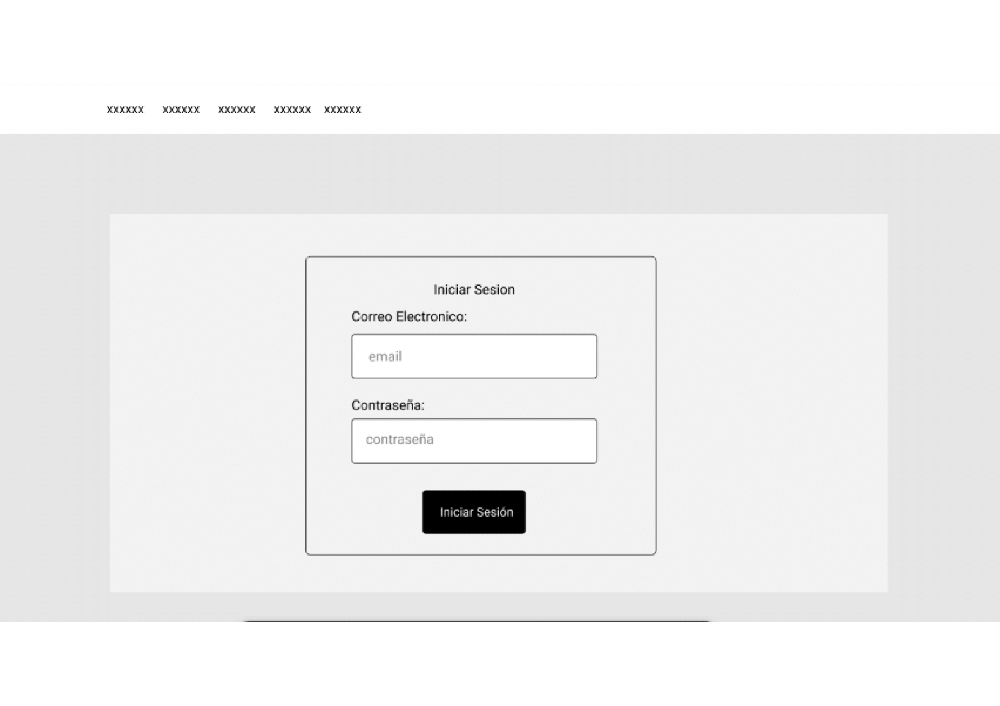
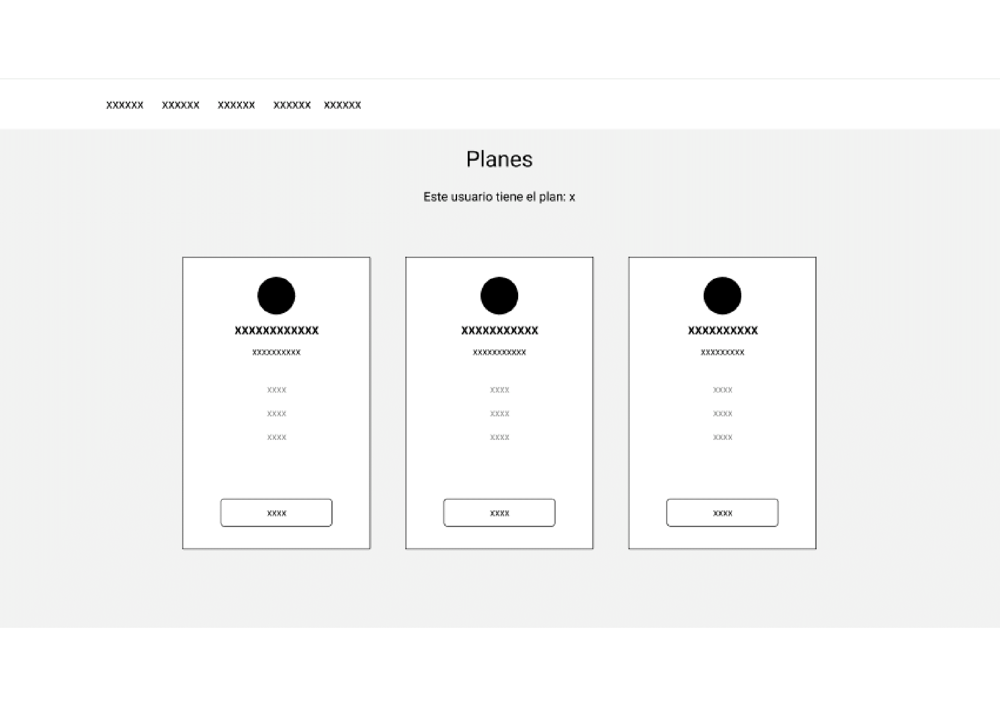
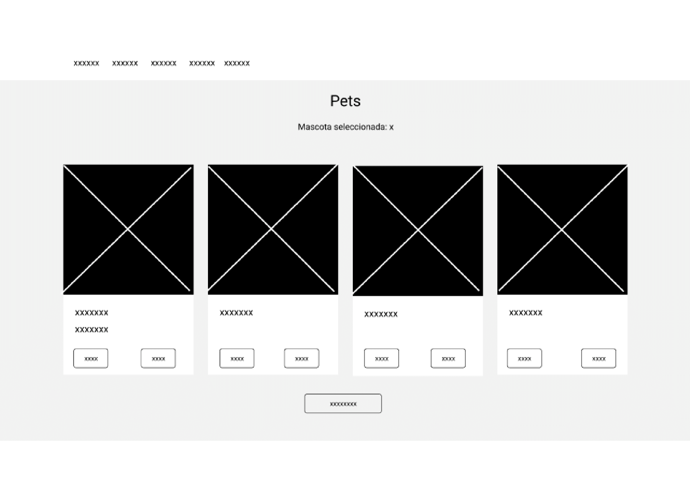
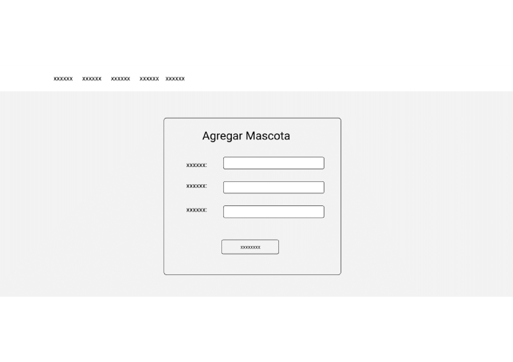
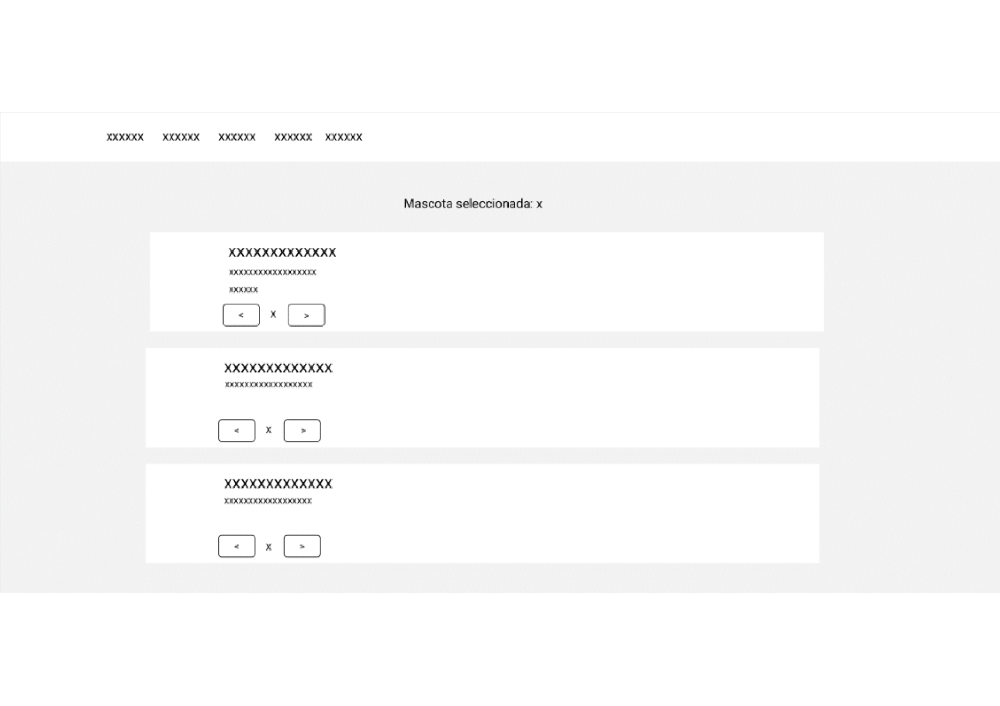
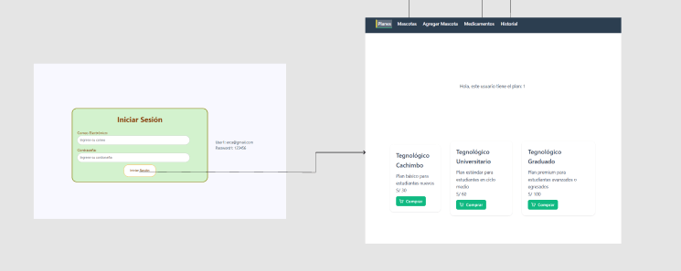
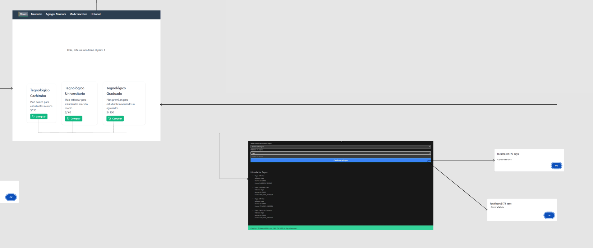
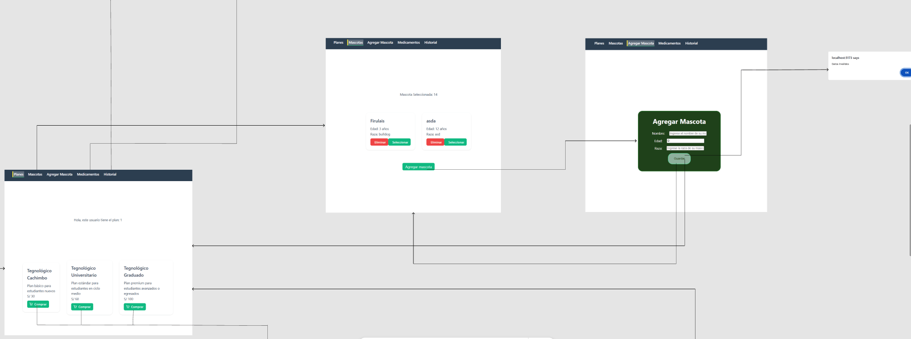

    <strong>Universidad Peruana de Ciencias Aplicadas</strong>     
    </img> 
    <strong>Ingeniería de Software</strong> 
     <strong>1ASI0730 Aplicaciones Web - 4374</strong> 
     <strong>Docente: Alberto Wilmer</strong> 
     
    

        <h2>Informe de Trabajo Final</h2>
    

     

    <strong>Startup: ManoloCorp</strong> 
     <strong>Producto: MascotaMatch</strong> 
     <strong>Team Members:</strong> 

  <table style="text-align:center;">
    <tr>
      <th style="text-align:center;">Nombre</th>
      <th style="text-align:center;">Código</th>
    </tr>
    <tr>
      <td style="text-align:center;">Oscar Espinoza</td>
      <td style="text-align:center;">U202311842</td>
    </tr>
    <tr>
      <td style="text-align:center;">Gianfranco Durand</td>
      <td style="text-align:center;">U202312614</td>
    </tr>
    <tr>
      <td style="text-align:center;">Stephano Landauri</td>
      <td style="text-align:center;">U202311828</td>
    </tr>
    <tr>
      <td style="text-align:center;">Fabian Olivia</td>
      <td style="text-align:center;">U202312013</td>
    </tr>
    <tr>
      <td style="text-align:center;">Miguel Castro</td>
      <td style="text-align:center;">U202314186</td>
    </tr>
    <tr>
      <td style="text-align:center;">Erick Goicochea</td>
      <td style="text-align:center;">U202019871</td>
    </tr>
  </table>

     <strong>2025-10</strong>

## Registro de Versiones del Informe

| Versión | Fecha      | Autor                                  | Descripción                                                                                                                                                        |
| ------- | ---------- | -------------------------------------- | ------------------------------------------------------------------------------------------------------------------------------------------------------------------ |
| TB1     | 17/04/2025 | **Oscar Espinoza Quijandría**          | Desarrollé el Lean UX Canvas y definí los problem statements, assumptions e hipótesis basados en las necesidades detectadas en usuarios.                           | 
| TB1     | 20/04/2025 | **Stephano Mayrzon Landauri Preciado** | Conduje entrevistas a usuarios del segmento objetivo, analicé patrones y definí el lenguaje ubicuo del proyecto.                                                   |
| TB1     | 16/04/2025 | **Fabian Alejandro Oliva López**       | Diseñé la arquitectura de la información y los sistemas de búsqueda, navegación y etiquetado del sistema, además de configurar el entorno de desarrollo.           |
| TB1     | 23/04/2025 | **Erick Alessander Vasquez Goicochea** | Elaboré los diagramas de arquitectura de software (contexto, contenedores y componentes) aplicando diseño orientado al dominio.                                    |
| TB1     | 19/04/2025 | **Gianfranco Jared Durand Vega**       | Documenté los antecedentes y problemática del proyecto, definiendo con claridad los retos a abordar.                                                               |
| TB1     | 22/04/2025 | **Miguel Angel Vidal Castro**          | Diseñé la interfaz gráfica y maqueta de la landing page en Figma, además de estructurar la base de datos y su diagrama respectivo.                                 |
| TB1     | 25/04/2025 | **Oscar Espinoza Quijandría**          | Configuré el despliegue del software, diseñé los diagramas de clases y aseguré la implementación funcional de la landing page y servicios.                         |
| TB1     | 18/04/2025 | **Stephano Mayrzon Landauri Preciado** | Redacté las user stories y participé en la organización de roles y la planificación del Sprint 1.                                                                  |
| TB1     | 21/04/2025 | **Gianfranco Jared Durand Vega**       | Elaboré el perfil de la startup, definiendo su propuesta de valor, objetivos y estructura de trabajo.                                                              |
| TB1     | 24/04/2025 | **Erick Alessander Vasquez Goicochea** | Reuní evidencias de ejecución, documentación y despliegue para el sprint review. También analicé la colaboración del equipo e identifiqué mejoras en coordinación. |
| TB1     | 15/04/2025 | **Miguel Angel Vidal Castro**          | Realicé el proceso de needfinding, elaboré los user personas, empathy maps y escenarios As-is.                                                                     |
| TB1     | 17/04/2025 | **Fabian Alejandro Oliva López**       | Propuse estrategias competitivas tras evaluar productos similares, diferenciando nuestra solución en el mercado.                                                   |
| TP      | 10/05/2025 | **Oscar Espinoza Quijandría**          | Desarrollé el Bounded Context de Planes y el Sprint 2                                                                                                              |
| TP      | 10/05/2025 | **Fabian Alejandro Oliva López**       | Desarrollé el Bounded Context de Pet-Historial y el Sprint 2                                                                                                       |
| TP      | 10/05/2025 | **Stephano Mayrzon Landauri Preciado** | Desarrollé el Bounded Context de Planes y el Sprint 2                                                                                                              |
| TP      | 10/05/2025 | **Gianfranco Jared Durand Vega**       | Desarrollé el Bounded Context de Login y el Sprint 2                                                                                                               |
| TP      | 10/05/2025 | **Miguel Angel Vidal Castro**          | Desarrollé el Bounded Context de New-Version-Connected y el Sprint 2                                                                                               |
| TP      | 10/05/2025 | **Erick Alessander Vasquez Goicochea** | Desarrollé el Bounded Context de Login y el Sprint 2                                                                                                               |
| TB2     | 10/05/2025 | **Oscar Espinoza Quijandría**          | Desarrollé el Bounded Context del Pet Profile y el Sprint 3                                                                                                        |
| TB2     | 10/05/2025 | **Fabian Alejandro Oliva López**       | Desarrollé el Bounded Context del Shopping Cart y el Sprint 3                                                                                                      |
| TB2     | 10/05/2025 | **Stephano Mayrzon Landauri Preciado** | Desarrollé el Bounded Context de Owner y Registro de Entrevistas                                                                                                   |
| TB2     | 10/05/2025 | **Gianfranco Jared Durand Vega**       | Desarrollé el Bounded Context de Pet Profile y Registro de Entrevistas                                                                                             |
| TB2     | 10/05/2025 | **Miguel Angel Vidal Castro**          | Desarrollé el Bounded Context de Shopping-Cart y despliegue del FrontEnd, BackEnd                                                                                  |
| TB2     | 10/05/2025 | **Erick Alessander Vasquez Goicochea** | Desarrollé el Bounded Context de Medicine y Revisión de tareas BackEnd y soporte general en integración                                                            |
| TF1     | 10/05/2025 | **Oscar Espinoza Quijandría**          | Desarrollé correciones en el documento, ademas edite el about the product para que tenga una mejor presentacion                                                    |
| TF1     | 10/05/2025 | **Fabian Alejandro Oliva López**       | Desarrollé correciones en el documento, ademas me encargue en ayudar con la mejora del backend                                                                     |
| TF1     | 10/05/2025 | **Stephano Mayrzon Landauri Preciado** | Desarrollé correciones en el documento, ademas me encargue de ajustar las entrevistas para tener mejor coherencia                                                  |
| TF1     | 10/05/2025 | **Gianfranco Jared Durand Vega**       | Desarrollé correciones en el documento, ademas me encargue en mejorar los diagramas para una mejor comprencion                                                     |
| TF1     | 10/05/2025 | **Miguel Angel Vidal Castro**          | Desarrollé correciones en el documento, ademas me encargue en mejorar la landing page para tener un mejor diseño                                                   |
| TF1     | 10/05/2025 | **Erick Alessander Vasquez Goicochea** | Desarrollé correciones en el documento, ademas me encargue en mejorar el frontend para tener un mejor diseño y puse los enlaces del frontend y backend             |

## Project Report Collaboration Insights

URL de la organización del Github de MascotaMatch: https://github.com/1ASI0730-2510-4374-G4-MASCOTAMATCH

| Módulo         | Descripción                                   | Enlace |
|----------------|-----------------------------------------------|--------|
|  Landing Page      | Página pública de presentación del proyecto               | [🔗mascotamatch-landing](https://github.com/1ASI0730-2510-4374-G4-MASCOTAMATCH/LANDINGPAGE) |
|  WebApp       | Aplicación web para usuarios finales          | [🔗mascotamatch-webapp](https://github.com/1ASI0730-2510-4374-G4-MASCOTAMATCH/FRONT-END) |
|  API          | Backend y lógica de negocio (C#)     | [🔗mascotamatch-api](https://github.com/1ASI0730-2510-4374-G4-MASCOTAMATCH/BACKEND) |
|  Reporte      | Documentación, informes y reportes del curso  | [🔗mascotamatch-report](https://github.com/1ASI0730-2510-4374-G4-MASCOTAMATCH/REPORT) |

# Contenido
## Tabla de contenidos
### [Registro de versiones del informe](#registro-de-versiones-del-informe)
### [Project Report Collaboration Insights](#project-report-collaboration-insights)
### [Student Outcome](#student-outcome)
## [Capítulo I: Introducción](#capítulo-i-introducción)
- [1.1. Startup Profile](#11-startup-profile)
    - [1.1.1. Descripción de la Startup](#111-descripción-de-la-startup)
    - [1.1.2. Perfiles de integrantes del equipo](#112-perfiles-de-integrantes-del-equipo)
- [1.2. Solution Profile](#12-solution-profile)
    - [1.2.1 Antecedentes y problemática](#121-antecedentes-y-problemática)
    - [1.2.2 Lean UX Process](#122-lean-ux-process)
        - [1.2.2.1. Lean UX Problem Statements](#1221-lean-ux-problem-statements)
        - [1.2.2.2. Lean UX Assumptions](#1222-lean-ux-assumptions)
        - [1.2.2.3. Lean UX Hypothesis Statements](#1223-lean-ux-hypothesis-statements)
        - [1.2.2.4. Lean UX Canvas](#1224-lean-ux-canvas)
- [1.3. Segmentos objetivo](#13-segmentos-objetivo)

## [Capítulo II: Requirements Elicitation & Analysis](#capítulo-ii-requirements-elicitation--analysis)
- [2.1. Competidores](#21-competidores)
    - [2.1.1. Análisis competitivo](#211-análisis-competitivo)
    - [2.1.2. Estrategias y tácticas frente a competidores](#212-estrategias-y-tácticas-frente-a-competidores)
- [2.2. Entrevistas](#22-entrevistas)
    - [2.2.1. Diseño de entrevistas](#221-diseño-de-entrevistas)
    - [2.2.2. Registro de entrevistas](#222-registro-de-entrevistas)
    - [2.2.3. Análisis de entrevistas](#223-análisis-de-entrevistas)
- [2.3. Needfinding](#23-needfinding)
    - [2.3.1. User Personas](#231-user-personas)
    - [2.3.2. User Task Matrix](#232-user-task-matrix)
    - [2.3.3. User Journey Mapping](#233-user-journey-mapping)
    - [2.3.4. Empathy Mapping](#234-empathy-mapping)
    - [2.3.5. As-is Scenario Mapping](#235-as-is-scenario-mapping)
- [2.4. Ubiquitous Language](#24-ubiquitous-language)

## [Capítulo III: Requirements Specification](#capítulo-iii-requirements-specification)
- [3.1. To-Be Scenario Mapping](#31-to-be-scenario-mapping)
- [3.2. User Stories](#32-user-stories)
- [3.3. Impact Mapping](#33-impact-mapping)
- [3.4. Product Backlog](#34-product-backlog)

## [Capítulo IV: Product Design](#capítulo-iv-product-design)
- [4.1. Style Guidelines](#41-style-guidelines)
    - [4.1.1. General Style Guidelines](#411-general-style-guidelines)
    - [4.1.2. Web Style Guidelines](#412-web-style-guidelines)
- [4.2. Information Architecture](#42-information-architecture)
    - [4.2.1. Organization Systems](#421-organization-systems)
    - [4.2.2. Labeling Systems](#422-labeling-systems)
    - [4.2.3. SEO Tags and Meta Tags](#423-seo-tags-and-meta-tags)
    - [4.2.4. Searching Systems](#424-searching-systems)
    - [4.2.5. Navigation Systems](#425-navigation-systems)
- [4.3. Landing Page UI Design](#43-landing-page-ui-design)
    - [4.3.1. Landing Page Wireframe](#431-landing-page-wireframe)
    - [4.3.2. Landing Page Mock-up](#432-landing-page-mock-up)
- [4.4. Web Applications UX/UI Design](#44-web-applications-uxui-design)
    - [4.4.1. Web Applications Wireframes](#441-web-applications-wireframes)
    - [4.4.2. Web Applications Wireflow Diagrams](#442-web-applications-wireflow-diagrams)
    - [4.4.3. Web Applications Mock-ups](#443-web-applications-mock-ups)
    - [4.4.4. Web Applications User Flow Diagrams](#444-web-applications-user-flow-diagrams)
- [4.5. Web Applications Prototyping](#45-web-applications-prototyping)
- [4.6. Domain-Driven Software Architecture](#46-domain-driven-software-architecture)
    - [4.6.1. Software Architecture Context Diagram](#461-software-architecture-context-diagram)
    - [4.6.2. Software Architecture Container Diagrams](#462-software-architecture-container-diagrams)
    - [4.6.3. Software Architecture Components Diagrams](#463-software-architecture-components-diagrams)
- [4.7. Software Object-Oriented Design](#47-software-object-oriented-design)
    - [4.7.1. Class Diagrams](#471-class-diagrams)
    - [4.7.2. Class Dictionary](#472-class-dictionary)
- [4.8. Database Design](#48-database-design)
    - [4.8.1. Database Diagram](#481-database-diagram)

## [Capítulo V: Product Implementation, Validation & Deployment](#capítulo-v-product-implementation-validation--deployment)
- [5.1. Software Configuration Management](#51-software-configuration-management)
    - [5.1.1. Software Development Environment Configuration](#511-software-development-environment-configuration)
    - [5.1.2. Source Code Management](#512-source-code-management)
    - [5.1.3. Source Code Style Guide & Conventions](#513-source-code-style-guide--conventions)
    - [5.1.4. Software Deployment Configuration](#514-software-deployment-configuration)
- [5.2. Landing Page, Services & Applications Implementation](#52-landing-page-services--applications-implementation)
    - [5.2.1. Sprint 1](#521-sprint-1)
        - [5.2.1.1. Sprint Planning 1](#5211-sprint-planning-1)
        - [5.2.1.2. Sprint Backlog 1](#5212-sprint-backlog-1)
        - [5.2.1.3. Development Evidence for Sprint Review](#5213-development-evidence-for-sprint-review)
        - [5.2.1.4. Testing Suite Evidence for Sprint Review](#5214-testing-suite-evidence-for-sprint-review)
        - [5.2.1.5. Execution Evidence for Sprint Review](#5215-execution-evidence-for-sprint-review)
        - [5.2.1.6. Services Documentation Evidence for Sprint Review](#5216-services-documentation-evidence-for-sprint-review)
        - [5.2.1.7. Software Deployment Evidence for Sprint Review](#5217-software-deployment-evidence-for-sprint-review)
        - [5.2.1.8. Team Collaboration Insights during Sprint](#5218-team-collaboration-insights-during-sprint)
    - [5.2.2. Sprint 2](#522-sprint-2)
        - [5.2.2.1. Sprint Planning 2](#5221-sprint-planning-2)
        - [5.2.2.2. Sprint Backlog 2](#5222-sprint-backlog-2)
        - [5.2.2.3. Development Evidence for Sprint Review](#5223-development-evidence-for-sprint-review)
        - [5.2.2.4. Testing Suite Evidence for Sprint Review](#5224-testing-suite-evidence-for-sprint-review)
        - [5.2.2.5. Execution Evidence for Sprint Review](#5225-execution-evidence-for-sprint-review)
        - [5.2.2.6. Services Documentation Evidence for Sprint Review](#5226-services-documentation-evidence-for-sprint-review)
        - [5.2.2.7. Software Deployment Evidence for Sprint Review](#5227-software-deployment-evidence-for-sprint-review)
        - [5.2.2.8. Team Collaboration Insights during Sprint](#5228-team-collaboration-insights-during-sprint)
    - [5.2.3. Sprint 3](#523-sprint-3)
        - [5.2.3.1. Sprint Planning 3](#5231-sprint-planning-3)
        - [5.2.3.2. Sprint Backlog 3](#5232-sprint-backlog-3)
        - [5.2.3.3. Development Evidence for Sprint Review](#5233-development-evidence-for-sprint-review)
        - [5.2.3.4. Testing Suite Evidence for Sprint Review](#5234-testing-suite-evidence-for-sprint-review)
        - [5.2.3.5. Execution Evidence for Sprint Review](#5235-execution-evidence-for-sprint-review)
        - [5.2.3.6. Services Documentation Evidence for Sprint Review](#5236-services-documentation-evidence-for-sprint-review)
        - [5.2.3.7. Software Deployment Evidence for Sprint Review](#5237-software-deployment-evidence-for-sprint-review)
        - [5.2.3.8. Team Collaboration Insights during Sprint](#5238-team-collaboration-insights-during-sprint)
    - [5.2.4. Sprint 4](#524-sprint-4)
    - [5.2.4.1. Sprint Planning 3](#5241-sprint-planning-4)
    - [5.2.4.2. Sprint Backlog 3](#5242-sprint-backlog-4)
    - [5.2.4.3. Development Evidence for Sprint Review](#5243-development-evidence-for-sprint-review)
    - [5.2.4.4. Testing Suite Evidence for Sprint Review](#5244-testing-suite-evidence-for-sprint-review)
    - [5.2.4.5. Execution Evidence for Sprint Review](#5245-execution-evidence-for-sprint-review)
    - [5.2.4.6. Services Documentation Evidence for Sprint Review](#5246-services-documentation-evidence-for-sprint-review)
    - [5.2.4.7. Software Deployment Evidence for Sprint Review](#5247-software-deployment-evidence-for-sprint-review)
    - [5.2.4.8. Team Collaboration Insights during Sprint](#5248-team-collaboration-insights-during-sprint)

- [5.3. Validation Interviews](#53-validation-interviews)
    - [5.3.1. Diseño de entrevistas](#531-diseño-de-entrevistas)
    - [5.3.2. Registro de entrevistas](#532-registro-de-entrevistas)
    - [5.3.3. Evaluación según heurísticas](#532-evaluación-según-heurísticas)

- [5.4. Video About the Product](#54-video-about-the-product)

## [Conclusiones](#conclusiones)
- [Video About the Team](#video-about-the-team)

## [Bibliografía](#bibliografía)
## [Anexos](#anexos)

--- 

# Capítulo I: Introducción
## 1.1. Startup Profile.

Esta sección presenta una visión general del startup y proporciona información sobre los perfiles de cada miembro del equipo.

### 1.1.1. Descripción de la Startup

MascotaMatch nace con el objetivo de mejorar el cuidado de las mascotas en el Perú. A través de una aplicación digital, conecta a los dueños con profesionales certificados como veterinarios, paseadores y groomers. Usando un modelo de suscripción mensual, ofrece servicios como paseos, grooming, chequeos médicos, recordatorios de vacunas y atención prioritaria.

Lo que nos diferencia es que no solo brindamos comodidad y confianza a los dueños, sino que también apoyamos a los profesionales del rubro ofreciéndoles una fuente de ingresos estable. Nuestra aplicación usa tecnología de geolocalización y un sistema de emparejamiento inteligente que ayuda a ofrecer una atención más personalizada. Con MascotaMatch buscamos crear una comunidad pet-friendly más conectada, segura y comprometida con el bienestar animal.

**Misión:** Mejorar el bienestar y calidad de vida de las mascotas, conectando a los dueños con profesionales confiables a través de una plataforma digital que simplifica el cuidado diario y promueve un entorno seguro en los servicios para mascotas.

**Visión:** Ser la app líder en servicios para mascotas en el Perú, impulsando la digitalización del sector, el desarrollo de las comunidades pet-friendly y fomentando el cuidado responsable, profesional y personalizado de los animales.

**Logotipo de la Startup:** 

### 1.1.2. Perfiles de integrantes del equipo

| Descripción de los Miembros del Equipo                                                                                                                                                                                                                                                                                                                                                                                                                        |     Perfiles de los Miembros del Equipo      | 
|:--------------------------------------------------------------------------------------------------------------------------------------------------------------------------------------------------------------------------------------------------------------------------------------------------------------------------------------------------------------------------------------------------------------------------------------------------------------|:--------------------------------------------:|
| Mi nombre es **Stephano Mayrzon Landauri Preciado - u202311828**, soy un estudiante de ingeniería de software y estoy cursando el 5to ciclo de mi carrera, me gusta jugar futbol, me considero un estudiante responsable y me gusta trabajar en equipo.                                                                                           |    | 
| Mi nombre es **Miguel Angel Vidal Castro- u202314186**, tengo 19 años y estudio la carrera de ingeniería de software, estoy cursando el 5to ciclo. Mi hobbie es la programación y entrenar con diversos problema del índole. Siempre estoy dispuesto a ofrecer mi ayuda a mis compañeros cuando la necesiten, para así mantener un buen trabajo grupal. Me considero una persona colaborativa y me comprometo a aportar al equipo siempre que se necesite.   |  | 
| Mi nombre es **Erick Alessander Vasquez Goicochea - u202019871**, estudio la carrera de ingeniería de software. Elegí esta carrera porque me interesaba cómo se desarrollaban los programas que daban vida a las computadoras. Cuento con un pensamiento crítico y me considero autodidacta. Tengo conocimientos en C++, Javascript, C#, MongoDB, SQL.                                                                                                                                                                                                                                                                                                                                                                                                                                                                                              |   | 
| Mi nombre es **Gianfranco Jared Durand Vega - u202312614**, estudio la carrera de ingeniería de software. Elegí esta carrear porque me interesaban cómo funcionaban las computadoras y lo que había detrás de las aplicaciones. Disfruto salir a pasear y jugar videojuegos.                                                                                                      |    | 
| Mi nombre es **Oscar Espinoza Quijandría - u202311842**, soy estudiante de 5to ciclo de ingeniería de software, apasionado por la tecnología y el desarrollo de aplicaciones. En mi tiempo libre disfruto jugar videojuegos, ver series y practicar deportes.                                                                                                            |  | 
| Mi nombre es **Fabian Aleandro Oliva Lopez - u202312013**, soy estudiante de 5to ciclo de ingeniería de software, entusiasta de la programación y la innovación tecnológica. Me gusta escuchar música, salir con amigos y jugar futbol en mi tiempo libre.                                                                                                            |  | 

## Student Outcome 

| Criterio específico                                                                                | Acciones realizadas                                                                                                                                                                                                                                                                                                                                                                                                                                                                                                                                                                                                                                                                                                                                                                                                                                                                                                                                                                                                                                                                                                                                                                                                                                                                                                                                                                                                                                                                                                                                                                                                                                                                                                                                                                                                                                                                                                                                                                                                                                                                                                                                                                                                                                                                                                                                                                                                                                                                                                                                                                                                                                                                                                                                                                                                                                                                                                                                                                                                                                                                                                                                                                                                                                                                                                                                                                                                                                                                                                                                                                                                                                                                                                                                                                                                                           | Conclusiones                                                                                                                                                                                                                                                                                                                                                                                                                                                                                                                                                                                                                                                                                                                                                                                                                                                                                                                                                                                                                                                                                                                                                                                                                                                                   |
| -------------------------------------------------------------------------------------------------- | --------------------------------------------------------------------------------------------------------------------------------------------------------------------------------------------------------------------------------------------------------------------------------------------------------------------------------------------------------------------------------------------------------------------------------------------------------------------------------------------------------------------------------------------------------------------------------------------------------------------------------------------------------------------------------------------------------------------------------------------------------------------------------------------------------------------------------------------------------------------------------------------------------------------------------------------------------------------------------------------------------------------------------------------------------------------------------------------------------------------------------------------------------------------------------------------------------------------------------------------------------------------------------------------------------------------------------------------------------------------------------------------------------------------------------------------------------------------------------------------------------------------------------------------------------------------------------------------------------------------------------------------------------------------------------------------------------------------------------------------------------------------------------------------------------------------------------------------------------------------------------------------------------------------------------------------------------------------------------------------------------------------------------------------------------------------------------------------------------------------------------------------------------------------------------------------------------------------------------------------------------------------------------------------------------------------------------------------------------------------------------------------------------------------------------------------------------------------------------------------------------------------------------------------------------------------------------------------------------------------------------------------------------------------------------------------------------------------------------------------------------------------------------------------------------------------------------------------------------------------------------------------------------------------------------------------------------------------------------------------------------------------------------------------------------------------------------------------------------------------------------------------------------------------------------------------------------------------------------------------------------------------------------------------------------------------------------------------------------------------------------------------------------------------------------------------------------------------------------------------------------------------------------------------------------------------------------------------------------------------------------------------------------------------------------------------------------------------------------------------------------------------------------------------------------------------------------------------- | ------------------------------------------------------------------------------------------------------------------------------------------------------------------------------------------------------------------------------------------------------------------------------------------------------------------------------------------------------------------------------------------------------------------------------------------------------------------------------------------------------------------------------------------------------------------------------------------------------------------------------------------------------------------------------------------------------------------------------------------------------------------------------------------------------------------------------------------------------------------------------------------------------------------------------------------------------------------------------------------------------------------------------------------------------------------------------------------------------------------------------------------------------------------------------------------------------------------------------------------------------------------------------ |
| **Trabaja en equipo para proporcionar liderazgo en forma conjunta**                                | **Oscar Espinoza Quijandría** **TB1**: Participé activamente en la configuración del sistema, elaborando los diagramas de arquitectura y liderando la implementación del Lean UX Canvas. **TP**: Coordiné la integración de los Bounded Contexts, participando en reuniones y asegurando la correcta implementación del módulo. **TB2**: Dirigí el desarrollo del Bounded Context de Pet Profile, trabajando estrechamente con el equipo para garantizar la integración exitosa del sistema. **TF1**: Coordiné las correcciones del documento y me encargué de mejorar la presentación de la sección *About the Product*. Participé activamente en las decisiones de diseño y coherencia de los contenidos.    **Fabian Alejandro Oliva López** **TB1**: Colaboré en la definición de la arquitectura de la información, creando diagramas técnicos y explicando los flujos del sistema al equipo. **TP**: Coordiné el desarrollo del Bounded Context de Pet-Historial, liderando el diseño de la interfaz de usuario y la integración del sistema. **TB2**: Supervisé la implementación del Bounded Context de Shopping Cart, asegurando que las funcionalidades fueran consistentes con los objetivos del sistema. **TF1**: Colaboré en la corrección del documento y me encargué de ayudar en la mejora del backend, optimizando algunos aspectos del proceso de integración.    **Stephano Mayrzon Landauri Preciado** **TB1**: Llevé a cabo sesiones de ideación y lideré la planificación de roles para el Sprint 1. **TP**: Coordiné las tareas del Sprint 2 y aseguré que se alcanzaran los objetivos de los Bounded Contexts de Planes. **TB2**: Coordiné la implementación y el despliegue del Bounded Context de Owner y Registro de Entrevistas, asegurando una integración eficiente. **TF1**: Trabajé en la corrección del documento y ajusté las entrevistas para asegurarme de que los datos fueran más coherentes y adecuados para el análisis.    **Gianfranco Jared Durand Vega** **TB1**: Desarrollé el perfil de la startup y trabajé en la documentación del proyecto.  **TP**: Lideré el desarrollo del Bounded Context de Login, participando en la definición de la arquitectura de seguridad. **TB2**: Supervisé la integración del Bounded Context de Pet Profile y trabajé con el equipo en el diseño del flujo de datos. **TF1**: Realicé correcciones en el documento y mejoré los diagramas visuales para asegurar que los conceptos fueran claros y fáciles de entender.    **Miguel Angel Vidal Castro** **TB1**: Coordiné el diseño de la interfaz gráfica, creando la maqueta de la landing page y el diagrama de la base de datos. **TP**: Dirigí el desarrollo del Bounded Context de New-Version-Connected, enfocándome en la conectividad y la compatibilidad de versiones. **TB2**: Coordiné el despliegue del FrontEnd y BackEnd en el Bounded Context de Shopping-Cart, asegurando su integración con el sistema. **TF1**: Corregí y mejoré la landing page, enfocándome en el diseño y en una mayor claridad visual para facilitar la navegación.    **Erick Alessander Vasquez Goicochea** **TB1**: Colaboré en la creación de los diagramas de arquitectura de software y en la definición de las integraciones del sistema. **TP**: Desarrollé el Bounded Context de Login y participé en el aseguramiento de la calidad en la integración de los módulos. **TB2**: Coordiné la integración y revisión de los Bounded Contexts, garantizando la correcta integración de las funcionalidades del sistema. **TF1**: Me encargué de las correcciones del documento y optimicé el frontend, integrando adecuadamente los enlaces de frontend y backend para mejorar la funcionalidad general. | **TB1**: El equipo trabajó de manera colaborativa desde las primeras etapas, definiendo roles, discutiendo ideas y liderando las decisiones clave de diseño. Esto permitió una ejecución eficaz y eficiente durante las primeras fases del proyecto.  **TP**: La planificación y coordinación durante el Sprint 2 fueron clave para el progreso del proyecto. Todos los miembros participaron activamente, brindaron feedback constructivo y realizaron avances significativos en sus respectivos módulos. La colaboración ayudó a integrar de manera efectiva los diferentes componentes del sistema.  **TB2**: En la fase final, se llevó a cabo una integración fluida entre los módulos, gracias a una fuerte colaboración entre los miembros del equipo. Todos los componentes fueron probados y evaluados juntos, asegurando la cohesión del sistema completo y su alineación con los objetivos del proyecto.  **TF1**: En este proceso de revisión, el equipo colaboró de manera eficaz en la mejora del documento y en la implementación de cambios clave en los distintos módulos del proyecto. A través de la corrección de detalles y la mejora de la estructura, se logró una integración más eficiente de los elementos visuales y funcionales. |
| **Crea un entorno colaborativo e inclusivo, establece metas, planifica tareas y cumple objetivos** | **Oscar Espinoza Quijandría** **TB1**: Establecí metas claras para la mejora del documento, trabajando en equipo para asegurar una presentación profesional. Coordiné las tareas necesarias para la reestructuración de la página de *About the Product*. **TP**: Coordiné las tareas de integración de los Bounded Contexts, asegurando que cada miembro cumpliera con los objetivos del Sprint 2. **TB2**: Supervisé la implementación y aseguré que los objetivos del Bounded Context de Pet Profile fueran alcanzados de acuerdo con el plan. **TF1**: Establecí metas claras para la mejora del documento, trabajando en equipo para asegurar una presentación profesional. Coordiné las tareas necesarias para la reestructuración de la página de *About the Product*.   **Fabian Alejandro Oliva López** **TB1**: Colaboré en la definición de las metas del equipo y participé en las sesiones de planificación de tareas. **TP**: Coordiné el Sprint 2 y establecí metas claras para cada módulo, garantizando que todos los miembros cumplieran con los plazos. **TB2**: Supervisé la implementación del Bounded Context de Shopping Cart y aseguré el cumplimiento de los objetivos definidos en la planificación. **TF1**: Participé activamente en la planificación de tareas para mejorar el backend y colaborar con los demás miembros del equipo para optimizar sus contribuciones.    **Stephano Mayrzon Landauri Preciado** **TB1**: Establecí metas para la fase inicial y trabajé en la asignación de tareas durante la planificación del Sprint 1. **TP**: Coordiné las tareas del Sprint 2 y aseguré que se alcanzaran los objetivos de los Bounded Contexts de Planes. **TB2**: Coordiné el trabajo del equipo en la implementación del Bounded Context de Owner, asegurando que cada miembro cumpliera con sus tareas. **TF1**: Planifiqué las tareas de ajuste en las entrevistas para garantizar que fueran más coherentes y útiles para el desarrollo del proyecto.   **Gianfranco Jared Durand Vega** **TB1**: Colaboré en la definición de las tareas de investigación y análisis de la problemática del proyecto. **TP**: Coordiné la integración de los Bounded Contexts de Login y Pet Profile, asegurando que se cumplieran los objetivos del Sprint 2. **TB2**: Trabajé con el equipo para integrar el Bounded Context de Pet Profile y aseguré la alineación con las metas del proyecto. **TF1**: Planifiqué y ejecuté mejoras en los diagramas, facilitando la comprensión de la información presentada.    **Miguel Angel Vidal Castro** **TB1**: Coordiné las tareas relacionadas con el diseño de la interfaz y la arquitectura de la base de datos. **TP**: Establecí metas claras para el desarrollo del Bounded Context de New-Version-Connected y aseguré que las tareas se completaran dentro del plazo. **TB2**: Supervisé el cumplimiento de los objetivos en el Bounded Context de Shopping-Cart, realizando ajustes según fuera necesario. **TF1**: Me encargué de la planificación y ejecución de mejoras en la landing page, optimizando el diseño para una mayor claridad.   **Erick Alessander Vasquez Goicochea** **TB1**: Trabajé en la planificación de las tareas relacionadas con la arquitectura de software y las integraciones del sistema. **TP**: Establecí metas para el Bounded Context de Login y aseguré su correcta integración. **TB2**: Coordiné la implementación de tareas y ayudé a integrar los Bounded Contexts, asegurando que se cumpliera con los objetivos del proyecto. **TF1**: Planifiqué las tareas para mejorar el diseño del frontend, y trabajé en la integración efectiva de enlaces entre frontend y backend para una mejor funcionalidad.      | **TB1**: El equipo fue muy eficaz en la planificación de tareas y la asignación de responsabilidades, lo que permitió que todas las metas se cumplieran en tiempo y forma.  **TP**: La planificación y ejecución durante el Sprint 2 fueron claves para el cumplimiento de objetivos, con tareas bien definidas y la colaboración activa de todos los miembros.  **TB2**: La implementación final fue exitosa, gracias a una planificación adecuada, la comunicación efectiva dentro del equipo y la coordinación de tareas que permitieron alcanzar los objetivos establecidos en cada fase del proyecto.  **TF1**: El equipo fue altamente colaborativo durante la corrección del documento y la mejora de los módulos del sistema. Las tareas se planificaron adecuadamente, lo que permitió una ejecución exitosa de las metas del proyecto.                                                                                                                                                                                                                                                                                                                                                                                                             |

### 1.2. Solution Profile:

Está compuesta por dos secciones:

### Antecedentes y Problemática:

Aquí se explica la situación actual que dio origen a MascotaMatch. Se describe el problema que enfrentan los dueños de mascotas al buscar servicios confiables, así como los puntos clave que la solución debe considerar. También se presentan los objetivos del proyecto y las limitaciones que se deben tener en cuenta.

### Lean UX Process:

En esta parte se aplica el enfoque Lean UX para mostrar cómo se trabajará en la solución. Se detalla el proceso que guía la creación del modelo de negocio y cómo este busca responder de forma eficiente a la necesidad identificada.

### 1.2.1 Antecedentes y problemática:

En los últimos años, el crecimiento del número de mascotas en hogares peruanos ha venido acompañado de una mayor preocupación por su bienestar y calidad de vida. En ciudades como Lima, Arequipa o Trujillo, muchas familias consideran a sus mascotas parte importante de la familia. Sin embargo, brindarles una atención adecuada no es sencillo. Factores como la falta de tiempo, el desconocimiento de servicios confiables y la informalidad del sector dificultan el acceso a servicios esenciales como paseos, grooming y atención veterinaria.

Actualmente, el mercado de servicios para mascotas en el Perú se caracteriza por estar altamente fragmentado y operar de manera informal. Muchos de los servicios disponibles se ofrecen sin estándares de calidad ni mecanismos de control, y la digitalización del rubro sigue siendo baja. Esta situación genera desconfianza en los propietarios y limita las oportunidades de desarrollo para quienes trabajan en el sector.

Pese a estas limitaciones, se observa una clara oportunidad para introducir una solución digital que centralice estos servicios, mejore la experiencia del usuario y promueva la formalización de los profesionales. Además, en un contexto donde la adopción de herramientas digitales va en aumento, especialmente entre jóvenes y adultos conectados, una plataforma integral puede transformar la forma en que los dueños cuidan a sus mascotas.

MascotaMatch nace para cubrir esta necesidad. Nuestra aplicación permite conectar a los dueños con profesionales certificados de manera segura, práctica y rápida, a través de un modelo de suscripción mensual. Al mismo tiempo, busca generar oportunidades de ingreso sostenibles para paseadores, groomers y veterinarios, fomentando su capacitación y formalización. Así, el proyecto apunta a mejorar tanto la calidad del servicio como el bienestar animal, promoviendo comunidades más responsables, organizadas y pet-friendly.

### Problemática (5Ws y 2Hs)

####  What (¿Cuál es el problema?)

Muchos dueños de mascotas en zonas urbanas tienen dificultades para organizar adecuadamente el cuidado de sus animales. Utilizan múltiples canales (llamadas, redes sociales, referencias informales) y enfrentan descoordinación, olvidos de citas o servicios poco confiables. No existe una plataforma única que centralice todos los servicios de cuidado animal de forma segura y profesional.

####  Why (¿Por qué es un problema?)

La falta de centralización y profesionalización en los servicios de cuidado animal genera varios problemas:

- Pérdida de tiempo en la búsqueda de proveedores.
- Riesgos para la salud de las mascotas por descuidos en vacunas o atención.
- Experiencias negativas con paseadores o groomers no certificados.
- Dificultad para reaccionar ante emergencias veterinarias.
- Frustración y estrés en los dueños por no tener control digital ni trazabilidad del bienestar de sus mascotas.

####  Who (¿A quiénes afecta?)

- A los **dueños de mascotas** que tienen agendas ocupadas y buscan soluciones confiables y rápidas.
- A los **emprendedores del cuidado animal**, que necesitan una vitrina digital para ofrecer sus servicios.

####  When (¿Cuándo ocurre el problema?)

De forma continua, especialmente en contextos urbanos donde las personas trabajan a tiempo completo y carecen de redes de apoyo para el cuidado diario de sus mascotas. Ocurre cuando:

- No se encuentra atención inmediata.
- Se olvidan vacunas, baños o chequeos regulares.
- Se desea agendar varios servicios, pero hay desorganización.

####  Where (¿Dónde ocurre el problema?)

En **ciudades peruanas urbanas** como Lima, Arequipa y Trujillo, donde existe una alta densidad de mascotas y servicios informales. El problema se presenta con mayor intensidad en sectores sin digitalización del cuidado animal o sin acceso a servicios profesionales centralizados.

####  How (¿Cómo sucede?)

El problema ocurre porque los dueños de mascotas deben organizar el cuidado de forma manual y dispersa. Usan WhatsApp, llamadas, redes sociales o recomendaciones informales para contactar a diferentes proveedores. Esto genera falta de coordinación, pérdida de información y poca trazabilidad. Además, muchos servicios no cuentan con agendas digitales, recordatorios ni historial médico accesible, lo que hace difícil llevar un control adecuado del bienestar de la mascota.

####  How Much (¿Cuánto cuesta o impacta?)

- **Emocionalmente:** Estrés y preocupación por la salud y seguridad de la mascota.
- **Económicamente:** Pérdida de dinero al contratar servicios de baja calidad o repetir citas por falta de seguimiento.
- **Socialmente:** Se normalizan servicios informales sin garantía, afectando el desarrollo del sector de cuidado animal.
- **En el proveedor:** Dificultad para formalizarse, pérdida de clientes por mala reputación o falta de visibilidad digital.

## 1.2.2 Lean UX Process

### 1.2.2.1 Lean UX Problem Statements

#### Problem Statement (POSIBLE 1) 

Creemos que tanto los dueños de mascotas con agendas ocupadas como los proveedores de servicios de cuidado animal (como veterinarios, paseadores y groomers) tienen dificultades para conectarse de forma rápida, segura y organizada, lo que complica la coordinación de servicios esenciales como paseos, grooming o atención veterinaria justo cuando se necesitan o con la frecuencia adecuada.
Actualmente, tanto los dueños de mascotas como los proveedores de servicios de cuidado animal dependen de recomendaciones informales, redes sociales, contactos personales o publicaciones aisladas para coordinar servicios. Este proceso suele tomar tiempo, no siempre garantiza calidad o disponibilidad y limita el alcance y la estabilidad de ingresos para los proveedores, generando una experiencia poco confiable y desorganizada para ambos.
Si construimos una plataforma que permita a los dueños de mascotas y proveedores de servicios de cuidado animal encontrar, agendar y gestionar servicios desde un solo lugar, con perfiles verificados, filtros por cercanía y recordatorios automáticos, ambos lograrán superar las dificultades actuales al tener una experiencia más rápida, confiable y organizada.
Lo sabremos cuando al menos el 60 % de los dueños de mascotas sean usuarios activos semanales y al menos el 70 % de los proveedores reciban un mínimo de 5 solicitudes efectivas de servicio durante ese mismo periodo.

### 1.2.2.2 Lean UX Assumptions

#### Business Problem
MascotaMatch enfrenta la dificultad de captar y fidelizar usuarios debido a la alta informalidad en el mercado de servicios para mascotas y la falta de soluciones digitales integradas.
Esto limita el crecimiento sostenible del negocio, ya que los usuarios siguen recurriendo a canales informales y no perciben suficiente valor en una plataforma centralizada, afectando la adopción del modelo de suscripción mensual.

#### Business Assumptions
- Existe una creciente demanda en zonas urbanas por soluciones digitales que faciliten el cuidado completo de las mascotas.
- Los dueños de mascotas están dispuestos a pagar por conveniencia, confianza y servicios especializados.
- La capacidad de responder rápidamente a emergencias veterinarias, mediante funcionalidades como la geolocalización, será clave para diferenciarse en el mercado.

#### Business Outcomes
- Aumentar la retención de usuarios ofreciendo servicios centralizados y personalizables desde una sola plataforma.
- Incrementar la conversión de usuarios gratuitos a suscriptores mediante funcionalidades diferenciadoras como recordatorios, botón de emergencia y perfiles verificados.
- Posicionar a MascotaMatch como una de las principales aplicaciones de cuidado de mascotas en el mercado urbano peruano.

#### User Assumptions
- Los usuarios prefieren gestionar el bienestar de sus mascotas de forma rápida, desde el celular y sin depender de múltiples canales informales.
- La confianza del usuario aumenta cuando se ofrecen servicios verificados, alertas automáticas y respuestas rápidas en caso de emergencia.
- Los usuarios valoran poder encontrar paseadores, veterinarios y groomers cercanos a su ubicación.

#### User Outcomes
- Los usuarios experimentan mayor tranquilidad al poder gestionar salud, paseos y emergencias desde una sola aplicación.
- Aumenta la frecuencia de reservas semanales debido a la confianza en los perfiles profesionales verificados.
- Se mejora la percepción del servicio como una alternativa confiable, moderna y centralizada para el cuidado integral de mascotas.

#### User Benefits
Los usuarios podrán ahorrar tiempo, evitar olvidos importantes y acceder a profesionales verifica dos, todo desde una misma plataforma, lo que mejora la calidad de vida de sus mascotas.

### 1.2.2.3 Lean UX Hypothesis Statements

#### Hypothesis Statement 1
**Creemos que** una app que integre servicios como paseos, grooming, atención veterinaria y recordatorios
**logrará** que los usuarios gestionen el bienestar de sus mascotas de forma más eficiente.
**Sabremos que es así si** los usuarios interactúan regularmente con las funcionalidades principales de la app y mantienen activa su suscripción.
**Cuando veamos** un aumento en la retención de usuarios activos del 70% o más durante el primer mes posterior al registro.

---

#### Hypothesis Statement 2
**Creemos que** implementar recordatorios inteligentes para vacunas, chequeos y desparasitaciones
**ayudará** a reducir olvidos en el cuidado preventivo de las mascotas.
**Sabremos que es así si** los usuarios activan las notificaciones y responden a ellas agendando citas veterinarias.
**Cuando veamos** que al menos el 65% de los usuarios que recibieron una notificación médica agenden una cita dentro de los siguientes 3 días.

### 1.2.2.4. Lean UX Canvas.

  

 

  
### 1.3 Segmentos Objetivo 

Dueños de mascotas en zonas urbanas: Hombres y mujeres, principalmente entre 25 y 45 años, que residen en ciudades como Lima, Arequipa y Trujillo. Son personas con estilos de vida activos, jornadas laborales extensas y poco tiempo disponible, pero que se preocupan profundamente por el bienestar de sus mascotas. Buscan soluciones prácticas, confiables y accesibles que les permitan brindar atención integral a sus animales sin complicaciones ni traslados innecesarios.

Profesionales del cuidado animal: Incluye a veterinarios, técnicos veterinarios, paseadores, groomers y cuidadores (pet sitters) que desean ampliar su base de clientes, generar ingresos estables y profesionalizar su labor. Están interesados en plataformas que les ofrezcan visibilidad, organización por zonas, herramientas para mejorar su servicio y oportunidades de desarrollo a través de capacitaciones y recompensas.

# Capítulo II: Requirements Elicitation & Analysis

## 2.1. Competidores

**Dog Houser**: Dog Houser es una plataforma peruana que conecta a dueños de mascotas con familias cuidadoras que ofrecen hospedaje y guardería en casa. Destaca por su ambiente familiar y personalizado, permitiendo elegir cuidadores según necesidades específicas.

**PaseaPerros**: Es una plataforma peruana que conecta a dueños de perros con paseadores y cuidadores en su zona. Ofrece servicios como paseo, guardería y hospedaje, con perfiles calificados y reseñas de clientes.

**PetBacker**: PetBacker es una plataforma internacional con presencia en Perú que permite encontrar cuidadores independientes cercanos. Ofrece servicios como paseos, visitas y hospedaje, con un sistema de reseñas que brinda confianza.

### 2.1.1. Análisis competitivo

### ¿Por qué llevar a cabo este análisis?
Identificar fortalezas, debilidades y oportunidades frente a los principales competidores para mejorar el posicionamiento de MacotaMatch en el mercado del cuidado de mascotas.

| **Nombre de los Startups**     |                                              | **MascotaMatch**    | **Dog Houser**    | **PaseaPerros**    | **PetBacker**    |
|-------------------------------|----------------------------------------------|------------------|----------------|----------------------|----------------|
| **Perfil**                    | Overview                                     | Plataforma peruana que conecta dueños de mascotas con cuidadores verificados para paseo, guardería y hospedaje. | Plataforma peruana que ofrece hospedaje y guardería en casas particulares. | Plataforma local que enlaza dueños con paseadores y cuidadores certificados. | Plataforma internacional que conecta a dueños con cuidadores independientes. |
|                               | Ventaja competitiva / ¿Qué valor ofrece?     | Servicio seguro y personalizado, con verificación de usuarios y experiencia enfocada en el bienestar de las mascotas. | Atención familiar en ambientes hogareños que reduce el estrés de las mascotas. | Diversidad de servicios con opiniones de clientes que aseguran confianza. | Variedad de servicios en una sola app con sistema de reseñas internacionales. |
| **Perfil de Marketing**       | Mercado objetivo                             | Dueños de mascotas en Perú que buscan confianza y seguridad en el cuidado. | Dueños que desean un trato hogareño y personalizado. | Usuarios que requieren opciones flexibles y cercanas. | Personas que valoran opciones amplias con soporte digital. |
|                               | Estrategias de marketing                     | Presencia en redes sociales, alianzas con veterinarias, promociones digitales. | Publicidad online y recomendaciones por experiencia. | SEO local y redes sociales. | Presencia en app stores y promociones por ubicación. |
| **Perfil del Producto**       | Productos & Servicios                        | Paseos, guardería, hospedaje y visitas domiciliarias. | Hospedaje y guardería personalizada. | Paseos, guardería, hospedaje. | Paseos, visitas, hospedaje, peluquería, etc. |
|                               | Precios & Costos                             | Modelo freemium y planes premium. | Tarifas por cuidador y tipo de servicio. | Costos establecidos por el cuidador. | Tarifas variables por cuidador y servicio. |
|                               | Canales de distribución (Web y/o Móvil)     | Web y app móvil. | Página web. | Página web. | App móvil y web. |
| **Análisis SWOT**             | Fortalezas                                   | Plataforma local con enfoque personalizado, sistema de verificación. | Atención familiar que brinda confianza a los dueños. | Plataforma simple y fácil de usar. | Amplia cobertura internacional y experiencia digital. |
|                               | Debilidades                                  | Nueva en el mercado, menor reconocimiento. | Limitado a ciertas zonas. | Menor visibilidad digital. | Menor personalización al ser global. |
|                               | Oportunidades                                | Aumento en demanda digital de servicios para mascotas. | Expandirse a otras regiones del país. | Fortalecer alianzas locales. | Adaptarse más al mercado local peruano. |
|                               | Amenazas                                     | Competencia internacional y local en crecimiento. | Nuevas plataformas más digitales. | Nuevos entrantes con más tecnología. | Preferencia por servicios personalizados locales. |

### 2.1.2. Estrategias y tácticas frente a competidores
A partir del análisis competitivo realizado, MascotaMatch adoptará un conjunto de estrategias y tácticas específicas con el objetivo de diferenciarse y ganar participación en el mercado del cuidado de mascotas en Perú. A continuación, se detallan las acciones planificadas para alcanzar dicho posicionamiento:

## Estrategias

**1. Impulsar la confianza mediante verificación y perfil profesional**
Diferenciarse por la validación rigurosa de proveedores, asegurando experiencia y confianza a los usuarios mediante perfiles certificados y reseñas verificadas.

**2. Experiencia personalizada y geolocalizada**
Mejorar la experiencia del usuario mediante la geolocalización, filtros avanzados y recomendaciones personalizadas, adaptadas a las necesidades de cada usuario y tipo de mascota.

**3. Modelo Freemium con servicios diferenciadores**
Atraer usuarios con funciones básicas gratuitas y promover la conversión a planes premium con funcionalidades exclusivas que agreguen valor y fidelicen.

**4. Construcción de comunidad local**
Fomentar un ecosistema activo mediante alianzas estratégicas con veterinarias, tiendas y refugios, organizando campañas y eventos que fortalezcan el sentido de pertenencia y la responsabilidad social.

**5. Centralización integral de servicios**
Ofrecer en una sola plataforma digital todos los servicios esenciales para el cuidado de mascotas, superando la fragmentación que presentan competidores que sólo ofrecen servicios específicos.

**6. Soporte inmediato y atención ante emergencias**
Implementar un sistema de soporte 24/7 con un botón de emergencia para garantizar atención rápida y confiable en situaciones críticas, cubriendo una necesidad no atendida por la competencia.

## Tácticas

**1. Proceso de validación de proveedores**
Establecer protocolos claros para verificar certificaciones, experiencia y reputación, con perfiles visibles para los usuarios incluyendo valoraciones y comentarios.

**2. Implementación de geolocalización y filtros**
Incorporar funcionalidades que permitan a los usuarios filtrar servicios por proximidad, disponibilidad, tipo de mascota y valoración, mejorando la rapidez y precisión en la búsqueda.

**3. Promociones de bienvenida y referidos**
Incentivar la adopción inicial y el crecimiento orgánico con descuentos para nuevos usuarios, ofertas por referidos y planes escalonados según el uso y servicios premium.

**4. Alianzas con actores locales y campañas educativas**
Firmar acuerdos con veterinarias, tiendas y refugios para promociones conjuntas, además de organizar eventos y contenido educativo sobre cuidado responsable.

**5. Desarrollo de una plataforma con módulos integrados**
Lanzar una versión inicial que permita a los usuarios agendar servicios, recibir recordatorios y encontrar proveedores cercanos desde una interfaz sencilla y centralizada.

**6. Implementación de soporte 24/7 y botón de emergencia**
Crear un canal de atención vía chat o llamada disponible todo el día, y un botón de emergencia dentro de la app que conecte a los usuarios con proveedores cercanos para atención urgente.

## 2.2. Entrevistas 

En esta sección se desarrolla la investigación realizada sobre nuestros públicos objetivos, utilizando como principal herramienta la realización de entrevistas para recolectar información relevante y obtener una mejor comprensión de sus necesidades y expectativas.

### 2.2.1 Diseño de Entrevistas 

###  Segmento 1: Dueños de Mascotas (Clientes)
- ¿Cómo te llamas y qué edad tienes?  
- ¿En qué distrito vives? ¿Vives solo/a o con familia?  
- ¿Cuál es tu ocupación o actividad principal?  
- ¿Podrías contarme sobre tu mascota y cómo es tu día a día con ella?  
- ¿Qué tan seguido necesita tu mascota servicios como paseos, baño o visitas al veterinario?  
- ¿Cómo sueles organizar esos servicios actualmente?  
- ¿Has tenido dificultades para encontrar profesionales confiables para el cuidado de tu mascota? ¿Cuáles?  
- ¿Qué tipo de experiencias negativas o frustraciones has tenido con servicios para mascotas?  
- ¿Qué tan familiarizado/a estás con aplicaciones móviles para contratar servicios? ¿Cuáles usas con frecuencia?  
- ¿Qué dispositivos sueles usar en tu día a día para conectarte a internet?  
- ¿Qué apps usas con frecuencia?  
- ¿Qué te motivaría a usar una app que reúna todos los servicios para tu mascota en un solo lugar?  
- ¿Qué tan dispuesto/a estarías a pagar una suscripción mensual que te ofrezca servicios integrales para tu mascota?  
- ¿Cuáles son tus principales preocupaciones respecto a la salud y bienestar de tu mascota?  
---
###  Segmento 2: Proveedores de Servicios (Veterinarios, Paseadores, Groomers)

- ¿Cómo te llamas y cuántos años tienes?  
- ¿En qué distrito trabajas principalmente?  
- ¿A qué te dedicas actualmente y cuántos años de experiencia tienes?  
- ¿Cómo gestionas actualmente a tus clientes?  
- ¿Cuáles son tus principales dificultades al ofrecer tus servicios hoy?  
- ¿Cómo consigues nuevos clientes actualmente?  
- ¿Qué tipo de servicios ofreces con mayor frecuencia?  
- ¿Hay algún servicio que te gustaría ofrecer pero aún no puedes?  
- ¿Estás interesado/a en recibir más formación o certificaciones en tu rubro?  
- ¿Qué importancia tiene para ti la estabilidad de ingresos y la fidelización de clientes?  
- ¿Qué dispositivos usas en tu día a día?  
- ¿Tienes experiencia usando apps tipo Uber, Rappi, etc.?  
- ¿Qué tan cómodo/a te sentirías usando una app que te conecte con dueños de mascotas cercanos?  
- ¿Qué características tendría una plataforma ideal para ayudarte a crecer profesionalmente?  
- ¿Qué beneficios o incentivos te motivarían a unirte y permanecer en una plataforma como MascotaMatch?  

---

### 2.2.2. Registro de entrevistas

## Entrevista a dueños de mascotas

#### Entrevistado 1: Renzo Livia

- **Timing:** 14:11 - 21:56 min
- **Edad:** 19  
- **Distrito:** Surco  
- **Resumen:**  
  Dueño de un pug de seis meses, al que cuida con rutinas diarias de paseos, alimentación y control del agua. Lleva a su mascota al veterinario cada cuatro meses o cuando detecta anomalías. Al inicio tuvo dificultades para encontrar veterinarios confiables, pero actualmente trabaja con dos de confianza. Baña a su mascota cada dos semanas y corta su pelo cada mes. Está dispuesto a pagar una suscripción mensual si esta ofrece servicios integrales con profesionales certificados. Se preocupa por enfermedades graves y accidentes en casa. Se siente muy familiarizado con el uso de aplicaciones móviles para servicios y considera que una app centralizada ayudaría a mejorar la organización y bienestar de su mascota.  

https://bit.ly/4jSgQgS

---

#### Entrevistado 2: Jagger Baldivieso

- **Timing:** 11:17 - 14:10 min
- **Edad:** 19  
- **Distrito:** Casaruinas.  
- **Resumen:**  
Realiza paseos a su mascota tres veces al día y verifica constantemente su bienestar. Las visitas al veterinario son esporádicas y gestionadas por su madre. Ha tenido malas experiencias con algunos veterinarios y peluqueros, lo que ha dificultado encontrar servicios confiables. Está dispuesto a pagar una suscripción mensual si esta garantiza atención de calidad. Le preocupa la salud emocional y física de su mascota, ya que impacta directamente en su bienestar personal. Aunque no es muy usuario de apps, ve con buenos ojos una plataforma que centralice todos los servicios para mascotas y le facilite su búsqueda y planificación.

https://bit.ly/4jSgQgS

--- 

### Entrevistado 3: Marcia Ramirez 

- **Timing:** 00:00 - 02:51 min
- **Edad:** 19  
- **Distrito:** Magdalena   
- **Resumen:**  
Dueña de un perro de 11 años que vive en una casa con amplio campo, por lo que no necesita paseos frecuentes. No ha tenido experiencias negativas con veterinarios, pero le interesa contar con un mejor control sobre servicios como baños, cortes de pelo y vacunación. Actualmente no organiza estos servicios de manera sistemática. Usa con frecuencia aplicaciones como Instagram y Twitter, y estaría dispuesta a pagar una suscripción mensual si esta le facilita el acceso integral y organizado a los servicios que su mascota necesita. Considera útil una app que le recuerde citas importantes y le permita gestionar el bienestar de su perro de forma más eficiente.

[https://bit.ly/4jSgQgS](https://bit.ly/4lKzcRO)

--- 

## Entrevista a Profesionales del cuidado animal

#### Entrevistado 4: Médico veterinario 

- **Timing:** 0:00 - 5:41 min
- **Edad:** 36  
- **Distrito:** Callao  
- **Resumen:**  
Veterinario con 8 años de experiencia colegiado, trabaja actualmente en una empresa enfocándose en el área sanitaria (profilaxis y tratamiento), mientras que el área de counter gestiona la llegada de clientes. Indica que las mayores dificultades radican en la comunicación con los propietarios, ya que muchos no comprenden la importancia de ciertos exámenes. También resalta la importancia de ser didáctico. Considera útil contar con una base de datos para enviar recordatorios o promociones. Cree que una app ayudaría a mejorar la relación con el cliente y a organizar mejor los servicios. Está a favor de la actualización profesional continua y considera que la rentabilidad es clave para mejorar la calidad del centro.

https://bit.ly/4jSgQgS

---

#### Entrevistado 5: Médico veterinario clínico

- **Timing:** 5:41 - 11:16 min
- **Edad:** 50
- **Distrito:** San Miguel 
- **Resumen:**  
Veterinario con horario de 9 a.m. a 5 p.m., brinda atención clínica presencial y algunas consultas virtuales. Se encarga de paseos, baños y consultas generales. Indica que el 70% de las dificultades en la atención provienen del comportamiento de las mascotas (ansiedad, agresividad) y el 30% de los clientes. Lleva registros manuales y considera útil contar con una app para organizar citas, enviar recordatorios y registrar tratamientos. Ofrece servicios de radiografías, ecografías y venta de productos, pero desea contar con un laboratorio propio para evitar depender de terceros. Considera que una aplicación ayudaría a mejorar la experiencia del cliente y permitiría brindar una atención más ordenada y efectiva.

https://bit.ly/4jSgQgS

---

### Entrevistado 6: Médico veterinario clínico

- **Timing:** 0:00 - 02:00 min
- **Edad:** 27
- **Distrito:** Surco 
- **Resumen:**  
Veterinaria independiente que gestiona sus propios horarios y clientes. Ofrece principalmente servicios clínicos presenciales como consultas generales, vacunación y desparasitación, y ocasionalmente realiza atenciones a domicilio. Utiliza aplicaciones como Rappi y Uber, por lo que se siente cómoda usando plataformas digitales. Señala que la fidelización del cliente es clave para la estabilidad de sus ingresos y considera fundamental contar con un historial completo de cada mascota para brindar un mejor seguimiento. Está dispuesta a usar una aplicación como MascotaMatch si esta le permite conectarse con nuevos clientes, organizar citas, y llevar un registro detallado de atenciones. También muestra interés en recibir capacitaciones o certificaciones que la ayuden a mejorar sus servicios.

https://bit.ly/4kpnvyw

---

### 2.2.3. Análisis de entrevistas 

# Resumen de entrevistas a proveedores de servicios

Se entrevistó a dos médicos veterinarios que trabajan en centros privados, quienes resaltaron que gestionan a sus clientes a través de promociones y atención presencial, aunque también realizan algunas consultas virtuales. Entre sus principales dificultades mencionaron la necesidad de explicar de manera didáctica los tratamientos a los propietarios y el manejo de mascotas nerviosas o agresivas. También señalaron la falta de laboratorios propios como una limitación. Ambos coincidieron en que la fidelización de clientes es esencial para garantizar ingresos y prestigio profesional. Además, expresaron gran interés en el uso de una aplicación que permita registrar citas, enviar recordatorios, organizar agendas y calificar discretamente a los clientes, mejorando la atención y el servicio. Finalmente, destacaron que la sostenibilidad económica del centro veterinario depende de ofrecer servicios especializados y modernizar la gestión mediante nuevas tecnologías.

# Resumen de entrevistas a dueños de mascotas

Se entrevistó a dos jóvenes dueños de mascotas que relataron su rutina diaria de cuidado, incluyendo paseos, control de alimentación y visitas veterinarias cuando detectan problemas de salud. Ambos comentaron que al inicio tuvieron dificultades para encontrar veterinarios confiables, pero actualmente trabajan con profesionales en quienes confían. Mostraron gran interés en una suscripción mensual que ofrezca servicios como paseos, emergencias, atención veterinaria 24/7 y peluquería, siempre con profesionales certificados. También expresaron preocupación por enfermedades o accidentes que puedan afectar a sus mascotas. Ambos se mostraron familiarizados con el uso de aplicaciones móviles y consideran muy útil contar con una plataforma que centralice estos servicios para facilitar la organización, mejorar el bienestar de sus animales y ahorrar tiempo en la gestión de citas y atenciones.

### 2.3 NeedFinding

## 2.3.1 User Personas

### Dueños de Mascotas (Clientes)

### Proveedores de cuidado animal (Proveedores)

### 2.3.2 User Task Matrix
Se muestra la Task Matrix, una tabla que detalla las tareas llevadas a cabo por los User Personas, señalando su relevancia y frecuencia. A continuación, se ofrece un resumen basado en los datos expuestos.

<table>
    <tr>
        <td></td>
        <td colspan=2>
            <b>Dueños</b>
        </td>
        <td colspan=2>
            <b>Proveedores de servicio</b>
        </td>
    </tr>
    <tr>
        <td>
            <b>Task</b>
        </td>
        <td>
            <b>Frequency</b>
        </td>
        <td>
            <b>Importance</b>
        </td>
        <td>
        <b>Frequency</b>
        </td>
        <td>
        <b>Importance</b>
        </td>
    </tr>
    <tr>
        <td>
            Conectar con profesionales/clientes confiables
        </td>
        <td>
        Alta
        </td>
        <td>
            Alta
        </td>
        <td>
        Media
        </td>
        <td>
        Alta
        </td>
    </tr>
    <tr>
        <td>
            Agendar y gestionar servicios
        </td>
        <td>
            Media
        </td>
        <td>
            Alta	
        </td>
        <td>
        Alta
        </td>
        <td>
        Media
        </td>
    </tr>
    <tr>
        <td>
            Realizar o recibir pagos
        </td>
        <td>
            Media
        </td>
        <td>
            Alta
        </td>
        <td>
        Alta
        </td>
        <td>
        Alta
        </td>
    </tr>
    <tr>
        <td>
            Consultar historial de atención	
        </td>
        <td>
            Media
        </td>
        <td>
        Media
        </td>
        <td>
            Media
        </td>
        <td>
        Baja
        </td>
    </tr>
    <tr>
        <td>
           Acceder o estar preparado para emergencias
        </td>
        <td>
            Alta
        </td>
        <td>
            Alta
        </td>
        <td>
            Baja
        </td>
        <td>
        Media
        </td>
    </tr>
    <tr>
        <td>
           Organizar disponibilidad y tiempo
        </td>
        <td>
            Baja
        </td>
        <td>
            Media
        </td>
        <td>
            Alta
        </td>
        <td>
        Alta
        </td>
    </tr>
    <tr>
        <td>
           Obtener beneficios económicos o generar ingresos
        </td>
        <td>
            Media
        </td>
        <td>
            Media
        </td>
        <td>
            Alta
        </td>
        <td>
        Alta
        </td>
    </tr>
    <tr>
        <td>
            Usar tecnología para gestionar servicios (apps, notificaciones)
        </td>
        <td>
            Baja
        </td>
        <td>
            Media
        </td>
        <td>
            Media
        </td>
        <td>
        Alta
        </td>
    </tr>
    <tr>
        <td>
            Buscar promociones, descuentos o fidelización
        </td>
        <td>
            Alta
        </td>
        <td>
            Media
        </td>
        <td>
            Media
        </td>
        <td>
        Alta
        </td>
    </tr>
</table>

Se observa que ambos segmentos consideran la conexión confiable con el otro grupo como una tarea fundamental, lo que confirma la necesidad de una plataforma que funcione como un puente seguro y eficiente entre ellos.

Para los dueños de mascotas, las tareas más frecuentes e importantes son:

- Buscar profesionales confiables
- Agendar servicios
- Gestionar pagos

También es muy importante para ellos tener acceso rápido en casos de emergencia, aunque no lo hacen con tanta frecuencia.

En cambio, para los proveedores, las tareas más relevantes y comunes son:

- Organizar su disponibilidad
- Generar ingresos
- Recibir pagos

Además, hay una diferencia importante en el nivel de urgencia: los dueños de mascotas priorizan tener acceso rápido en situaciones inesperadas (emergencias), mientras que los proveedores se enfocan más en planificar su tiempo y disponibilidad, mostrando que sus necesidades operativas son distintas.

Por último, ambos grupos muestran un interés medio alto en promociones y programas de fidelización, lo que sugiere que ofrecer descuentos o beneficios podría ser una buena estrategia para aumentar el uso de la aplicación.

### 2.3.3 User Journey Mapping

En esta sección se presenta el recorrido completo (end-to-end journey) que realizan los usuarios de MascotaMatch, tanto los dueños de mascotas como los proveedores. El recorrido empieza cuando descubren la aplicación y entienden lo que ofrece. Luego, pasa por la etapa en la que eligen el servicio que necesitan o desean brindar. Después viene el proceso de contratación, donde se coordinan detalles como fecha, hora y ubicación. Una vez realizado el servicio, los usuarios pueden evaluarlo y compartir su experiencia. Este recorrido permite identificar los puntos clave donde la app debe ser clara, útil y confiable para ambos segmentos.

#### Dueños de Mascotas (Clientes)

#### Proveedores de cuidado animal (Proveedores)

### 2.3.4. Empathy Mapping.

En esta parte se muestra un resumen del trabajo que hizo el equipo para crear el Empathy Map de los usuarios. Este mapa ayuda a entender mejor lo que piensan sienten dicen y hacen los dueños de mascotas y los proveedores de servicios. Gracias a esto se pudo conocer sus motivaciones preocupaciones y lo que necesitan para crear una solución que se ajuste más a lo que realmente esperan.

#### Dueños de Mascotas (Clientes)

#### Proveedores de cuidado animal (Proveedores)

### 2.3.5. As-is Scenario Mapping.

En esta parte se presenta un resumen del trabajo que hizo el equipo para crear el As-is Scenario Mapping actual. Este proceso ayudó a entender cómo los usuarios resuelven hoy sus necesidades sin la aplicación. Así se identificaron los pasos que siguen los dueños de mascotas y proveedores de servicios y también se encontraron problemas o dificultades que enfrentan en el camino.

#### Dueños de Mascotas (Clientes)

#### Proveedores de cuidado animal (Proveedores)

## 2.4. Ubiquitous Language.

| **Término (en inglés)**               | **Término (en español)**               | **Definición**              |
|---------------------------------------|----------------------------------------|-----------------------------|
|     Pet Owner     |     Dueño de mascota    |     Persona que tiene bajo su cuidado uno o más animales domésticos y requiere servicios para su bienestar.    |
|     Service Provider    |    Proveedor de servicios    |    Profesional o empresa que ofrece servicios para mascotas como veterinaria, grooming, paseo, adiestramiento, entre otros.     |
|     Verified Provider     |     Proveedor verificado     |     Profesional que ha sido validado por MascotaMatch mediante documentos y filtros de seguridad para garantizar su confiabilidad.     |
|     Pet Service     |    Servicio para mascotas     |     Cualquier tipo de atención o actividad dirigida al cuidado, salud, higiene o recreación de una mascota.     |
|     Appointment     |     Cita     |     Reserva hecha por un dueño de mascota para que un proveedor brinde un servicio en una fecha y hora determinada.     |
|     Service Rating     |     Calificación del servicio     |     Valoración que un usuario hace sobre la calidad del servicio recibido, basado en su experiencia.     |
|     Subscription Plan     |     Plan de suscripción     |     Modelo de pago recurrente (mensual, trimestral, etc.) que permite a los usuarios acceder a funciones premium de la app.     |
|Location Filter|Filtro de ubicación|Herramienta en la app que permite buscar servicios disponibles según la cercanía geográfica del usuario.|
|Pet Profile|Perfil de mascota|Información registrada de una mascota dentro de la app, incluyendo raza, edad, tamaño, condiciones de salud, etc.|
|Emergency Service|Servicio de emergencia|Atención inmediata brindada por un proveedor ante situaciones críticas de salud o riesgo para la mascota.|
|Trusted Network|Red confiable|Comunidad de proveedores y usuarios verificados que garantiza calidad, seguridad y buenas prácticas.|
|Service History|Historial de servicios|Registro de todas las citas y servicios pasados realizados a través de la plataforma.|
|Availability Schedule|Horario de disponibilidad|Tiempo en el que un proveedor está libre para ofrecer sus servicios y recibir reservas.|
|Customer Review|Reseña del cliente|Opinión escrita por el usuario sobre el proveedor o el servicio, visible para otros usuarios.|
|Pet Care Ecosystem|Ecosistema de cuidado de mascotas|Conjunto de actores, servicios y procesos que intervienen en la atención integral de los animales domésticos.|

# Capítulo III: Requirements Specification

En esta sección definimos los requisitos de MascotaMatch basándonos en la información obtenida durante las entrevistas y análisis. Aquí se establecen las funciones que la app debe tener para cubrir las necesidades de dueños y proveedores de servicios para mascotas.

Se detallan tanto los requisitos funcionales, como agendar servicios o recibir notificaciones, como los no funcionales, como facilidad de uso y seguridad. Esto asegura que el desarrollo se enfoque en entregar una solución útil y confiable para los usuarios.

## 3.1. To-Be Scenario Mapping.

En esta sección describimos cómo será el proceso ideal para los usuarios de MascotaMatch al usar la aplicación. Resumimos cómo los dueños y proveedores podrán interactuar con la plataforma para obtener y ofrecer servicios de forma fácil, rápida y segura.

Mostramos cómo la app mejora la experiencia actual, simplificando la búsqueda, contratación y gestión de servicios para mascotas, además de facilitar la comunicación y generar confianza entre los usuarios.

#### Dueños de Mascotas (Clientes)

#### Proveedores de cuidado animal (Proveedores)

## 3.2. User Stories 

| Epic / Story ID | Título | Description |
|:----------------|:-------|:------------|
| EPIC01 | Landing Page Informativa | Comprende las funcionalidades informativas de la plataforma accesibles sin registro. Incluye la portada principal, presentación de servicios, planes, preguntas frecuentes y navegación general, permitiendo que visitantes entiendan el propósito de MascotaMatch antes de registrarse. |  | - |
| EPIC02 | Gestión de cuentas de usuario | Cubre las funcionalidades que permiten a los usuarios registrarse, iniciar sesión y acceder al sistema de forma segura para personalizar su experiencia dentro de la plataforma. |  | - |
| EPIC03 | Gestión de planes de suscripciones | Abarca todo lo relacionado con la visualización, comparación, selección y contratación de los planes de suscripción disponibles para los usuarios, incluyendo el proceso de pago. |  | - |
| EPIC04 | Gestión de mascotas | Incluye las funcionalidades necesarias para registrar, visualizar, eliminar y mantener actualizada la información de las mascotas del usuario, permitiendo una gestión ordenada y personalizada. |  | - |
| EPIC05 | Compra de medicamentos | Se enfocada en el proceso de compra de medicamentos o productos veterinarios según la mascota seleccionada, asegurando el bienestar y tratamiento adecuado de los animales. |  | - |
| EPIC06 | Historial de pedidos | Agrupa las funcionalidades que permiten a los usuarios revisar un registro detallado de los medicamentos comprados para sus mascotas. Incluye el acceso a información como la mascota asociada, el medicamento adquirido y la cantidad, facilitando el seguimiento del cuidado y tratamiento. |  | - |

| ID | Título | Descripción | Criterios de Aceptación | Epic Relacionado |
|-------|--------------------------------------|-----------------------------------------------------------------------------------------------------|----------------------------------------------------------------------------------------------------------------------------------------------------------------------------------------------------------------------------------------------------------------|------------------|
| HU1 | Barra de navegación por el sitio | **Como** visitante, **quiero** acceder fácilmente a las secciones de inicio, servicios, planes y preguntas frecuentes, **para** navegar cómodamente por la información. | Escenario 1: Navegación correcta desde el menú    **Dado** que estoy en la landing, **cuando** hago clic en una opción del menú superior, **entonces** me desplazo automáticamente hacia la sección correspondiente. | EPIC01 |
| HU2 | Visualización de sección inicial (Hero) | **Como** visitante, **quiero** ver una sección inicial llamativa con contenido relevante, **para** entender rápidamente el propósito de la aplicación. | Escenario 1: Visualización correcta de la sección hero (Hero)    **Dado** que ingreso a la landing, **cuando** se carga la página, **entonces** visualizo una sección destacada con texto principal y un enlace que permite continuar hacia la aplicación. | EPIC01 |
| HU3 | Visualización de servicios ofrecidos | **Como** visitante, **quiero** ver una sección con tarjetas que describan los servicios ofrecidos, **para** conocer lo que incluye la aplicación.| Escenario 1:  Visualización correcta de la sección de servicios    **Dado** que ingreso a la sección de servicios, **cuando** la página se carga, **entonces**  visualizo cuatro elementos con nombre, descripción breve y contenido multimedia relacionado con los servicios. | EPIC01 |
| HU4 | Visualización de planes disponibles | **Como** visitante, **quiero** ver los planes de suscripción con detalles claros, **para** poder compararlos y evaluar cuál me conviene.| Escenario 1:  Visualización clara de los planes    **Dado** que ingreso a la sección de planes, **cuando** visualizo cada plan, **entonces** entonces encuentro el nombre y beneficios de cada plan para evaluar cuál es más conveniente. | EPIC01 |
| HU5 | Consulta de preguntas frecuentes | **Como** visitante, **quiero** acceder a una sección con preguntas frecuentes organizadas, **para** resolver mis dudas comunes.| Escenario 1:  Visualización clara de preguntas frecuentes    **Dado** que ingreso a la sección FAQ, **cuando** la página se carga, **entonces** visualizo al menos seis preguntas con sus respuestas organizadas de forma clara. | EPIC01 |
| HU6 |  Visualización del pie de página (footer) | **Como** visitante, **quiero** ver una sección final con información adicional y enlaces relevantes, **para** acceder a datos de contacto o redes sociales.| Escenario 1:  Carga del pie de página con información útil    **Dado** que llego al final de la landing, **cuando** visualizo esta sección, **entonces** encuentro enlaces y datos relacionados con contacto, términos o redes sociales. | EPIC01 |
| HU7  | Creación de User Personas              | **Como** equipo de desarrollo, **queremos** definir User Personas basadas en los datos recolectados, **para** entender mejor a nuestros usuarios objetivos. | Escenario 1: Creación de persona representativa    **Dado** que tenemos resultados de entrevistas, **cuando** analizamos los datos, **entonces** podemos construir una persona de usuario con nombre, motivaciones y frustraciones. | EPIC02 |
| HU8  | Desarrollo del User Journey Map         | **Como** equipo de UX, **queremos** mapear el recorrido del usuario, **para** detectar puntos críticos y oportunidades de mejora. | Escenario 1: Mapeo completo del recorrido    **Dado** que ya identificamos las etapas clave, **cuando** construimos el mapa, **entonces** incluimos la evaluación del servicio. | EPIC02 |
| HU9  | Elaboración de Empathy Mapping          | **Como** equipo de UX, **queremos** visualizar lo que piensan, sienten, dicen y hacen nuestros usuarios, **para** diseñar soluciones más empáticas. | Escenario 1: Mapa de empatía creado correctamente    **Dado** que contamos con entrevistas a usuarios, **cuando** completamos el mapping, **entonces** se identifican emociones, pensamientos y comportamientos clave. | EPIC02 |
| HU10  | Construcción del User Task Matrix        | **Como** equipo de análisis, **queremos** mapear las tareas que realizan nuestros segmentos, **para** identificar cuáles son prioritarias y frecuentes. | Escenario 1: Matriz completada con tareas y niveles    **Dado** que ya tenemos identificadas las tareas, **cuando** las categorizamos, **entonces** las organizamos según frecuencia e importancia. | EPIC02 |
| HU11  | Mapeo de escenarios actuales (As-Is)     | **Como** equipo de análisis, **queremos** mapear cómo nuestros usuarios interactúan hoy con soluciones existentes, **para** identificar problemas reales. | Escenario 1: Escenario actual bien definido    **Dado** que conocemos las acciones actuales de los usuarios, **cuando** documentamos el proceso, **entonces** se visualiza el flujo real paso a paso. | EPIC02 |
| HU12  | Diseño del escenario futuro (To-Be)      | **Como** equipo de diseño, **queremos** construir el escenario ideal de interacción, **para** mejorar la experiencia de usuario dentro de nuestra app. | Escenario 1: Escenario futuro bien definido    **Dado** que tenemos claro cómo debería ser la experiencia, **cuando** creamos el mapeo To-Be, **entonces** proponemos mejoras concretas en el flujo. | EPIC02 |
| HU13  | Construcción del Impact Mapping          | **Como** equipo estratégico, **queremos** alinear objetivos del negocio con acciones del producto, **para** generar impacto real en los usuarios. | Escenario 1: Impact Mapping alineado con objetivos    **Dado** que tenemos definidos los objetivos estratégicos, **cuando** construimos el mapa, **entonces** las funcionalidades se vinculan directamente con los impactos esperados. | EPIC02 |
| HU14  | Elaboración del Diagrama C4          | **Como** equipo de arquitectura, **queremos** construir el diagrama C4 en sus cuatro niveles, **para** representar claramente los componentes y relaciones del sistema. | Escenario 1: Diagrama C4 completo    **Dado** que tenemos definidos los módulos y su arquitectura, **cuando** construimos los niveles Contexto, Contenedores, Componentes y Código, **entonces** se visualiza cómo se organiza y comunica todo el sistema.    Escenario 2: Diagrama parcial por falta de información    **Dado** que no todos los niveles están definidos, **cuando** construimos el C4, **entonces** documentamos los vacíos como áreas por definir. | EPIC02 |
| HU15  | Creación del Diagrama de Clases       | **Como** equipo de backend, **queremos** diseñar un diagrama de clases, **para** visualizar la estructura de las entidades del dominio y sus relaciones. | Escenario 1: Diagrama de clases completo y coherente    **Dado** que tenemos identificadas las entidades principales, **cuando** creamos el diagrama, **entonces** se muestran atributos, métodos y relaciones entre clases.    Escenario 2: Relaciones incompletas    **Dado** que no todas las entidades están definidas, **cuando** creamos el diagrama, **entonces** se anotan como entidades a validar. | EPIC02 |
| HU16  | Diseño del Diagrama de Base de Datos  | **Como** equipo de desarrollo, **queremos** definir un diagrama de base de datos, **para** estructurar cómo se almacenará la información del sistema. | Escenario 1: Diagrama relacional implementado    **Dado** que ya definimos los modelos de datos, **cuando** creamos el diagrama, **entonces** se incluyen las tablas con sus relaciones, claves primarias y foráneas.    Escenario 2: Campos o relaciones faltantes    **Dado** que algunas relaciones aún no están claras, **cuando** realizamos el diagrama, **entonces** lo dejamos registrado como pendiente de ajuste. | EPIC02 |
| HU17 | Registro de nuevos usuarios | **Como** visitante, **quiero** crear una cuenta en la plataforma, **para** poder acceder a los servicios personalizados para mi mascota.   | Escenario 1: Registro exitoso con datos válidos    **Dado** que ingreso mi información correctamente, **cuando** envío el formulario de registro, **entonces** mi cuenta es creada y recibo una confirmación.     Escenario 2:  Registro fallido por datos incompletos    **Dado** que dejo campos requeridos vacíos, **cuando** intento enviar el formulario, **entonces** se me indica que complete los campos necesarios. | EPIC03 |
| HU18 |  Inicio de sesión | **Como** usuario registrado, **quiero** iniciar sesión con mis credenciales, **para** acceder a mi cuenta y funcionalidades de la aplicación. | Escenario 1:  Ingreso exitoso con credenciales válidas    **Dado** que ya tengo una cuenta, **cuando** ingreso correo y contraseña correctos **entonces** accedo a mi dashboard de la aplicacion.     Escenario 2:  Fallo en el inicio de sesión    **Dado** que ingreso datos incorrectos, **cuando**  intento iniciar sesión, **entonces** recibo un mensaje de error y no accedo.  | EPIC03 |
| HU19 | Visualización de planes disponibles | **Como** usuario, **quiero** ver los planes de suscripción disponibles, **para** comparar beneficios y elegir el más adecuado. | Escenario 1: Visualizo todos los planes con información completa     **Dado** que accedo a la sección de planes, **cuando** la página carga, **entonces** veo los detalles de cada plan disponibles.     Escenario 2:  No hay planes disponibles    **Dado** que la plataforma no tiene planes activos, **cuando** ingreso a la sección, **entonces** visualizo un mensaje indicando que no hay planes por el momento. | EPIC04 |
| HU20 | Selección y contratación de plan | **Como** usuario, **quiero** seleccionar y contratar un plan, **para** obtener beneficios de acuerdo a mi suscripción. | Escenario 1: Selección y pago exitoso del plan    **Dado** que elijo un plan, **cuando** realizo el proceso de pago correctamente, **entonces** se activa mi suscripción.    Escenario 2: Error en el pago del plan    **Dado** que intento realizar el pago, **cuando** hay un problema con el método de pago, **entonces** el sistema me notifica el fallo y no se activa el plan. | EPIC04 |
| HU21 | Visualización de mascotas registradas | **Como** usuario, **quiero** ver una lista de mis mascotas registradas, **para** gestionarlas fácilmente según sus necesidades. | Escenario 1: Lista de mascotas disponible    **Dado** que tengo mascotas registradas, **cuando** ingreso a la sección, **entonces** se muestra la lista con sus datos básicos.    Escenario 2: No tengo mascotas registradas    **Dado** que es mi primera vez, **cuando** accedo a la sección, **entonces** visualizo un mensaje indicando que aún no hay mascotas. | EPIC05 |
| HU22 | Registro de nueva mascota | **Como** usuario, **quiero** registrar una nueva mascota, **para** poder acceder a los servicios correspondientes a ella. | Escenario 1: Registro exitoso    **Dado** que ingreso los datos válidos de mi mascota, **cuando** envío el formulario, **entonces** se añade a mi lista de mascotas.    Escenario 2: Registro fallido por datos inválidos    **Dado** que ingreso información incompleta, **cuando** intento registrar la mascota, **entonces** recibo una advertencia para completar los campos. | EPIC05 |
| HU23 | Eliminación de mascota | **Como** usuario, **quiero** eliminar una mascota registrada, **para** mantener actualizada mi lista. | Escenario 1: Eliminación exitosa    **Dado** que selecciono una mascota, **cuando** confirmo la eliminación, **entonces** esta desaparece de la lista.    Escenario 2: Cancelación de la eliminación    **Dado** que inicio la eliminación, **cuando** cancelo la acción, **entonces** la mascota se mantiene registrada. | EPIC05 |
| HU24 | Compra de medicamentos según la mascota seleccionada | **Como** usuario, **quiero** comprar medicamentos relacionados con la mascota seleccionada, **para** asegurar su salud y tratamiento adecuado. | Escenario 1: Compra exitosa    **Dado** que selecciono una mascota y un medicamento, **cuando** indico la cantidad y confirmo, **entonces** el medicamento se registra como comprado. | EPIC06 |
| HU25 | Visualización de historial de medicamentos comprados | **Como** usuario, **quiero** ver un historial de medicamentos comprados, **para** llevar control del tratamiento de mis mascotas. | Escenario 1: Historial disponible    **Dado** que he realizado compras, **cuando** accedo a la sección, **entonces** veo una tabla con los detalles: mascota, medicamento, cantidad.    Escenario 2: Sin historial    **Dado** que aún no he comprado, **cuando** ingreso a la sección, **entonces** visualizo un mensaje indicando que no hay registros. | EPIC07 |
| TS01 | Registro de nuevo dueño | Como developer, quiero permitir registrar dueños mediante un endpoint, para que puedan acceder a la plataforma. | Escenario 1: Registro válido Dado que el dueño llena sus datos correctamente, cuando envío la solicitud POST, entonces se guarda con código 201.  Escenario 2: Registro inválido Dado que falta algún campo obligatorio, cuando envío la solicitud, entonces recibo un código 400 con errores de validación. | EPIC02 |
| TS02 | Autenticación de dueño | Como developer, quiero autenticar al dueño mediante email y contraseña, para generar un token de acceso. | Escenario 1: Login exitoso Dado que el dueño existe y envía credenciales correctas, cuando hace login, entonces recibe un token JWT y código 200.  Escenario 2: Login fallido Dado que las credenciales son incorrectas, cuando intenta loguearse, entonces recibe un código 401. | EPIC02 |
| TS03 | Actualización de plan del dueño | Como developer, quiero permitir actualizar el idPlan del dueño, para cambiar su suscripción. | Escenario 1: Actualización exitosa Dado que el dueño tiene un plan válido, cuando envío un PUT al endpoint con su ID, entonces el idPlan se actualiza con código 200.  Escenario 2: Plan inexistente Dado que el ID de plan no existe, cuando hago el update, entonces recibo un error 404. | EPIC02 |
| TS04 | Consulta de planes disponibles | Como developer, quiero obtener todos los planes disponibles, para permitir al usuario compararlos. | Escenario 1: Existen planes Dado que hay planes registrados, cuando hago GET, entonces recibo la lista con sus detalles.  Escenario 2:  No hay planes Dado que aún no hay planes cargados, cuando consulto entonces obtengo una lista vacía. | EPIC03 |
| TS05 | Consulta de plan por dueño | Como developer, quiero obtener el plan actual asignado a un dueño, para personalizar su acceso y restricciones. | Escenario 1: Plan asignado Dado que el dueño tiene un plan activo, cuando hago una solicitud GET a /api/v1/plan/owner/{ownerId}, entonces recibo la información del plan con código 200.  Escenario 2: Sin plan asignado Dado que el dueño no ha contratado ningún plan, cuando realizo la consulta, entonces recibo una respuesta vacía o null con código 200. |  EPIC03 |
| TS06 | Registro de nueva mascota | Como developer, quiero registrar una nueva mascota para un dueño, para que pueda gestionarla. | Escenario 1: Registro válido Dado que ingreso datos válidos, cuando realizo un POST, entonces la mascota se guarda y devuelve código 201.  Escenario 2: Registro inválido Dado que faltan datos, cuando intento registrar, entonces obtengo un 400 con mensaje de error. | EPIC04 |
| TS07 | Consulta de mascotas por dueño | Como developer, quiero obtener todas las mascotas de un dueño, para mostrarlas en su perfil. | Escenario 1: Existen mascotas Dado que el dueño tiene mascotas, cuando hago GET con su ID, entonces recibo la lista con código 200.  Escenario 2: No hay mascotas Dado que no tiene mascotas registradas, cuando hago la solicitud, entonces obtengo una lista vacía con código 200. | EPIC04 |
| TS08 | Eliminación de mascota | Como developer, quiero eliminar una mascota por su ID, para mantener actualizada la información. | Escenario 1: Eliminación válida Dado que la mascota existe, cuando hago DELETE, entonces se elimina con código 204.  Escenario 2: Mascota no encontrada Dado que el ID no existe, cuando intento borrar, entonces obtengo un 404. | EPIC04 |
| TS09 | Registro de nuevo medicamento | Como developer, quiero crear un endpoint para registrar nuevos medicamentos, para que estén disponibles para su compra. | Escenario 1:  Datos válidos Dado que envío una solicitud POST con nombre, tipo y dosis, cuando los datos son válidos, entonces el medicamento se crea con código 201.  Escenario 2: Datos inválidos Dado que omito campos obligatorios, cuando intento registrar el medicamento, entonces recibo un código 400 con un mensaje de validación. | EPIC05 |
| TS10 | Consulta de medicamentos | Como developer, quiero obtener todos los medicamentos registrados, para mostrarlos en la sección de compra. | Escenario 1: Existen medicamentos Dado que hay medicamentos guardados, cuando hago una solicitud GET, entonces recibo un listado con código 200.  Escenario 2: No hay medicamentos Dado que la base está vacía, cuando consulto, entonces recibo una lista vacía y código 200. | EPIC05 |
| TS11 | Crear carrito de compra | Como developer, quiero crear un carrito de compra asociado a un dueño y su mascota, para registrar los medicamentos adquiridos. | Escenario 1: Creación exitosa Dado que el dueño tiene una mascota seleccionada y un plan activo, cuando se registra un medicamento, entonces se guarda en el carrito con código 201.  Escenario 2: Creación fallida Dado que no hay mascota activa, cuando intento crear el carrito, entonces obtengo código 400 con mensaje de error.| EPIC06 |
| TS12 | Consulta de carrito por dueño y mascota | Como developer, quiero obtener los productos en el carrito según el dueño y mascota, para mostrar las compras asociadas. | Escenario 1: Datos válidos Dado que envío los IDs correctos, cuando consulto, entonces recibo los productos registrados en el carrito.  Escenario 2: No hay compras registradas Dado que el dueño no ha comprado, cuando hago GET, entonces recibo una lista vacía. | EPIC06 |

## 3.3 Impact Mapping

## 3.4. Product Backlog.

El Product Backlog es una lista priorizada de todas las funcionalidades, mejoras, correcciones y tareas necesarias para desarrollar un producto. Cada ítem del backlog, como las User Stories y Technical Stories, representa algo que aporta valor al proyecto. El backlog se actualiza constantemente y sirve como guía para el equipo, asegurando que se enfoque en construir lo que realmente necesita el usuario o cliente final.

| # Orden | User Story ID | Título                                      | Descripción                                                                                             | Story Points |
|---------|----------------|---------------------------------------------|----------------------------------------------------------------------------------------------------------|--------------|
| 1       | HU1            | Barra de navegación por el sitio            | **Como** visitante, **quiero** acceder fácilmente a las secciones de inicio, servicios, planes y preguntas frecuentes, **para** navegar cómodamente por la información. | 3 |
| 2       | HU2            | Visualización de sección inicial (Hero)     | **Como** visitante, **quiero** ver una sección inicial llamativa con contenido relevante, **para** entender rápidamente el propósito de la aplicación. | 2 |
| 3       | HU3            | Visualización de servicios ofrecidos        | **Como** visitante, **quiero** ver una sección con tarjetas que describan los servicios ofrecidos, **para** conocer lo que incluye la aplicación. | 3 |
| 4       | HU4            | Visualización de planes disponibles         | **Como** visitante, **quiero** ver los planes de suscripción con detalles claros, **para** poder compararlos y evaluar cuál me conviene. | 3 |
| 5       | HU5            | Consulta de preguntas frecuentes            | **Como** visitante, **quiero** acceder a una sección con preguntas frecuentes organizadas, **para** resolver mis dudas comunes. | 2 |
| 6       | HU6            | Visualización del pie de página (footer)   | **Como** visitante, **quiero** ver una sección final con información adicional y enlaces relevantes, **para** acceder a datos de contacto o redes sociales. | 2 |
| 7       | HU7            | Creación de User Personas                  | **Como** equipo de desarrollo, **queremos** definir User Personas basadas en los datos recolectados, **para** entender mejor a nuestros usuarios objetivos. | 2 |
| 8       | HU8            | Desarrollo del User Journey Map            | **Como** equipo de UX, **queremos** mapear el recorrido del usuario, **para** detectar puntos críticos y oportunidades de mejora. | 3 |
| 9       | HU9            | Elaboración de Empathy Mapping             | **Como** equipo de UX, **queremos** visualizar lo que piensan, sienten, dicen y hacen nuestros usuarios, **para** diseñar soluciones más empáticas. | 2 |
| 10      | HU10           | Construcción del User Task Matrix          | **Como** equipo de análisis, **queremos** mapear las tareas que realizan nuestros segmentos, **para** identificar cuáles son prioritarias y frecuentes. | 2 |
| 11      | HU11           | Mapeo de escenarios actuales (As-Is)       | **Como** equipo de análisis, **queremos** mapear cómo nuestros usuarios interactúan hoy con soluciones existentes, **para** identificar problemas reales. | 2 |
| 12      | HU12           | Diseño del escenario futuro (To-Be)        | **Como** equipo de diseño, **queremos** construir el escenario ideal de interacción, **para** mejorar la experiencia de usuario dentro de nuestra app. | 3 |
| 13      | HU13           | Construcción del Impact Mapping            | **Como** equipo estratégico, **queremos** alinear objetivos del negocio con acciones del producto, **para** generar impacto real en los usuarios. | 3 |
| 14      | HU14           | Elaboración del Diagrama C4                | **Como** equipo de arquitectura, **queremos** construir el diagrama C4 en sus cuatro niveles, **para** representar claramente los componentes y relaciones del sistema. | 5 |
| 15      | HU15           | Creación del Diagrama de Clases            | **Como** equipo de backend, **queremos** diseñar un diagrama de clases, **para** visualizar la estructura de las entidades del dominio y sus relaciones. | 4 |
| 16      | HU16           | Diseño del Diagrama de Base de Datos       | **Como** equipo de desarrollo, **queremos** definir un diagrama de base de datos, **para** estructurar cómo se almacenará la información del sistema. | 4 |
| 17      | HU17           | Registro de nuevos usuarios                | **Como** visitante, **quiero** crear una cuenta en la plataforma, **para** poder acceder a los servicios personalizados para mi mascota. | 3 |
| 18      | HU18           | Inicio de sesión                           | **Como** usuario registrado, **quiero** iniciar sesión con mis credenciales, **para** acceder a mi cuenta y funcionalidades de la aplicación. | 3 |
| 19      | HU19           | Visualización de planes disponibles        | **Como** usuario, **quiero** ver los planes de suscripción disponibles, **para** comparar beneficios y elegir el más adecuado. | 3 |
| 20      | HU20           | Selección y contratación de plan           | **Como** usuario, **quiero** seleccionar y contratar un plan, **para** obtener beneficios de acuerdo a mi suscripción. | 5 |
| 21      | HU21           | Visualización de mascotas registradas      | **Como** usuario, **quiero** ver una lista de mis mascotas registradas, **para** gestionarlas fácilmente según sus necesidades. | 3 |
| 22      | HU22           | Registro de nueva mascota                  | **Como** usuario, **quiero** registrar una nueva mascota, **para** poder acceder a los servicios correspondientes a ella. | 3 |
| 23      | HU23           | Eliminación de mascota                     | **Como** usuario, **quiero** eliminar una mascota registrada, **para** mantener actualizada mi lista. | 2 |
| 24      | HU24           | Compra de medicamentos por mascota         | **Como** usuario, **quiero** comprar medicamentos relacionados con la mascota seleccionada, **para** asegurar su salud y tratamiento adecuado. | 4 |
| 25      | HU25           | Visualización de historial de medicamentos | **Como** usuario, **quiero** ver un historial de medicamentos comprados, **para** llevar control del tratamiento de mis mascotas. | 3 |
| 26      | TS01           | Registro de nuevo dueño                    | Como developer, quiero permitir registrar dueños mediante un endpoint, para que puedan acceder a la plataforma. | 3 |
| 27      | TS02           | Autenticación de dueño                     | Como developer, quiero autenticar al dueño mediante email y contraseña, para generar un token de acceso. | 3 |
| 28      | TS03           | Actualización de plan del dueño            | Como developer, quiero permitir actualizar el idPlan del dueño, para cambiar su suscripción. | 2 |
| 29      | TS04           | Consulta de planes disponibles             | Como developer, quiero obtener todos los planes disponibles, para permitir al usuario compararlos. | 2 |
| 30      | TS05           | Consulta de plan por dueño                 | Como developer, quiero obtener el plan actual asignado a un dueño, para personalizar su acceso y restricciones. | 3 |
| 31      | TS06           | Registro de nueva mascota                  | Como developer, quiero registrar una nueva mascota para un dueño, para que pueda gestionarla. | 3 |
| 32      | TS07           | Consulta de mascotas por dueño             | Como developer, quiero obtener todas las mascotas de un dueño, para mostrarlas en su perfil. | 2 |
| 33      | TS08           | Eliminación de mascota                     | Como developer, quiero eliminar una mascota por su ID, para mantener actualizada la información. | 2 |
| 34      | TS09           | Registro de nuevo medicamento              | Como developer, quiero crear un endpoint para registrar nuevos medicamentos, para que estén disponibles para su compra. | 3 |
| 35      | TS10           | Consulta de medicamentos                   | Como developer, quiero obtener todos los medicamentos registrados, para mostrarlos en la sección de compra. | 2 |
| 36      | TS11           | Crear carrito de compra                    | Como developer, quiero crear un carrito de compra asociado a un dueño y su mascota, para registrar los medicamentos adquiridos. | 5 |
| 37      | TS12           | Consulta de carrito por dueño y mascota    | Como developer, quiero obtener los productos en el carrito según el dueño y mascota, para mostrar las compras asociadas. | 3 |

### 4. UX/UI Design

### 4.1 Style Guidelines
### Branding:
MascotaMatch es una plataforma que conecta a dueños de mascotas con profesionales certificados del cuidado animal, y su estilo visual refleja los valores de bienestar, confianza y accesibilidad. El diseño busca inspirar tranquilidad y cercanía, utilizando una interfaz limpia, moderna y emocionalmente cálida. Con una paleta de colores suaves y elementos ilustrativos amigables, la aplicación facilita la navegación, la toma de decisiones y la conexión con los servicios esenciales para el bienestar de las mascotas.

### Typography:
Se utiliza la tipografía "Nunito", una fuente redondeada, amigable y altamente legible. Su estructura moderna y fluida se adapta perfectamente a textos largos, botones y encabezados. Además, brinda una experiencia visual cómoda y cercana, ideal para transmitir confianza y afecto. En algunos casos, se combina con "Inter" para contenidos secundarios o informativos.

  

### Colors:
Para nuestra versión de  landing page hemos utilizado un fondo azul degradado que transmite calma y profesionalismo, combinado con acentos en verde neón que llaman la atención de forma positiva.

### Principal:
#3B82F6 – Azul Claro: fondo principal de la hero section.

#34D399 – Verde Menta: botones y llamados a la acción

### Fondo:
#FFFFFF – Blanco: áreas de contenido y tarjetas.

#F3F4F6 – Gris muy claro: fondo alternativo y separación sutil.

### Detalles:
#111827 – Gris oscuro: texto principal y títulos.

#6366F1 – Azul/violeta para íconos y detalles informativos.

#2563EB – Azul secundario para navegación y resaltes.

### Tone of Communication:
El tono de MascotaMatch es positivo, empático y claro, adaptándose según la sección:

Informativo y directo en preguntas frecuentes y descripciones de planes.

Motivador y cálido en los llamados a la acción y presentación de servicios.

Tranquilizador y profesional en servicios como urgencias veterinarias.

  
### 4.1.2. Web Style Guidelines

La web de MascotaMatch está enfocada en ser una entrada clara y amigable para el usuario. Utiliza una landing con estructura simple, encabezado directo, visual principal con mascota, CTA visible (“See Services”) y tarjetas explicativas de servicios. Los planes están presentados con imágenes reales que aportan confianza, mientras que las preguntas frecuentes usan íconos grandes y textos concretos para resolver dudas comunes.

En el diseño de la web se evita la sobrecarga de contenido y se prioriza la jerarquía visual a través del uso de espacios amplios, tarjetas modulares y una navegación intuitiva. La estructura está pensada para acompañar al usuario paso a paso, facilitando la comprensión de los planes de suscripción, servicios disponibles y preguntas frecuentes.
La página de inicio (landing page) cumple una función de presentación general: presenta el valor diferencial de la plataforma, sus beneficios clave, y los distintos planes con imágenes amigables y testimonios visuales. Aunque la funcionalidad completa de MascotaMatch se encuentra en la app, la web sirve como vitrina digital que guía al usuario hacia su descarga y registro.

### Características destacadas:

Navegación superior clara (Home, Services, Plans, FAQ).

Fondo degradado azul que da identidad y profundidad visual.

Botones verdes para destacar acciones clave.

Uso de íconos ilustrativos y fotografía humana para conexión emocional.

Footer organizado por secciones útiles (ayuda, contacto, distritos).

## 4.2 Information Architecture
La arquitectura de la información de MascotaMatch ha sido diseñada para ofrecer una experiencia clara, fluida y accesible, enfocada en conectar a dueños de mascotas con profesionales certificados. La organización y etiquetado del contenido permite guiar a los usuarios desde su ingreso hasta la elección de servicios y planes, priorizando la simplicidad, personalización y bienestar animal. Esta arquitectura se implementa mediante jerarquías visuales limpias, categorización por secciones, acciones intuitivas y navegación orientada a la acción.

### 4.2.1 Organization Systems

El sistema de organización de MascotaMatch ha sido diseñado para brindar una experiencia intuitiva y eficiente, diferenciando las necesidades de dos tipos de usuarios: dueños de mascotas (clientes) y profesionales del cuidado animal (proveedores). Aunque ambas audiencias acceden a secciones similares, el enfoque y la funcionalidad varían según el tipo de usuario.

#### Dueños de Mascotas

Los usuarios acceden a una interfaz centrada en la salud y el cuidado de su mascota. Se utiliza una estructura jerárquica que resalta primero la información más relevante, como los servicios disponibles, los recordatorios de salud y el historial de atenciones.

- **Inicio:** Se presenta una organización matricial con módulos visuales a un mismo nivel: servicios destacados, próximos recordatorios, acceso a cuidadores y planes activos. Cada bloque tiene una función clara, y su distribución facilita la navegación.
- **Planes:** Visualización jerárquica. Muestra los planes disponibles con beneficios específicos y permite su comparación directa. La organización prioriza la elección rápida mediante botones de acción.
- **Servicios contratados:** Organización secuencial. Lista los servicios contratados y programados, incluyendo detalles como fecha, tipo de servicio y profesional asignado.
- **Historial del animal:** Organización cronológica, con acceso al historial de vacunación, chequeos y notas del profesional. Se prioriza lo más reciente.
- **FAQ / Emergencias:** Organización por temas frecuentes. Se destacan preguntas sobre funcionamiento del servicio, cambios de plan y asistencia en emergencias.

#### Proveedores

El módulo para proveedores está centrado en la gestión operativa y profesional. Se aplica una estructura organizativa matricial para facilitar la administración de servicios, agenda y formación continua.

- **Agenda diaria:** Vista visual tipo calendario, organizada por zonas y horas. Permite una rápida visualización de citas próximas y servicios a brindar.
- **Perfil profesional:** Organización jerárquica. Sección destacada con información pública del proveedor, servicios ofrecidos y puntuación recibida.
- **Clientes asignados:** Organización secuencial. Lista de mascotas y dueños asignados, con opciones para ver historial o contactar.
- **Capacitación:** Organización temática por niveles. Acceso a módulos según la categoría del proveedor (groomer, paseador, veterinario).
- **Bonos y beneficios:** Vista de recompensas, promociones internas y medallas por desempeño. Organización visual tipo tarjetas.

### 4.2.2 Labeling Systems

Las etiquetas usadas en la plataforma priorizan la claridad, simplicidad y orientación a la acción. Se evita el uso de términos técnicos, optando por palabras clave comprensibles y directas.

#### Landing Page

| Etiqueta         | Descripción                                                                 |
|------------------|------------------------------------------------------------------------------|
| Home             | Presenta la propuesta de valor general y acceso a servicios                  |
| Services         | Acceso directo a los cuatro servicios principales de la app                  |
| Plans            | Visualización de los planes disponibles, con descripción y botón de acción   |
| FAQ              | Sección de preguntas frecuentes sobre el uso del servicio                    |
| See Services     | Botón CTA para navegar a la sección de servicios                             |
| Read more        | Botones para expandir información de cada plan                               |
| Contact Support  | Campo para ingresar correo y enviar consulta                                 |
| Login / Register | Accesos rápidos para crear cuenta o iniciar sesión                           |

#### Interfaces Login / Register

| Etiqueta     | Descripción                                     |
|--------------|--------------------------------------------------|
| Email        | Campo de ingreso para correo electrónico         |
| Password     | Campo de ingreso para contraseña                 |
| Login        | Botón de acceso para usuarios registrados        |
| Register     | Botón para crear cuenta                          |
| Register here / Login | Enlaces alternos para navegar entre ambas interfaces |

### 4.2.3 SEO Tags and Meta Tags

**Landing Page**
- **Title:** MascotaMatch – Cuida a tu mascota con profesionales certificados
- **Meta Description:** Plataforma integral de servicios para mascotas. Conecta con veterinarios, paseadores y groomers cerca de ti. Suscríbete al plan que mejor se adapte a ti.
- **Keywords:** mascotas, veterinarios, paseadores, cuidado de mascotas, planes para mascotas, grooming, servicios para mascotas Perú
- **Author:** MascotaMatch Team

**Planes**
- **Title:** Planes MascotaMatch – Encuentra el cuidado ideal para tu mascota
- **Meta Description:** Compara planes y accede a beneficios como atención veterinaria, paseos, grooming y emergencias 24/7.
- **Keywords:** planes de mascotas, atención veterinaria, paseos de perros, suscripción mascotas, MascotaMatch

**Servicios**
- **Title:** Servicios MascotaMatch – Paseos, Chequeos, Grooming y Emergencias
- **Meta Description:** Descubre todos los servicios incluidos en tu suscripción mensual. Cuidado integral para tu mascota con expertos certificados.
- **Keywords:** paseos seguros, grooming mascotas, veterinario domicilio, atención de emergencias para mascotas

### 4.2.4 Searching Systems

| Filtro            | Descripción                                                                 |
|-------------------|------------------------------------------------------------------------------|
| Buscar en FAQ     | Permite ingresar palabras clave relacionadas a suscripciones, cancelaciones o servicios |
| Filtrar por Plan  | Permite ver únicamente los beneficios asociados al plan seleccionado (VIP, Complete, Mini) |
| Buscar Servicio   | Navegación rápida por los servicios destacados (Paseos, Chequeos, Grooming, Emergencias) |

### 4.2.5 Navigation Systems

El sistema de navegación de MascotaMatch ha sido diseñado para facilitar el recorrido del usuario tanto en la landing page como dentro de la aplicación, garantizando una experiencia fluida, clara y centrada en el cumplimiento de objetivos. La navegación se basa en principios de diseño centrado en el usuario y estructuras modernas que aseguran accesibilidad, claridad y bajo esfuerzo cognitivo.

#### Landing Page

- **Estructura:** Presentación general de MascotaMatch con llamada a la acción visible, acceso a servicios, planes, preguntas frecuentes y contacto.
- **Incluye acceso rápido a:**
  - Registro / Inicio de sesión
  - Servicios destacados
  - Comparación de planes disponibles
  - Preguntas frecuentes (FAQ)
  - Contacto / soporte
- **Acción del Usuario:** Explorar contenido, comparar opciones y tomar decisiones como registrarse, consultar servicios o resolver dudas.

#### Aplicación Web – Clientes

- **Inicio:**
  - Muestra servicios activos, recordatorios próximos y acceso rápido a cuidadores.
  - Organización matricial con tarjetas de acción.
- **Planes:**
  - Vista jerárquica con opciones comparativas.
  - Botón de contratación rápida.
- **Historial de mascota:**
  - Lista cronológica con información médica y servicios pasados.
- **Emergencias:**
  - Acceso directo desde el menú principal, disponible en todo momento.

#### Aplicación Web – Proveedores

- **Inicio:**
  - Vista resumida del día: citas próximas, zonas asignadas y alertas.
- **Agenda:**
  - Calendario semanal organizado por hora y tipo de servicio.
- **Clientes asignados:**
  - Lista detallada por día, con accesos al historial del animal.
- **Perfil profesional:**
  - Navegación hacia configuraciones, reputación pública y certificaciones.
- **Bonos / Recompensas:**
  - Acceso a promociones y beneficios organizados por categorías.

## 4.3. Landing Page UI Design

El diseño de la landing page de MascotaMatch se enfocó en ofrecer una experiencia clara, accesible y centrada en el bienestar animal, dirigida tanto a dueños de mascotas como a profesionales del cuidado animal. Se organizó el contenido siguiendo principios de jerarquía visual, arquitectura de la información orientada a la acción y experiencia de usuario intuitiva. Cada sección está diseñada para reforzar la propuesta de valor de MascotaMatch: facilitar el acceso a servicios de calidad para mascotas urbanas.

## 4.3.1. Landing Page Wireframe

La navegación principal está compuesta por secciones clave: Home, Services, Plans, FAQ y Contact Support, complementadas con botones visibles de Login y Register, permitiendo que los usuarios accedan fácilmente a sus cuentas o se registren según su necesidad. Cada sección fue estructurada para responder preguntas esenciales del usuario: primero entender qué ofrece MascotaMatch, luego qué servicios están disponibles y cómo suscribirse.

### Desktop Web Browser

Se presentan las siguientes secciones:

- **Navbar:** Fijo en la parte superior con acceso directo a Home, Services, Plans, FAQ, y botones de Login/Register.
- **Hero Section:** Mensaje central con un eslogan claro (“Comprehensive care for your pet”), imagen representativa (un perro) y botón de llamada a la acción ("See Services").

- **Our Services:** Cards o bloques visuales que describen los servicios clave (Safe Walks, Veterinary Check-Ups, Grooming, Emergencies) acompañados de íconos ilustrativos y texto breve.

- **Plans Section:** Presenta los planes disponibles (VIP Plan, Complete Plan, Mini Plan) en tarjetas visuales con breve descripción de beneficios y botones para "Read more".

- **FAQ Section:** Cards individuales que responden a preguntas frecuentes relevantes sobre servicios, suscripciones, cambios de plan y emergencias veterinarias.

- **Contact Support:** Formulario simple para ingresar un correo electrónico y solicitar asistencia directa.

- **Footer:** Información básica de la empresa, zonas de cobertura (Surquillo, San Borja, San Isidro) y enlaces rápidos de ayuda.

## 4.3.2. Landing Page Mock-up
El mock-up de la landing page de MascotaMatch presenta una interfaz limpia, moderna y funcional, organizada en una estructura vertical con navegación fija superior. Las secciones Home, Services, Plans y FAQs se muestran claramente en el navbar, acompañadas de botones visibles para Login y Register.

Visualmente se usaron colores frescos (degradado celeste), tipografías legibles y gráficos amigables que refuerzan la identidad de MascotaMatch como plataforma confiable para el cuidado de mascotas. La paleta clara y los accesos rápidos mejoran la experiencia del usuario.

## 4.4 Web Applications UX/UI Design

## 4.4.1 Web Applications Wireframes

### Iniciar sesión
- La imagen muestra la pantalla de inicio de sesión, donde los usuarios registrados podrán ingresar sus credenciales para acceder al sistema.

  

### Planes
- La imagen corresponde a la sección de planes, donde los usuarios pueden visualizar las distintas opciones de suscripción disponibles, comparar beneficios y seleccionar la que más se adecúe a sus necesidades.

  

### Pet
- Esta imagen representa la sección donde el usuario puede visualizar la lista de mascotas previamente registradas y gestionar su información básica.

  

### Agregar Mascota
- La imagen muestra el formulario para registrar una nueva mascota, ingresando datos como nombre, edad y tipo, lo cual permitirá asociarla a servicios y medicamentos.

  

### Medicamentos
- La imagen muestra la sección de medicamentos, donde el usuario puede visualizar los productos disponibles y adquirirlos según la mascota seleccionada.

  

### Historial
- La imagen representa la sección de historial, donde se muestra una tabla con los medicamentos adquiridos por cada mascota, incluyendo cantidades y detalles relevantes.

  

### 4.4.2. Web Applications Wireflow Diagrams.

## User Persona:

Dueño de mascota 

## User Goal:

El usuario desea acceder a la plataforma MascotaMatch para gestionar su cuenta y los servicios disponibles para sus mascotas.

### Descripción del fllujo:
El usuario accede a la pantalla de inicio de sesión desde el navegador. Ingresa su correo electrónico y contraseña. El sistema valida las credenciales. Si son correctas, el usuario es redirigido al dashboard. En caso de error (como contraseña incorrecta o usuario no encontrado), se muestra un mensaje de error y el usuario puede volver a intentar o ir a la sección de registro.

  

## User Goal:

El usuario desea seleccionar y contratar un plan en MascotaMatch para habilitar funciones adicionales y acceder a beneficios exclusivos.

### Descripción del fllujo:
Este flujo detalla cómo el usuario accede a la sección de planes, compara las opciones disponibles y realiza el proceso de contratación de un plan, considerando tanto un pago exitoso como un error de transacción.

  

## User Goal:

El usuario desea registrar una nueva mascota en MascotaMatch para acceder a servicios personalizados de cuidado y compra de medicamentos.

### Descripción del fllujo:
Este flujo muestra cómo el usuario entra a la sección de mascotas, ve la lista de las que ya tiene registradas y accede al formulario para agregar una nueva. Luego llena los datos necesarios y la registra. Si hay un error porque faltan datos o porque ya alcanzó el número máximo de mascotas según su plan, el sistema lo lleva a la sección de planes para que pueda cambiar su suscripción.

  

## User Goal:

El usuario desea adquirir medicamentos para su mascota seleccionada en la plataforma MascotaMatch, asegurando que el tratamiento esté registrado correctamente y considerando las restricciones del plan.

### Descripción del fllujo:
Este flujo muestra cómo el usuario entra a la sección de mascotas, ve la lista de las que ya tiene registradas y accede al formulario para agregar una nueva. Luego llena los datos necesarios y la registra. Si hay un error porque faltan datos o porque ya alcanzó el número máximo de mascotas según su plan, el sistema lo lleva a la sección de planes para que pueda cambiar su suscripción.

  

## 4.4.3 Web Applications Mock-ups 

### Iniciar sesión
- Para iniciar sesión en la aplicación, los usuarios que ya se hayan registrado deberán proporcionar la información requerida para verificar su identidad.
  

	
   

### Planes
- La imagen muestra la sección de pantalla de planes, donde el usuario podrá ver los planes que podemos ofrecerle como empresa para una mejor atención.

   

### Mascotas 
- La imagen muestra la sección de Mascotas en el cual el usuario puede ver a sus mascotas poder seleccionarlas o eliminarlas.

   

### Agregar Mascotas
- La imagen muestra la sección de Agregar Mascotas, en el cual el usuario puede añadir su mascota donde puede ingresar su nombre, edad y raza

     

### Medicamentos 
- La imagen muestra la sección de medicamentos en el cual usuario puede ver los tipos de medicamentos y poder añadir la cantidad necesaria y poder comprarlo

    

### Historial
- La imagen muestra la sección de Historial en el cual el usuario puede verificar todo su historial que hizo durante el uso de la pagina.

   

### 4.4.4 Web Applications User Flow Diagrams.

### User Goal: Iniciar Sesión

### User Persona: Usuario

Explicación del flujo: El proceso de inicio de sesión se inicia cuando el usuario intenta acceder a la aplicación, lo que requiere el llenado de sus credenciales. El sistema verifica estos datos ingresados y, si son correctos, confirma la identidad del usuario, permitiéndole el acceso a la pantalla principal. En caso de que la verificación falle debido a credenciales incorrectas o inexistentes, el sistema indica al usuario que debe pasar por el proceso de registro para crear una nueva cuenta.

### 🟩 Happy Path (Desde "Iniciar sesión"):

1.	El usuario accede a la opción de "Iniciar sesión".
   
2.	Realiza el "Relleno de datos" con sus credenciales correctas (usuario/email y contraseña).
   
3.	El sistema "Verifica los datos ingresados" y los encuentra válidos.
   
4.	La condición "Confirma los datos" es "Sí".
   
5.	"Le muestra la pantalla principal" al usuario.

### 🟩 Unhappy Path (Desde "Iniciar sesión"):

1.	El usuario accede a la opción de "Iniciar sesión".
   
2.	Realiza el "Relleno de datos" con credenciales incorrectas o correspondientes a una cuenta inexistente.
   
3.	El sistema "Verifica los datos ingresados" y no encuentra una coincidencia válida.
   
4.	La condición "Confirma los datos" es "No".
   
5.	El usuario es dirigido a "Debe pasar por la parte del registro".

### User Goal: Registro

### User Persona: Usuario

Explicación del flujo: El proceso de registro se inicia cuando un usuario accede a la opción de "Registro". A continuación, se le solicita el "Relleno de datos", donde deberá ingresar la información necesaria para crear una cuenta. El sistema luego "Verifica si ya tiene una cuenta existente" utilizando los datos proporcionados. Si el sistema "Confirma los datos" y determina que ya existe una cuenta asociada a esa información ("sí"), "Lo lleva a la página del login para que pueda entrar". Si, por el contrario, no se encuentra una cuenta existente ("no"), el sistema "Rellena sus datos, se registra y lo manda al login para ingresar su cuenta y mostrar la página principal". En resumen, el flujo permite tanto a usuarios nuevos registrarse y ser dirigidos al inicio de sesión, como a usuarios existentes ser redirigidos directamente a la página de inicio de sesión si sus datos ya están en el sistema.

### 🟩 Happy Path (Desde "Inicio de la opción Registro"):

1.	El usuario accede a la opción de "Registro".
   
2.	Realiza el "Relleno de datos" con la información requerida para crear una nueva cuenta.
   
3.	El sistema "Verifica si ya tiene una cuenta existente" con los datos proporcionados y determina que no existe una cuenta.
   
4.	La condición implícita (¿Cuenta existente?) es "No".
   
5.	El sistema "Rellena sus datos, se registra y lo manda al login para ingresar su cuenta y mostrar la página principal".

### 🟩 Unhappy Path (Desde "Inicio de la opción Registro"):

1.	El usuario accede a la opción de "Registro".
   
2.	Realiza el "Relleno de datos" con información que ya está asociada a una cuenta existente en el sistema.
   
3.	El sistema "Verifica si ya tiene una cuenta existente" y determina que sí existe una cuenta con esos datos.
   
4.	La condición implícita (¿Cuenta existente?) es "Sí".
   
5.	"Lo lleva a la página del login para que pueda entrar" (implicando que debe iniciar sesión con su cuenta existente en lugar de crear una nueva).

### 🟩 Happy Path (Desde "Inicio de la opción Registro"):

1.	El usuario accede a la opción de "Registro".
   
2.	Realiza el "Relleno de datos" con la información requerida para crear una nueva cuenta.
   
3.	El sistema "Verifica si ya tiene una cuenta existente" con los datos proporcionados y determina que no existe una cuenta.
   
4.	La condición implícita (¿Cuenta existente?) es "No".
   
5.	El sistema "Rellena sus datos, se registra y lo manda al login para ingresar su cuenta y mostrar la página principal".

### 🟩 Unhappy Path (Desde "Inicio de la opción Registro"):

1.	El usuario accede a la opción de "Registro".
   
2.	Realiza el "Relleno de datos" con información que ya está asociada a una cuenta existente en el sistema.
   
3.	El sistema "Verifica si ya tiene una cuenta existente" y determina que sí existe una cuenta con esos datos.
   
4.	La condición implícita (¿Cuenta existente?) es "Sí".
   
5.	"Lo lleva a la página del login para que pueda entrar" (implicando que debe iniciar sesión con su cuenta existente en lugar de crear una nueva).

### User Goal: Nuestros servicios

### User Persona: Usuario

Explicación del flujo: El flujo se inicia cuando el usuario selecciona la opción "Ver los servicios". Inicialmente, el usuario "Está en la página principal". Al seleccionar "Ver los servicios", el sistema navega a "Vamos a la sección de nuestros servicios". Luego, se evalúa si "Estamos en la página" de servicios. Si la respuesta es "sí", entonces "Se muestra todos los servicios que ofrecemos". Si por alguna razón no se llega correctamente a la página de servicios ("no"), entonces la consecuencia es que "Si no se muestra todos los servicios que ofrecemos". En resumen, el flujo describe la navegación desde la página principal hacia la sección de servicios, verificando que la transición sea exitosa para mostrar la lista completa de servicios disponibles.

### 🟩 Happy Path (Desde la "Página principal"):
1.	El usuario se encuentra en la "Página principal".
	
2.	Selecciona la opción "Ver los servicios".
	
3.	El sistema navega a "Vamos a la sección de nuestros servicios".
	
4.	La condición "¿Estamos en la página?" es "Sí".
	
5.	"Se muestra todos los servicios que ofrecemos" al usuario.

### 🟩 Unhappy Path (Desde la "Página principal"):

1.	El usuario se encuentra en la "Página principal".
   
2.	Selecciona la opción "Ver los servicios".
   
3.	El sistema intenta navegar a "Vamos a la sección de nuestros servicios", pero ocurre un error técnico o de navegación.
   
4.	La condición "¿Estamos en la página?" es "No".
   
5.	"Si no se muestra todos los servicios que ofrecemos" (el usuario no puede ver la lista de servicios).

### User Goal: Planes

### User Persona: Usuario

Explicación del flujo: El flujo comienza cuando el usuario selecciona la opción "Ver los planes". Inicialmente, el usuario "Está en la página principal". Al seleccionar "Ver los planes", el sistema navega a "Vamos a la sección de Planes". Luego, se evalúa si "Estamos en la página" de planes. Si la respuesta es "sí", entonces "Se muestra todos los planes que ofrecemos". Si por alguna razón no se llega correctamente a la página de planes ("no"), entonces la consecuencia es que "Si no se muestra todos los planes que ofrecemos". En resumen, el flujo describe la navegación desde la página principal hacia la sección de planes, verificando que la transición sea exitosa para mostrar la lista completa de planes disponibles.

### 🟩 Happy Path (Desde la "Página principal"):

1.	El usuario se encuentra en la "Página principal".
   
2.	Selecciona la opción "Ver los planes".
   
3.	El sistema navega a "Vamos a la sección de Planes".
   
4.	La condición "¿Estamos en la página?" es "Sí".
   
5.	"Se muestra todos los planes que ofrecemos" al usuario.

### 🟩 Unhappy Path (Desde la "Página principal"):

1.	El usuario se encuentra en la "Página principal".
   
2.	Selecciona la opción "Ver los planes".
   
3.	El sistema intenta navegar a "Vamos a la sección de Planes", pero ocurre un error técnico o de navegación.
   
4.	La condición "¿Estamos en la página?" es "No".
   
5.	"Si no se muestra todos los planes que ofrecemos" (el usuario no puede ver la lista de planes).

### User Goal: Preguntas Frecuentes

### User Persona: Usuario

Explicación del flujo: El flujo se inicia cuando el usuario selecciona la opción "Ver las preguntas frecuentes". Inicialmente, el usuario "Está en la página principal". Al seleccionar "Ver las preguntas frecuentes", el sistema navega a "Vamos a la sección de preguntas frecuentes". Luego, se evalúa si "Estamos en la página" de preguntas frecuentes. Si la respuesta es "sí", entonces "Se muestra todas las preguntas frecuentes de otros usuarios". Si por alguna razón no se llega correctamente a la página de preguntas frecuentes ("no"), entonces la consecuencia es que "Si no se muestra las preguntas frecuentes de otros usuarios". En resumen, el flujo describe la navegación desde la página principal hacia la sección de preguntas frecuentes, verificando que la transición sea exitosa para mostrar el listado de preguntas y respuestas de otros usuarios.

### 🟩 Happy Path (Desde la "Página principal"):

1.	El usuario se encuentra en la "Página principal".
   
2.	Selecciona la opción "Ver las preguntas frecuentes".
   
3.	El sistema navega a "Vamos a la sección de preguntas frecuentes".
   
4.	La condición "¿Estamos en la página?" es "Sí".
   
5.	"Se muestra todas las preguntas frecuentes de otros usuarios" al usuario.

### 🟩 Unhappy Path (Desde la "Página principal"):

1.	El usuario se encuentra en la "Página principal".
   
2.	Selecciona la opción "Ver las preguntas frecuentes".
   
3.	El sistema intenta navegar a "Vamos a la sección de preguntas frecuentes", pero ocurre un error técnico o de navegación.
   
4.	La condición "¿Estamos en la página?" es "No".
   
5.	"Si no se muestra las preguntas frecuentes de otros usuarios" (el usuario no puede ver la lista de preguntas frecuentes).

Este diagrama muestra cómo un usuario interactúa con la app para gestionar mascotas. Empieza al iniciar sesión, donde ingresa sus datos. Una vez dentro, llega al dashboard, desde donde puede hacer varias cosas: elegir un plan de servicio, agregar nuevas mascotas con información como nombre y edad, o eliminar mascotas si lo desea. También puede gestionar los medicamentos para sus mascotas, como comprar nuevos y ver el historial de los medicamentos ya adquiridos. Si el usuario termina, puede cerrar sesión y salir de la app. Todo está organizado para que el usuario pueda moverse fácilmente entre las secciones y realizar las acciones sin complicaciones.

Enlace: https://lucid.app/lucidchart/d55fe3f4-9615-4091-a3e3-c715169b2df1/edit?viewport_loc=-36%2C283%2C1933%2C871%2C0_0&invitationId=inv_b17c5844-c165-436e-bd0a-4f6c24433e82 

## 4.5. Web Applications Prototyping

Para el desarrollo de los prototipos de interfaz de usuario, tanto para escritorio como para navegadores móviles, se consideraron varios principios esenciales, entre ellos:

1.	Simplicidad y Comprensión: Se buscó que la navegación dentro de la aplicación fuera clara e intuitiva, permitiendo que los usuarios comprendan con facilidad las funcionalidades principales, como el registro de procesos y la consulta de reportes estadísticos.
   
2.	Adaptabilidad del Diseño: Se priorizó un enfoque de diseño adaptable o responsive, asegurando que la interfaz se visualice correctamente en distintos tamaños de pantalla y dispositivos, brindando una experiencia consistente sin importar el equipo utilizado.
   
3.	Enfoque en lo Esencial: El diseño se centró en mostrar únicamente la información más relevante para el público objetivo, facilitando así una interacción más directa y eficiente con la aplicación.
   
LINK: https://youtu.be/L9YZMDfhDUc 

### FIGMA:
-	https://www.figma.com/design/Kki4rMGiITv5IylQMlT7u6/Web-Applications-UX-UI-Design?m=auto&t=P9LBuwLdRwt8ezJy-6 
-	https://www.figma.com/design/0NFSnZZMYlf8GnUl0M5M4K/Web-Applications-Wireframes?m=auto&t=P9LBuwLdRwt8ezJy-6 
-	https://www.figma.com/design/c4bfohm4ieVACqzJKjsoLw/Web-Applications-Mock-ups?m=auto&t=P9LBuwLdRwt8ezJy-6
-	https://www.figma.com/design/m0wCmL072lpSwNI1j2okPd/Web-Applications-Wireflow-Diagrams.?m=auto&t=P9LBuwLdRwt8ezJy-6
-	https://www.figma.com/design/ul4NEPHMmQiqoXuBLgIwkA/Web-Applications-Prototyping?m=auto&t=P9LBuwLdRwt8ezJy-6
-	https://www.figma.com/design/qk6azbZrE6A5AfY629JCGE/Mobile-Applications-Prototyping?m=auto&t=P9LBuwLdRwt8ezJy-6 

## 4.6. Domain-Driven Software Arquitecture

### 4.6.1. Software Architecture Context Diagram 

El diagrama de contexto proporciona una visión general de alto nivel sobre cómo el sistema MascotaMatch interactúa con sus distintos tipos de usuarios y, si corresponde, con sistemas externos relacionados.

### 4.6.2. Software Architecture Container Diagram

El diagrama de contenedores presenta una vista general de alto nivel sobre cómo interactúan las aplicaciones y las fuentes de datos que intervienen en la operación del sistema MascotaMatch.

### 4.6.3. Software Architecture Component Diagram

Los diagramas de componentes ilustran las relaciones entre los principales elementos del sistema MascotaMatch, detallando cómo se implementan los módulos funcionales dentro del programa.

En esta sección se detallan los componentes asociados al componente Pet Profile and Health.
  

En esta sección se detallan los componentes asociados al componente Provider Management.
  

En esta sección se detallan los componentes asociados al componente Rewards System.
  

   
En esta sección se detallan los componentes asociados al componente Authentication and User.
  

   
En esta sección se detallan los componentes asociados al componente Appointment and Services.
  

   
En esta sección se detallan los componentes asociados al componente Emergency and Alerts.
  

   
En esta sección se detallan los componentes asociados al componente Geolocation.
  

En esta sección se detallan los componentes asociados al componente Subscription Management.
  

## 4.7. Software Object-Oriented Design.

### 4.7.1. Class Diagrams.

## Diagrama de BoundedPet 

## Diagrama de BoundedMedicina

## Diagrama de BoundedShoppingCart

## Diagrama General 

### 4.7.2. Class Dictionary

#### **Pet**
| Attribute        | Type  | Description                                  |
|------------------|-------|----------------------------------------------|
| id               | int   | Identificador único de la mascota.           |
| name             | string| Nombre de la mascota.                        |
| breed            | string| Raza de la mascota.                          |
| age              | int   | Edad de la mascota.                          |
| ownerId          | int   | ID del propietario de la mascota.            |

#### **Medication**
| Attribute        | Type    | Description                                      |
|------------------|---------|--------------------------------------------------|
| id               | int     | Identificador único del medicamento.             |
| name             | string  | Nombre del medicamento.                          |
| description      | string  | Descripción del medicamento.                     |
| price            | double  | Precio del medicamento.                          |
| characteristics  | string  | Características del medicamento.                 |

#### **PurchaseCart**
| Attribute        | Type    | Description                                      |
|------------------|---------|--------------------------------------------------|
| id               | int     | Identificador único del carrito de compras.      |
| ownerId          | int     | ID del propietario del carrito.                  |
| petId            | int     | ID de la mascota asociada al carrito.            |
| items            | List<PurchaseItem> | Lista de ítems en el carrito.             |

#### **PurchaseItem**
| Attribute        | Type    | Description                                      |
|------------------|---------|--------------------------------------------------|
| id               | int     | Identificador único del ítem.                    |
| medicationId     | int     | ID del medicamento asociado al ítem.             |
| quantity         | int     | Cantidad de unidades del medicamento.            |
| quantityValue    | int     | Valor de la cantidad de unidades.                |
| purchaseCartId   | int     | ID del carrito de compras al que pertenece.      |

#### **Owner**
| Attribute        | Type    | Description                                      |
|------------------|---------|--------------------------------------------------|
| id               | int     | Identificador único del propietario.             |
| name             | string  | Nombre completo del propietario.                 |
| email            | string  | Correo electrónico del propietario.              |
| address          | string  | Dirección del propietario.                       |
| phoneNumber      | string  | Número de teléfono del propietario.              |

#### **Plan**
| Attribute        | Type    | Description                                      |
|------------------|---------|--------------------------------------------------|
| id               | int     | Identificador único del plan.                    |
| name             | string  | Nombre del plan.                                 |
| description      | string  | Descripción y beneficios del plan.               |
| price            | double  | Precio del plan.                                 |

#### **Subscription**
| Attribute        | Type    | Description                                      |
|------------------|---------|--------------------------------------------------|
| id               | int     | Identificador único de la suscripción.           |
| startDate        | string  | Fecha de inicio de la suscripción.               |
| endDate          | string  | Fecha de finalización de la suscripción.         |
| status           | bool    | Estado de la suscripción (activa o inactiva).    |
| userId           | int     | ID del usuario asociado a la suscripción.        |
| planId           | int     | ID del plan asociado a la suscripción.           |

#### **Service**
| Attribute        | Type    | Description                                      |
|------------------|---------|--------------------------------------------------|
| id               | int     | Identificador único del servicio.                |
| name             | string  | Nombre del servicio (ej. baño, vacuna).          |
| description      | string  | Descripción detallada del servicio.              |

#### **Appointment**
| Attribute        | Type    | Description                                      |
|------------------|---------|--------------------------------------------------|
| id               | int     | Identificador único de la cita.                  |
| dateTime         | date    | Fecha y hora programada de la cita.              |
| serviceType      | string  | Tipo de servicio brindado en la cita.            |
| petId            | int     | ID de la mascota asociada a la cita.             |
| providerId       | int     | ID del proveedor de servicios para la cita.      |

#### **Provider**
| Attribute        | Type    | Description                                      |
|------------------|---------|--------------------------------------------------|
| id               | int     | Identificador único del proveedor.               |
| name             | string  | Nombre del proveedor.                            |
| specialty        | string  | Especialidad del proveedor.                      |
| certificate      | string  | Certificación del proveedor.                     |
| contactInfo      | string  | Información de contacto del proveedor.           |

# Capítulo V: Product Implementation, Validation & Deployment
## 5.1. Software Configuration Management

### 5.1.1. Software Development Environment Configuration

**Requirements Management**

**User Experience Design (UX/UI)**

**Project Managment**

1. Discord y WhatsApp: Estas plataformas fueron esenciales para la comunicación interna del equipo, siendo WhatsApp especialmente útil por su facilidad para gestionar grupos de trabajo.

2. Trello: Se utilizó para planificar y dar seguimiento al avance del proyecto mediante tableros que representaban el backlog del producto y otras tareas organizativas.

**Product UX/UI**

1. Figma: Herramienta principal para el diseño de wireframes y prototipos, tanto en versiones de escritorio como móviles.

2. Miro: Apoyo en la creación de los escenarios mapping y escenario mapping en ambos casos para ambos segmentos del objetivo en el desarrollo del proyecto.

**Software Development**

1. Visual Studio Code: Editor principal utilizado para programar el landing page.

2. Github y Git bash: Se emplearon para el control de versiones y el desarrollo colaborativo del repositorio del proyecto.

3.HTML y CSS: Lenguajes fundamentales utilizados para la estructura (HTML) y el diseño visual (CSS) del landing page.

**Software Documentation**

1. Google Drive: Plataforma utilizada para el almacenamiento compartido de documentación e informes colaborativos.
   
2. Google Meets y Zoom: Se usó Google Meets más que nada para las videoconferencias de reunión del equipo y el Zoom para las grabaciones de las entrevistas, y las presentaciones del trabajo en el desarrollo de este.
   
3. LucidChart: Herramienta utilizada para diagramas de flujo y modelado visual del diseño de la aplicación, incluyendo diagramas de clases.
   
4. Structuriz: Permite la creación del modelo C4 en sus tres niveles (contexto, contenedores, componentes), también trabajado en conjunto con Visual Studio Code.
   
5. Vertabello: Se empleó para el diseño de la base de datos y sus respectivos diagramas lógicos.

### 5.1.2. Source Code Management

Para el desarrollo de MascotaMatch, se implementará el modelo GitFlow como estándar de control de versiones, utilizando GitHub como plataforma central. Esta metodología permitirá una organización clara y sistemática del trabajo en equipo, facilitando la colaboración, el control de cambios y la integración continua. A continuación, se describe cómo se aplicará GitFlow dentro del proyecto y los enlaces relevantes a los repositorios de GitHub.

**GitFlow Workflow:**

- Ramas principales: main (para versiones estables de producción) y develop (para integrar el desarrollo en curso).
  
- Ramas de características (features): Cada nueva funcionalidad de MascotaMatch será desarrollada en una rama específica, siguiendo un esquema de nombres como feature/nombre-de-la-funcionalidad.
  
- Rama develop:  Es la rama base para el desarrollo de nuevas funcionalidades. Todo el trabajo en curso se integra primero en develop, y solo después de ser validado, se pasa a main.

**Repositorios de GitHub:**

URL de la organización del Github de MascotaMatch: https://github.com/1ASI0730-2510-4374-G4-MASCOTAMATCH

| Módulo         | Descripción                                   | Enlace |
|----------------|-----------------------------------------------|--------|
|  Landing Page      | Página pública de presentación del proyecto               | [🔗mascotamatch-landing](https://github.com/1ASI0730-2510-4374-G4-MASCOTAMATCH/LANDINGPAGE) |
|  WebApp       | Aplicación web para usuarios finales          | [🔗mascotamatch-webapp](https://github.com/1ASI0730-2510-4374-G4-MASCOTAMATCH/FRONT-END) |
|  API          | Backend y lógica de negocio (C#)     | [🔗mascotamatch-api](https://github.com/1ASI0730-2510-4374-G4-MASCOTAMATCH/BACKEND) |
|  Reporte      | Documentación, informes y reportes del curso  | [🔗mascotamatch-report](https://github.com/1ASI0730-2510-4374-G4-MASCOTAMATCH/REPORT) |

**Estructura de Ramas (Branches) en GitFlow:**

1. **Rama main (Principal):** Es la rama principal del proyecto, contiene la versión más reciente y estable de MascotaMatch, apta para producción.
   
2. **Rama Develop (Desarrollo):** Su función es mantener el progreso continuo del proyecto. Aglutina el trabajo diario del equipo de desarrollo, sirviendo de base para integrar nuevas funcionalidades antes de su despliegue final.
   
3. **Ramas de Funcionalidad (Feature branches):** Cada funcionalidad nueva (por ejemplo, "registro de mascotas" o "búsqueda de adopciones") se trabajará en una rama independiente, la cual se fusionará en develop una vez completada y verificada.

**Convenciones de Commits:**

En el repositorio de GitHub del proyecto MascotaMatch, se siguió el estándar de convenciones de commits versión 1.1.0. Esta convención establece una sintaxis clara para los mensajes de commit con el siguiente formato:

<tipo>[alcance opcional]: <descripción>

1. Tipo: indica la naturaleza del cambio, como feat para nuevas funcionalidades, fix para correcciones, o docs para modificaciones en la documentación.

2. Alcance (opcional): especifica el área del código afectada por el cambio.

3. Descripción: resume brevemente lo que se ha hecho en ese commit.

### 5.1.3. Source Code Style Guide & Conventions

En el desarrollo de nuestra Landing Page, hemos seguido las mejores prácticas de diseño web, empleando HTML y CSS para estructurar y
estilizar el contenido de manera eficaz. Para organizar la información, utilizamos etiquetas HTML de encabezado, como "h1" para los 
títulos y "p" para los párrafos. Para personalizar el estilo visual, aplicamos el atributo styles.css en HTML, ajustando propiedades 
como el color, el tamaño de la fuente y el tipo de letra. Para resaltar ciertos elementos, usamos "strong" en el footer para énfasis 
adicional. En cuanto a la navegación, diseñamos una barra horizontal con css, lo que contribuye a una experiencia de usuario más fluida 
al explorar la página. Para hacer la página más interactiva, agregamos botones con efectos de hover utilizando css, tanto en secciones 
como planes y botones para register y login. Para facilitar el acceso entre diferentes secciones de productos también usamos css. Por 
último, en el pie de página, incluimos un formulario para contactarse con nuestro soporte, brindando a los usuarios una forma sencilla y 
directa de conectarse con nosotros y por nuestra parte estar al tanto de ellos.

**HTML Style Guide and Coding Conventions**

1. Se emplea una indentación de dos espacios para mantener una estructura clara y legible.

2. Las etiquetas HTML se escriben en minúsculas, al igual que sus atributos.

3. Se insertan comentarios breves y precisos en el código para facilitar su entendimiento por parte del equipo de desarrollo.

**CSS Style Guide (Based on Google HTML/CSS Style Guide)**

1. Las clases siguen el formato de guiones medios (por ejemplo, .main-container).

2. Las líneas de código se limitan a un máximo de 80 caracteres para mantener la legibilidad.

3. Se utilizan nombres descriptivos para clases e identificadores, facilitando la comprensión de su propósito.

**JavaScript Style Guide**

1. Las variables y funciones se nombran utilizando camelCase.

2. Se usa una indentación de dos espacios para mantener la uniformidad.

3. Las comillas simples (' ') son el estándar para definir strings.

4. Se incluyen comentarios explicativos para aclarar el comportamiento de las funciones y bloques clave.

**Gherkin Conventions for Readable Specifications**

1. Se redactan escenarios en lenguaje claro y comprensible, siguiendo la estructura Given - When - Then, para documentar de forma efectiva el comportamiento esperado del sistema.

### 5.1.4. Software Deployment Configuration. 

Para el alojamiento de nuestra Landing Page, utilizaremos GitHub Pages. Subiremos los archivos necesarios (como HTML y CSS) a un repositorio público en GitHub, de modo que la página sea accesible en línea y pueda ser visitada por cualquier usuario.

# 5.2. Landing Page, Services & Applications Implementation.

## 5.2.1. Sprint 1

### 5.2.1.1. Sprint Planning 1.

El Sprint Planning 1 establece la organización inicial del equipo para desarrollar el MVP de Mascota Match. Se definen el objetivo del Sprint, las User Stories que serán trabajadas, la capacidad del equipo, y los entregables esperados. Este proceso permite una planificación clara y el alineamiento de todo el equipo hacia un mismo objetivo para la entrega de valor.

| Field | Information |
|:------|:------------|
| **Sprint #** | Sprint 1 |
| **Date** | 2024-04-18 |
| **Time** | 05:00 PM |
| **Location** | Virtual (Discord y Zoom) |
| **Prepared By** | Espinoza Quijandria, Oscar Leonardo |
| **Attendees (to planning meeting)** | Oscar Espinoza, Miguel Vidal, Stephano Landaurí, Fabian Oliva, Gianfranco Durand, Erick Vasquez |
| **Sprint n – 1 Review Summary** | Not applicable (First Sprint of the Mascota Match project) |
| **Sprint n – 1 Retrospective Summary** | Not applicable (First Sprint of the Mascota Match project). |
| **Sprint n Goal** | Finalizar la primera versión de Mascota Match, incluyendo registro de usuarios, login, navegación general, publicación de servicios, planes de suscripción, sección de FAQ, agendamiento de citas y perfil de usuario.  **Sprint Goal:** Our focus is on launching Mascota Match MVP. We believe it delivers essential functionality and first user experience. This will be confirmed when users can register, navigate, consult services, choose a plan, and book an appointment successfully. |
| **Sprint n Velocity** | 29 Story Points |
| **Sprint Goal & User Stories** | **User Stories:**  HU14, HU15, HU16, HU17 , HU18, HU19, HU20 |
| **Sum of Story Points** | **29 Story Points** |

### 5.2.1.2. Aspect Leaders and Collaborators

Para asegurar una ejecución eficiente del Sprint 1, se definieron líderes y colaboradores responsables de las principales áreas del proyecto. Cada miembro del equipo lidera o apoya aspectos específicos como el desarrollo de páginas, integración de funcionalidades, diseño visual y animaciones. Esta matriz garantiza una asignación clara de tareas y fomenta el trabajo colaborativo.

| Team Member | GitHub Username | Home | Index | Plan Complete | Plan Mini | Plan VIP | FAQ / Perfil / Agendamiento / Animaciones |
|:-----------:|:----------------|:----:|:-----:|:-------------:|:---------:|:--------:|:----------------------------------------:|
| Oscar Espinoza | OscarEspinoza5443 | L | C | C | C | C | C |
| Miguel Vidal | Gossk | C | L | C | C | C | C |
| Fabian Oliva | FabulousFabStar | C | C | L | C | C | C |
| Stephano Landaurí | Mayrzon02 | C | C | C | L | C | C |
| Gianfranco Durand | Azucarita | C | C | C | C | L | C |
| Erick Vasquez | erick580 | C | C | C | C | C | L |

### 5.2.1.3. Sprint Backlog 1 

El Sprint Backlog 1 consolida todas las funcionalidades principales de Mascota Match, enfocándose en completar toda la experiencia de usuario inicial: navegación, servicios, planes de suscripción, sección FAQ.

| Historia de Usuario | Tarea ID | Descripción de la Tarea                                           | Duración Estimada | Responsable | Estado |
| ------------------- | -------- | ----------------------------------------------------------------- | ----------------- | ----------- | ------ |
| HU1                 | T01      | Implementar barra de navegación con anclaje a secciones           | 6h                | Oscar       | Done   |
| HU2                 | T02      | Diseñar e implementar la sección hero (introducción)              | 4h                | Stephano    | Done   |
| HU3                 | T03      | Crear sección de tarjetas de servicios                            | 5h                | Miguel      | Done   |
| HU4                 | T04      | Implementar visualización de planes de suscripción                | 5h                | Oscar       | Done   |
| HU5                 | T05      | Desarrollar sección de preguntas frecuentes (FAQ)                 | 4h                | Erick       | Done   |
| HU6                 | T06      | Diseñar y programar el footer con enlaces y datos útiles          | 3h                | Miguel      | Done   |

 URL del Board Trello 

--> https://trello.com/invite/b/680d687b243945443095fd34/ATTIce7e124a2b8bc6835ae388ae521389d986676F9C/trabajo

### 5.2.1.4. Development Evidence for Sprint Review

| Repository   | Branch               | Commit ID | Commit Message                  | Commit Message Body | Committed on Date     |
|--------------|----------------------|-----------|----------------------------------|----------------------|------------------------|
| MascotaMatch | feature/animaciones  | 298c45a   | feat: add vc animaciones         | -                    | 26 de abril de 2025    |
| MascotaMatch | feature/plan_vip     | e856efe   | feat:add plan_vip                | -                    | 26 de abril de 2025    |
| MascotaMatch | feature/plan_mini    | d08a274   | feat:Add Plan_mini               | -                    | 26 de abril de 2025    |
| MascotaMatch | feature/plan_complete| b8fe11d   | feat: add PlanComplete           | -                    | 26 de abril de 2025    |
| MascotaMatch | feature/index        | afe5753   | feat: landing page               | -                    | 26 de abril de 2025    |
| MascotaMatch | feature/home         | b1a74fa   | Feature: add landing register-login | -                 | 26 de abril de 2025    |

## Detalles
Cada feature fue desarrollado en una branch diferente siguiendo buenas prácticas de control de versiones y trabajo en equipo. Se utilizaron mensajes de commit descriptivos y cada cambio fue verificado.

### 5.2.1.5. Execution Evidence for Sprint Review.

Durante el Sprint 1, el equipo ejecutó las tareas de desarrollo de la Landing Page de MascotaMatch siguiendo el plan establecido. Se completó el objetivo de crear, implementar y desplegar la página con una estructura HTML básica, diseño UX/UI optimizado y estilos responsivos, todo dentro del plazo asignado.

-Enlace al Landing Page desplegado: https://youtu.be/L9YZMDfhDUc?si=qtolreUqJ-c4QS-B 

-Capturas de pantalla de la ejecución: 

### 5.2.1.6. Services Documentation Evidence for Sprint Review.

Durante el Sprint 1, el equipo de MascotaMatch se enfocó en el desarrollo de la Landing Page del proyecto, por lo que no se implementaron ni consumieron servicios (APIs) en esta etapa. La documentación de servicios se realizará en futuros sprints, conforme se avance en el desarrollo del backend y las funcionalidades dinámicas de la aplicación.

### 5.2.1.7. Software Deployment Evidence for Sprint Review.

En el Sprint 1 se realizó el lanzamiento de la primera versión del Landing Page, la cual fue publicada mediante GitHub Pages. A continuación, se muestran las evidencias correspondientes al despliegue.

Cómo acceder a la landing page: https://1asi0730-2510-4374-g4-mascotamatch.github.io/LANDINGPAGE/

Accedemos al dominio de la Landing Page, nos aseguramos que esta correctamente configurado y hacemos click en "guardar".

Imágenes de la pantalla del Landing Page:

### 5.2.1.8. Team Collaboration Insights during Sprint.

En el Sprint 1, el equipo se centró en el desarrollo, implementación y despliegue de la Landing Page de MascotaMatch. El trabajo se distribuyó de manera colaborativa, con cada miembro asumiendo responsabilidades en áreas clave como el desarrollo de la estructura HTML, el diseño de la interfaz y la experiencia de usuario, y la creación de estilos responsivos. Además, algunos miembros se encargaron del control de versiones y del despliegue en GitHub Pages.

La comunicación fue constante a través de plataforma usada: Discord, WhatsApp, Slack; y utilizamos herramientas como Trello, GitHub Projects para gestionar tareas y hacer seguimiento de los avances. La colaboración fue eficiente y fluida, pero se identificó la necesidad de mejorar la planificación temporal para optimizar la entrega de futuros sprints.

---
## 5.2.2. Sprint 2

###  5.2.2.1. Spring Planning 2.

| Field | Information |
|:------|:------------|
| **Sprint #** | Sprint 2 |
| **Date** | 2025-05-15 |
| **Time** | 07:00 PM |
| **Location** | Virtual (Discord y Zoom) |
| **Prepared By** | Stephano Landauri |
| **Attendees (to planning meeting)** | Oscar Espinoza, Miguel Vidal, Stephano Landauri, Fabian Oliva, Gianfranco Durand, Erick Vasquez |
| **Sprint 1 – 2 Review Summary** | The Mascota Match landing page was developed exclusively, focusing on the visual design, informative text, initial navigation, and basic front-end structure. While no system features were integrated, the development allowed for the definition of the product's graphical layout and laid the groundwork for the future implementation of the MVP. The feedback received was positive, highlighting the aesthetics and clarity of the content. |
| **Sprint 1 – 2 Retrospective Summary** | The team highlighted strengths in coordination for mockup design and visual implementation. Improvements were identified as a need to better divide tasks, as some members were unable to move forward due to a lack of definition regarding future functions. It was agreed to establish clear acceptance criteria from the start of the sprint. |
| **Sprint 2 Goal** | Implement the first functional version of the MascotaMatch frontend with the main user flows:   - Iniciar sesión   - Registrarse   - Ver planes   - Agregar y seleccionar mascotas   - Ver medicamentos y comprarlos   - Consultar historial    **Sprint Goal (EN):**  Deliver a functional MVP of MascotaMatch with key user flows: authentication, user navigation, pet management, service browsing, and purchase history.  **Success Criteria:** User is able to complete all key flows without backend errors.|
| **Sprint 2 Velocity** | 55 Story Points |
| **Sprint Goal & User Stories** | **User Stories:** HU01, HU02, HU03, HU04, HU05, HU06, TS01, TS02, TS04, TS03 |
| **Sum of Story Points** | **55 Story Points** |
| **Sprint 1 – 2 Review Summary** | Se desarrolló exclusivamente la Landing Page de Mascota Match, enfocándose en el diseño visual, los textos informativos, navegación inicial y estructura base del frontend. Si bien no se integraron funcionalidades del sistema, el avance permitió definir la línea gráfica del producto y sentó las bases para la futura implementación del MVP. El feedback recibido fue positivo, destacando la estética y claridad del contenido. |
| **Sprint 1 – 2 Retrospective Summary** | El equipo resaltó fortalezas en la coordinación para el diseño de mockups y la implementación visual. Se identificó como mejora la necesidad de dividir mejor las tareas, ya que algunos miembros no pudieron avanzar por la falta de definición en funciones futuras. Se acordó establecer criterios de aceptación claros desde el inicio del sprint. |
| **Sprint 2 Goal** | Implementar la primera versión del Frontend de Mascota Match, incluyendo registro de usuarios, login, navegación entre pantallas, perfil de usuario, listado de servicios disponibles, selección de planes y agendamiento de citas.  **Sprint Goal:** Deliver the first MVP version of Mascota Match with core user flows: sign up, login, explore services, and schedule an appointment. Success will be confirmed when users can complete these flows end-to-end. |
| **Sprint 2 Velocity** | 82 Story Points |
| **Sprint Goal & User Stories** | **User Stories:** HU19, HU20, HU21, HU22, HU23, HU24, HU25, HU25, HU26|
| **Sum of Story Points** | **82 Story Points** |

###  5.2.2.2. Aspect Leaders and Collaborators

## Introducción

En el presente Sprint, se han identificado cinco aspectos clave para el desarrollo del proyecto: Frontend, Testing, UX/UI Design, Documentación y Coordinación General. Con el objetivo de asegurar una ejecución eficiente, el equipo ha asignado un líder por cada aspecto y colaboradores de apoyo. La distribución se ha realizado considerando fortalezas individuales y la participación activa de cada miembro en múltiples áreas. A continuación, se presenta la tabla de líderes y colaboradores por aspecto:

## Tabla de Aspect Leaders and Collaborators

| Team Member (Last Name, First Name)          | GitHub Username        | Frontend (L/C) | Testing (L/C) | UX/UI Design (L/C) | Documentación (L/C) | Coordinación (L/C) |
|---------------------------------------------|------------------------|----------------|---------------|---------------------|----------------------|---------------------|
| Mayrzon Landauri Preciado, Stephano         | `Mayrzon02`            | C              | C             | C                   | L                    | C                   |
| Vidal, Miguel Angel                         | `Gossk`                | L              | C             | C                   | C                    | C                   |
| Vasquez Goicochea, Erick Alessander         | `erick580`             | C              | L             | C                   | C                    | C                   |
| Durand Vega, Gianfranco Jared               | `Azucarita`            | C              | C             | L                   | L                    | C                   |
| Espinoza Quijandría, Oscar                  | `OscarEspinoza5443`    | C              | C             | C                   | C                    | L                   |
| Oliva Lopez, Fabian Alejandro               | `FabulousFabStar`      | C              | L             | C                   | C                    | C                   |
| Erick Vasquez                               | erick580               | L              | C             | C                   | C                    | C                   |

###  5.2.2.3. Sprint Backlog 2.

| User Story ID | Título                                      | Descripción                                                                                             | Duración Estimada | Responsable  | Estado |
|---------------|---------------------------------------------|-------------------------------------------------------------------------------------------------------|-------------------|--------------|--------|
| HU7           | Creación de User Personas                  | Definir User Personas basadas en los datos recolectados, para entender mejor a nuestros usuarios objetivos. | 6h                | Oscar        | Done   |
| HU8           | Desarrollo del User Journey Map            | Mapear el recorrido del usuario para detectar puntos críticos y oportunidades de mejora.               | 8h                | Stephano     | Done   |
| HU9           | Elaboración de Empathy Mapping             | Visualizar lo que piensan, sienten, dicen y hacen los usuarios para diseñar soluciones empáticas.       | 4h                | Erick        | Done   |
| HU10          | Construcción del User Task Matrix          | Mapear las tareas que realizan los segmentos para identificar prioridades.                             | 5h                | Fabian       | Done   |
| HU11          | Mapeo de escenarios actuales (As-Is)       | Mapear cómo los usuarios interactúan hoy con soluciones existentes para identificar problemas reales. | 7h                | Miguel       | Done   |
| HU12          | Diseño del escenario futuro (To-Be)        | Construir el escenario ideal de interacción para mejorar la experiencia de usuario en la app.          | 6h                | Gianfranco   | Done   |
| HU13          | Construcción del Impact Mapping            | Alinear objetivos de negocio con acciones del producto para generar impacto real.                      | 7h                | Oscar        | Done   |
| HU14          | Elaboración del Diagrama C4                | Construir diagrama C4 en sus cuatro niveles para representar claramente componentes y relaciones.     | 8h                | Stephano     | Done   |
| HU15          | Creación del Diagrama de Clases            | Diseñar un diagrama de clases para visualizar la estructura del dominio y sus relaciones.              | 7h                | Erick        | Done   |
| HU16          | Diseño del Diagrama de Base de Datos       | Definir un diagrama de base de datos para estructurar el almacenamiento del sistema.                   | 6h                | Fabian       | Done   |
| HU17          | Registro de nuevos usuarios                | Permitir a visitantes crear una cuenta para acceder a servicios personalizados para mascotas.         | 5h                | Miguel       | Done   |
| HU18          | Inicio de sesión                           | Permitir a usuarios registrados iniciar sesión con sus credenciales para acceder a su cuenta.          | 6h                | Gianfranco   | Done   |
| HU19          | Visualización de planes disponibles        | Mostrar planes de suscripción con detalles claros para comparar y elegir el más adecuado.              | 4h                | Oscar        | Done   |
| HU20          | Selección y contratación de plan           | Permitir seleccionar y contratar un plan para obtener beneficios según la suscripción.                | 7h                | Stephano     | Done   |
| HU21          | Visualización de mascotas registradas      | Mostrar lista de mascotas registradas para gestión según necesidades.                                  | 5h                | Erick        | Done   |
| HU22          | Registro de nueva mascota                  | Registrar una nueva mascota para acceder a sus servicios correspondientes.                            | 6h                | Fabian       | Done   |
| HU23          | Eliminación de mascota                     | Eliminar una mascota registrada para mantener actualizada la lista.                                   | 4h                | Miguel       | Done   |
| HU24          | Compra de medicamentos por mascota         | Comprar medicamentos relacionados con la mascota seleccionada para su salud y tratamiento adecuado.   | 8h                | Gianfranco   | Done   |
| HU25          | Visualización de historial de medicamentos | Mostrar historial de medicamentos comprados para llevar control del tratamiento de mascotas.          | 5h                | Oscar        | Done   |

###  5.2.2.4. Development Evidence for Sprint Review

| Repository      | Branch                | Commit ID | Commit Message                  | Commit Message Body | Committed on Date     |
|-----------------|------------------------|-----------|----------------------------------|----------------------|------------------------|
| MascotaMatch    | feature/router     | 0b90c13   | feat: router         | -                    | 25 de mayo de 2025    |
| MascotaMatch    | feature/fake-api        | ba3a4ba   | feat: fake-api                | -                    | 21 de mayo de 2025    |
| MascotaMatch    | feature/styles      | 166289d   | feat: styles             | -                    | 20 de mayo de 2025    |
| MascotaMatch    | feature/assets   | a39c564   | feat: assets           | -                    | 26 de mayo de 2025    |
| MascotaMatch    | feature/main           | 74712f1   | feat: main               | -                    | 24 de mayo de 2025    |
| MascotaMatch    | feature/layout            | 4906d4d   | feat: layout | -                |  23 de mayo de 2025    |

## Detalles
Cada feature fue desarrollado en una branch diferente siguiendo buenas prácticas de control de versiones y trabajo en equipo. Se utilizaron mensajes de commit descriptivos y cada cambio fue verificado.

###  5.2.2.5. Execution Evidence for Sprint Review

En este sprint, se ejecutaron tareas de desarrollo correspondientes a la visualización y navegación dentro de la plataforma MascotaMatch. Se completó la implementación de componentes como:

✅Página de bienvenida personalizada con mensaje dinámico.

✅Vista de servicios con diseño gráfico mejorado.

✅Planes de suscripción visualmente diferenciados y responsivos.

✅Módulo de FAQ con respuestas claras y jerarquía visual optimizada.

✅Perfil editable con campos personales estructurados.

Durante el Sprint 2, se avanzó significativamente en la implementación de nuevas funcionalidades para la aplicación MascotaMatch. Se desarrollaron vistas clave como el dashboard de bienvenida personalizado, el módulo de edición de perfil con campos dinámicos y la sección de preguntas frecuentes (FAQ). Estas mejoras consolidan la arquitectura base del sistema, aportando una experiencia más completa para el usuario final.

###  5.2.2.6. Services Documentation Evidence for Sprint Review

Durante este sprint, aún no se implementaron servicios o consumo de APIs externas, ya que el enfoque se centró en el desarrollo del frontend completo. No obstante, se estructuró el diseño base para la futura integración de funcionalidades dinámicas que involucren lógica de backend y comunicación con servicios externos. La documentación correspondiente será incluida conforme se avance hacia esas etapas.

###  5.2.2.7. Software Deployment Evidence for Sprint Review

El equipo desplegó exitosamente la segunda versión de la Landing Page en GitHub Pages. Esta versión contiene las nuevas secciones implementadas en este sprint, con navegación funcional y layout optimizado para distintos dispositivos. La verificación se realizó accediendo directamente al dominio, comprobando la correcta carga y visualización del contenido.

Enlace a la landing page desplegada: https://github.com/1ASI0730-2510-4374-G4-MASCOTAMATCH/LANDINGPAGE

Enlace al repositorio: https://github.com/1ASI0730-2510-4374-G4-MASCOTAMATCH/REPORT/tree/develop

###  5.2.2.8. Team Collaboration Insights during Sprint

| Repository     | Branch     | Commit ID      | Commit Message                     | Commit Message Body                                        | Committed on Date     |
|----------------|------------|----------------|-------------------------------------|-------------------------------------------------------------|------------------------|
| MascotaMatch   | feature/ui-home      | a1c3f4e     | feat: add Home View                | Implementación de la vista de bienvenida personalizada       | 13 de mayo de 2025    |
| MascotaMatch   | feature/profile      | b7d8e2c     | feat: add Profile Page             | Creación del módulo de edición de perfil con campos dinámicos| 13 de mayo de 2025    |
| MascotaMatch   | feature/services     | c2e9a8d     | feat: services page                | Diseño e implementación de la sección de servicios           | 13 de mayo de 2025    |
| MascotaMatch   | feature/plans        | d4b7f3a     | feat: plans section                | Incorporación de los tres planes de suscripción con botones  | 13 de mayo de 2025    |
| MascotaMatch   | feature/faq          | e5f6b0d     | feat: FAQ page                     | Desarrollo de la sección FAQ con preguntas frecuentes        | 13 de mayo de 2025    |
| MascotaMatch   | deploy/github-pages  | f9c2a1b     | chore: deploy to GitHub Pages      | Despliegue de la landing actualizada en entorno de producción| 13 de mayo de 2025    |

## 5.2.3. Sprint 3 
### 5.2.3.1.Spring Planning 3.

| Field                        | Information                                                                                                   |
|-----------------------------|---------------------------------------------------------------------------------------------------------------|
| **Sprint #**                | Sprint 3                                                                                                     |
| **Date**                    | 2025-06-15                                                                                                   |
| **Time**                    | 07:00 PM                                                                                                     |
| **Location**                | Virtual (Discord y Zoom)                                                                                     |
| **Prepared By**             | Oscar Espinoza                                                                                               |
| **Attendees (to planning meeting)** | Oscar Espinoza, Miguel Vidal, Stephano Landauri, Fabian Oliva, Gianfranco Durand, Erick Vasquez               |
| **Sprint 2 – 3 Review Summary** | The visual and logical structure of the frontend was successfully completed, including routes, views, and navigation tests. The landing page was completed with its respective functional sections. |
| **Sprint 2 – 3 Retrospective Summary** | The need for a better connection between the frontend and backend was identified. REST endpoints were prioritized in this new phase, business contexts were better organized, and integration testing was strengthened. |
| **Sprint 3 Goal**           | **Sprint Goal:** Build the functional backend of MascotaMatch, dividing the logic into three Bounded Contexts: User (plans), Pet, and Medication (medication purchases). Also, create the final version of the landing page and web application. **Success:** All endpoints must respond correctly to frontend requests and maintain persistence with the database, in addition to being deployed to a public address. |
| **Sprint 3 Velocity**       | 55 Story Points                                                                                              |
| **Sprint Goal & User Stories** |**  TS05, TS06, TS07, TS08, TS09, TS12, TS13, TS14, TS15, TS16, HU20, HU07, HU08, HU09, HU10, HU11, HU1, HU13|
| **Sum of Story Points**     | 55 Story Points                                                                                              |

### 5.2.3.2. Aspect Leaders and Collaborators.
##### Introducción

En este sprint, se ha definido el desarrollo del backend del proyecto **MascotaMatch**, dividiéndolo en tres bounded contexts principales: **User** (incluye Planes), **Pet** y **Medication** (incluye PetPurchases). Además, se han identificado aspectos críticos como la implementación de **API REST**, diseño de **Base de Datos** y pruebas en **Testing Backend**.  
La distribución de tareas y liderazgo se ha realizado con base en las fortalezas técnicas de cada integrante y su participación en las etapas anteriores del proyecto.

#### Tabla de Aspect Leaders and Collaborators

| Team Member (Last Name, First Name)     | GitHub Username        | User Context (L/C) | Pet Context (L/C) | Medication Context (L/C) | API REST (L/C) | Base de Datos (L/C) | Testing Backend (L/C) |
|----------------------------------------|------------------------|--------------------|-------------------|---------------------------|----------------|----------------------|------------------------|
| Mayrzon Landauri Preciado, Stephano   | `Mayrzon02`            | C                  | **L**             | C                         | C              | C                    | C                      |
| Vidal, Miguel Angel                   | `Gossk`                | **L**              | C                 | C                         | **L**          | C                    | C                      |
| Vasquez Goicoechea, Erick Alessander | `erick580`             | C                  | C                 | **L**                     | C              | **L**                | C                      |
| Durand Vega, Gianfranco Jared         | `Azucarita`            | C                  | C                 | C                         | C              | C                    | **L**                  |
| Espinoza Quijandría, Oscar           | `OscarEspinoza5443`    | **L**              | C                 | C                         | C              | C                    | C                      |
| Oliva Lopez, Fabian Alejandro         | `FabulousFabstar`      | C                  | C                 | C                         | C              | C                    | C                      |

### 5.2.3.3.Sprint Backlog 3.

| Historia Técnica / Usuario            | Tarea ID | Descripción de la Tarea                                  | Duración Estimada | Responsable | Estado      |
| ------------------------------------- | -------- | -------------------------------------------------------- | ----------------- | ----------- | ----------- |
| TS01          | Registro de nuevo dueño             | Permitir registrar dueños mediante un endpoint para que puedan acceder a la plataforma.          | 6h                | Oscar        | Done   |
| TS02          | Autenticación de dueño             | Autenticar al dueño mediante email y contraseña para generar un token de acceso.                 | 5h                | Stephano     | Done   |
| TS03          | Actualización de plan del dueño    | Permitir actualizar el idPlan del dueño para cambiar su suscripción.                            | 7h                | Erick        | Done   |
| TS04          | Consulta de planes disponibles     | Obtener todos los planes disponibles para permitir al usuario compararlos.                      | 4h                | Fabian       | Done   |
| TS05          | Consulta de plan por dueño         | Obtener el plan actual asignado a un dueño para personalizar su acceso y restricciones.         | 6h                | Miguel       | Done   |
| TS06          | Registro de nueva mascota          | Registrar una nueva mascota para un dueño para que pueda gestionarla.                           | 7h                | Gianfranco   | Done   |
| TS07          | Consulta de mascotas por dueño     | Obtener todas las mascotas de un dueño para mostrarlas en su perfil.                            | 5h                | Oscar        | Done   |
| TS08          | Eliminación de mascota             | Eliminar una mascota por su ID para mantener actualizada la información.                        | 6h                | Stephano     | Done   |
| TS09          | Registro de nuevo medicamento      | Crear un endpoint para registrar nuevos medicamentos disponibles para compra.                   | 7h                | Erick        | Done   |
| TS10          | Consulta de medicamentos           | Obtener todos los medicamentos registrados para mostrarlos en la sección de compra.            | 5h                | Fabian       | Done   |
| TS11          | Crear carrito de compra            | Crear un carrito de compra asociado a un dueño y su mascota para registrar medicamentos adquiridos. | 8h             | Miguel       | Done   |
| TS12          | Consulta de carrito por dueño y mascota | Obtener los productos en el carrito según dueño y mascota para mostrar las compras asociadas.  | 6h                | Gianfranco   | Done   |

### 5.2.3.4.Development Evidence for Sprint Review.

| Repository      | Branch                | Commit ID | Commit Message                  | Commit Message Body | Committed on Date     |
|-----------------|------------------------|-----------|----------------------------------|----------------------|------------------------|
| MascotaMatch    | feature/medicine     | 298c45a   | feat: add MedicationCatalog        | -                    | 21 de junio de 2025    |
| MascotaMatch    | feature/PetProfile        | e856efe   | feat:add PetProfileManagement                | -                    | 21 de junio de 2025    |
| MascotaMatch    | feature/Shoppin-cart       | d08a274   | feat:Add ShoppingCard               | -                    | 21 de junio de 2025    |
| MascotaMatch    | feature/Owner   | b8fe11d   | feat: add UserManagement           | -                    | 21 de junio de 2025    |

## 5.2.4. Sprint 4 

### 5.2.4.1.Spring Planning 4.

| Field                                | Information                                                                                           |
|--------------------------------------|-------------------------------------------------------------------------------------------------------|
| **Sprint #**                         | Sprint 4                                                                                              |
| **Date**                             | 2025-07-07                                                                                             |
| **Time**                             | 07:00 PM                                                                                               |
| **Location**                         | Virtual (Discord and Zoom)                                                                             |
| **Prepared By**                      | Oscar Espinoza                                                                                         |
| **Attendees (to planning meeting)**  | Oscar Espinoza, Miguel Vidal, Stephano Landauri, Fabian Oliva, Gianfranco Durand, Erick Vasquez        |
| **Sprint 3 – 4 Review Summary**      | The backend was deployed publicly and successfully responded to requests. Corrections were made to all Technical Stories (TS), and the frontend and landing page were finalized and verified. |
| **Sprint 3 – 4 Retrospective Summary** | Final adjustments ensured integration between frontend and backend. REST endpoints were tested with the deployed database, confirming public access and functionality.                                 |
| **Sprint 4 Goal**                    | **Sprint Goal:** Complete the final deployment of MascotaMatch, ensuring all endpoints work correctly with the database, provide public access, and deliver a fully integrated system.  **Success:** All Technical Stories (TS) must be corrected, deployed to production, and verified for complete integration with the frontend and database.  |
| **Sprint 4 Velocity**                | 55 Story Points                                                                                        |
| **Sprint Goal & User Stories**       | **Technical Stories:**  TS05, TS06, TS07, TS08, TS09, TS12, TS13, TS14, TS15, TS16                   |
| **Sum of Story Points**              | **55 Story Points**                                                                                    |

### 5.2.4.2. Aspect Leaders and Collaborators.
##### Introducción

### 5.2.3.2. Aspect Leaders and Collaborators

En este Sprint 4 se identificaron cinco aspectos clave para el despliegue final de MascotaMatch: **Frontend**, **Backend / TS**, **Testing**, **UX/UI Design**, **Documentación y Coordinación General**. El objetivo fue asegurar la entrega del flujo completo del proyecto, validando endpoints, resolviendo issues y dejando el despliegue disponible en producción.  

La distribución se realizó considerando fortalezas individuales y participación activa del equipo para cumplir con los tiempos de entrega y garantizar calidad.  

A continuación, la tabla de líderes y colaboradores por aspecto:

| Team Member (Apellido, Nombre)         | GitHub Username         | Frontend (L/C) | Backend / TS (L/C) | Testing (L/C) | UX/UI Design (L/C) | Documentación (L/C) | Coordinación (L/C) |
|----------------------------------------|-------------------------|-----------------|--------------------|----------------|--------------------|---------------------|--------------------|
| Mayrzon Landauri Preciado, Stephano    | Mayrzon02               | C               | L                  | L              | C                  | C                   |                    |
| Vidal, Miguel Angel                     | Gossk                   | C               | C                  | L              | L                  |                     |                    |
| Vasquez Goicochea, Erick Alessander     | erick580                |                  | C                  | C              |                    | C                   | L                  |
| Durand Vega, Gianfranco Jared           | Azucarita               |                  | C                  | C              |                    | L                   | C                  |
| Espinoza Quijandría, Oscar              | OscarEspinoza5443       | L               | L                  | C              | C                  |                     | L                  |
| Oliva Lopez, Fabian Alejandro           | FabulousFabStar         | C               | C                  | C              | L                  | L                   |                    |

**L = Leader**  
**C = Collaborator**  

En Sprint 4 se reforzó la colaboración para validar todos los TS (endpoints) con el frontend, realizando ajustes y pruebas de integración. Se trabajó en la documentación de despliegue y en la organización del repositorio para la entrega final en un dominio público. El equipo destacó por su coordinación para solucionar incidencias y garantizar la funcionalidad completa del producto.

### 5.2.4.3.Sprint Backlog 4.

| Historia Técnica (TS) / User Story | Tarea ID | Descripción de la Tarea                                       | Duración Estimada | Responsable | Estado     |
|------------------------------------|----------|---------------------------------------------------------------|--------------------|-------------|------------|
| TS12 (POST /register)              | T18      | Crear endpoint para registro de usuario                       | 4 horas            | Oscar       | Done       |
| TS13 (POST /login)                 | T19      | Crear endpoint para login de usuario                          | 8 horas            | Stephano    | Done       |
| TS14 (GET /users/profile)          | T20      | Endpoint para obtener perfil autenticado                      | 4 horas            | Fabian      | Done       |
| TS15 (POST /appointments)          | T21      | Endpoint para agendar cita                                    | 4 horas            | Erick       | Done       |
| TS16 (GET /appointments/:id)       | T22      | Obtener citas del usuario autenticado                         | 4 horas            | Gianfranco  | Done       |
| TS05 (CRUD mascotas)               | T23      | Endpoints para agregar, ver y eliminar mascotas               | 4 horas            | Oscar       | Done       |
| TS06 (Agregar mascota)             | T24      | Endpoint adicional para agregar mascota con validaciones      | 8 horas            | Stephano    | Done       |
| TS07 (Compra medicamentos)         | T25      | Endpoint para compra y selector de cantidad                   | 4 horas            | Oscar       | Done       |
| TS08 (Validación compra medicamentos) | T26    | Validar mínimo 1 medicamento antes de confirmar               | 4 horas            | Miguel      | Done       |
| TS09 (Historial medicamentos)      | T27      | Mostrar historial por mascota (nombre/productos)              | 4 horas            | Erick       | Done       |

### 5.2.4.4.Development Evidence for Sprint Review.

| Repository   | Branch                   | Commit ID | Commit Message                | Commit Message Body | Committed on Date         |
|--------------|-------------------------|-----------|-------------------------------|---------------------|---------------------------|
| MascotaMatch | feature/medication      | 298c45a   | feat: add MedicationCatalog   | -                   | 07 de julio de 2025       |
| MascotaMatch | feature/PetProfile      | e856efe   | feat: add PetProfileManagement| -                   | 07 de julio de 2025       |
| MascotaMatch | feature/ShoppingCart    | d08a274   | feat: add ShoppingCart        | -                   | 07 de julio de 2025       |
| MascotaMatch | feature/Owner           | b8fe11d   | feat: add UserManagement      | -                   | 07 de julio de 2025       |

**Detalles**

Cada funcionalidad fue desarrollada en una rama específica siguiendo buenas prácticas de control de versiones y trabajo colaborativo en equipo.  
Se usaron mensajes de commit descriptivos para facilitar la trazabilidad y validación del progreso del Sprint 4.  
Todos los endpoints fueron revisados, validados e integrados al despliegue en dominio público.

### 5.2.4.5. Evidencia de Ejecución para Sprint Review.

En este Sprint se realizaron las correcciones finales de todos los servicios backend de MascotaMatch, asegurando su correcto funcionamiento con la base de datos y el frontend. Se corrigieron los Technical Stories (TS), se realizaron pruebas de integración y se desplegó la aplicación en una dirección pública.

Las funcionalidades fueron validadas mediante pruebas automáticas y manuales, confirmando que los endpoints responden adecuadamente a las peticiones del frontend. Se documentaron los resultados con capturas de pantalla y un video explicativo que demuestra la operación general del sistema ya desplegado y accesible de forma pública.

En el Sprint 4 se consolidó la versión final del BACKEND, garantizando que el sistema esté completamente funcional, accesible y disponible para su uso por parte de los usuarios y proveedores. A continuación, se presentan las evidencias correspondientes al despliegue público y las pruebas realizadas.

### 5.2.4.6.Services Documentation Evidence for Sprint Review

Durante este sprint se trabajó en la corrección y levantamiento de todas las observaciones, priorizando tanto la coherencia visual como la funcionalidad de la plataforma. Se revisaron detenidamente los componentes desarrollados en la fase anterior, ajustando detalles de diseño, navegación y organización del contenido. Uno de los avances más importantes fue la carga completa de los enlaces funcionales en la landing page, permitiendo que los usuarios puedan navegar correctamente entre las distintas secciones del sitio sin errores ni enlaces rotos.

Asimismo, se realizó el despliegue del proyecto en una dirección pública, lo cual representa un paso clave para futuras pruebas de usabilidad, validación con usuarios reales y revisiones externas. Esto también facilitará el acceso del equipo a la plataforma desde distintos dispositivos y ubicaciones, asegurando que el producto sea visualizado correctamente en diferentes entornos.

### 5.2.4.7. Software Deployment Evidence for Sprint Review

Se trabajó en asegurar una navegación fluida y completamente funcional entre secciones, mejorando la experiencia del usuario final. El diseño fue adaptado para ser completamente responsivo, garantizando una visualización óptima tanto en computadoras como en dispositivos móviles. Asimismo, se implementaron componentes visuales activos como botones de compra y mensajes dinámicos, brindando una primera interacción real con las funcionalidades clave de la plataforma.

La verificación del correcto funcionamiento se realizó accediendo directamente al enlace público del despliegue, comprobando que todos los elementos se cargan adecuadamente y sin errores. Este avance representa un paso sólido hacia la integración de lógica backend.

## Detalles
Cada feature fue desarrollado en una branch diferente siguiendo buenas prácticas de control de versiones y trabajo en equipo. Se utilizaron mensajes de commit descriptivos y cada cambio fue verificado.

### 5.2.3.5.Execution Evidence for Sprint Review.

En este Sprint se desarrollaron los principales servicios del backend para Mascota Match. Se implementaron endpoints para el registro e inicio de sesión de usuarios, programación de citas, gestión de mascotas y compra de medicamentos.

Las funcionalidades se validaron mediante pruebas con herramientas externas y se documentaron los resultados. Se adjuntan capturas de pantalla de las peticiones realizadas y un video explicativo que muestra el funcionamiento general de los servicios implementados y su integración con el sistema.

En el Sprint 3 se realizó el lanzamiento de la primera versión del BACKEND, la cual fue publicada mediante GitHub Pages. A continuación, se muestran las evidencias correspondientes al despliegue.

Imágenes de la pantalla del BACKEND:

### 5.2.3.6.Services Documentation Evidence for Sprint Review

Durante este sprint no se implementaron servicios ni se consumieron APIs externas, ya que el enfoque estuvo en completar la parte visual del frontend. Aun así, se dejó lista la estructura para futuras integraciones, como el manejo dinámico de mascotas y el consumo de datos reales.

Se trabajó en la interfaz de servicios (paseos, chequeos, grooming, emergencias) y en la sección de mascotas, con botones funcionales para seleccionar, eliminar o agregar. Todo quedó preparado para conectar con la lógica del backend en los siguientes sprints.

### 5.2.2.7. Software Deployment Evidence for Sprint Review

Nuestro equipo desplegó correctamente una nueva versión de la plataforma en GitHub Pages, donde ya se pueden visualizar los distintos planes de suscripción (VIP, Complete, Mini). Esta versión incluye navegación funcional, diseño responsivo y componentes visuales activos como botones de compra y mensajes dinámicos. Además de hacer la actualización de el frontend de manera correcta desplegandolo en una dirección publica. La verificación se hizo accediendo directamente al enlace del despliegue, asegurando que todo el contenido cargue correctamente en distintos dispositivos.

### 5.2.2.8. Team Collaboration Insights during Sprint

| Repository     | Branch             | Commit ID | Commit Message                                 | Commit Message Body                                               | Committed on Date      |
|----------------|--------------------|-----------|------------------------------------------------|-------------------------------------------------------------------|-------------------------|
| MascotaMatch   | feat/PetProfile     | ad37a73   | feat: add PetController                        | Controlador para gestionar mascotas (PetController)              | 21 de junio de 2025     |
| MascotaMatch   | feat/PetProfile     | bdc2bc1   | feat: add resources                            | Carga inicial de recursos necesarios para la aplicación          | 21 de junio de 2025     |
| MascotaMatch   | feat/PetProfile     | 091f08a   | feat: add PetProfile ContextFacade             | Fachada de contexto para el perfil de mascota                    | 21 de junio de 2025     |
| MascotaMatch   | feat/PetProfile     | f1a7937   | feat: add ACL PetProfile                       | Control de acceso para perfil de mascota                         | 21 de junio de 2025     |
| MascotaMatch   | feat/owner          | d47d2a3   | feat: Create Internal                          | Creación del módulo interno de lógica de negocio                 | 21 de junio de 2025     |
| MascotaMatch   | feat/owner          | ab68d7b   | Feat Add QueryServices                         | Servicios de consulta para manejo de información                 | 21 de junio de 2025     |
| MascotaMatch   | feat/owner          | 8b0b3fe   | Feat Add Repositories                          | Repositorio de persistencia para entidades                       | 21 de junio de 2025     |
| MascotaMatch   | feat/owner          | b0dd8ed   | Feat Add Services                              | Servicios principales para el dominio de mascotas                | 21 de junio de 2025     |
| MascotaMatch   | feat/shopping-cart  | 212ab17   | feat:add Interfaces\\REST                      | Implementación de endpoints REST para el carrito de compras      | 21 de junio de 2025     |
| MascotaMatch   | feat/shopping-cart  | fca06c4   | feat:add Interfaces\\ACL                       | Configuración de control de acceso para el carrito               | 21 de junio de 2025     |
| MascotaMatch   | feat/shopping-cart  | 4adc55c   | feat:add Applicatio\\Internal                  | Lógica interna del carrito de compras                            | 21 de junio de 2025     |
| MascotaMatch   | feat/shopping-cart  | fc543eb   | feat:add Application\\ACL                      | Control de acceso desde capa aplicación                          | 21 de junio de 2025     |
| MascotaMatch   | feat/shopping-cart  | c742f51   | feat:add Infrastructure                        | Configuración de la infraestructura del carrito                  | 21 de junio de 2025     |
| MascotaMatch   | feat/shopping-cart  | 62c59a4   | feat:add Infrastructure                        | Configuración adicional de infraestructura                       | 21 de junio de 2025     |
| MascotaMatch   | feat/shopping-cart  | 7fff3ea   | feat:add .git                                   | Inicialización del repositorio                                   | 21 de junio de 2025     |
| MascotaMatch   | feat/shopping-cart  | db69b49   | feat:add Repositories                          | Repositorios del carrito de compras                              | 21 de junio de 2025     |
| MascotaMatch   | feat/shopping-cart  | bcaba0d   | feat:add Commands                              | Comandos para lógica del carrito                                 | 21 de junio de 2025     |
| MascotaMatch   | feat/shopping-cart  | 8077598   | feat: Add Commands, Queries ValueObjects       | Objetos de valor usados en CQRS                                  | 21 de junio de 2025     |
| MascotaMatch   | feat/shopping-cart  | aac8209   | feat: Add Aggregates                           | Agregados del dominio de carrito                                 | 21 de junio de 2025     |
| MascotaMatch   | feat/medicine       | 1e9d4b7   | feature: add Commands and Queries              | Lógica CQRS para módulo de medicamentos                          | 20 de junio de 2025     |
| MascotaMatch   | feat/medicine       | ffd266c   | feature: add Infrastructure                    | Infraestructura de medicamentos                                  | 20 de junio de 2025     |
| MascotaMatch   | feat/medicine       | 6828fbb   | feature: add repositories and services         | Repositorios y servicios de medicamentos                         | 20 de junio de 2025     |
| MascotaMatch   | feat/medicine       | 3185122   | feature: Add aggregates, entities, value obj...| Estructuras base del módulo                                      | 20 de junio de 2025     |
| MascotaMatch   | feat/medicine       | 10c2ee5   | feat:Interfaces                                | Interfaces para módulo medicamentos                              | 20 de junio de 2025     |
| MascotaMatch   | feat/medicine       | 990d79b   | feat:OutBoundServices                          | Servicios externos para farmacia                                 | 20 de junio de 2025     |
| MascotaMatch   | feat/medicine       | 1291ccb   | feat:ACLServices                               | Configuración de control de acceso                               | 20 de junio de 2025     |
| MascotaMatch   | main                | d582970   | Initial commit                                 | Inicio del repositorio                                           | 6 de junio de 2025      |

### 5.3.1 Diseño de Entrevistas 

###  Segmento 1: Dueños de Mascotas (Clientes)

- ¿Te resultó sencillo registrar a tus mascotas con su nombre y edad?
- ¿Pudiste entender claramente qué incluye cada plan antes de comprarlo?
- ¿La funcionalidad del carrito de compras y la compra de medicamentos te pareció clara?
- ¿Te gustaría recibir recomendaciones automáticas para tu mascota según su edad o necesidades?
- ¿Te resultó fácil moverte entre las diferentes secciones de la app?
- ¿Los botones y etiquetas fueron comprensibles y visibles en todo momento?
- ¿Los colores, textos y elementos visuales son legibles y accesibles?
- ¿Crees que alguien sin conocimientos técnicos podría usar fácilmente esta plataforma?
- ¿La aplicación te da retroalimentación clara al realizar acciones como guardar o comprar?
- ¿En algún momento sentiste que la acción que hiciste no fue registrada correctamente?
---
###  Segmento 2: Proveedores de Servicios (Veterinarios, Paseadores, Groomers)

- ¿Te pareció fácil identificar qué mascota debes atender y acceder a su información?
- ¿Recibiste confirmación clara cuando fuiste seleccionado por un dueño?
- ¿Te resultó útil el historial de servicios o mascotas asignadas para organizar tu trabajo?
- ¿Te gustaría tener una opción para comunicarte directamente con los dueños dentro de la app?
- ¿Te resultó fácil moverte entre las diferentes secciones de la app?
- ¿Los botones y etiquetas fueron comprensibles y visibles en todo momento?
- ¿Los colores, textos y elementos visuales son legibles y accesibles?
- ¿Crees que alguien sin conocimientos técnicos podría usar fácilmente esta plataforma?
- ¿La aplicación te da retroalimentación clara al realizar acciones como guardar o comprar?
- ¿En algún momento sentiste que la acción que hiciste no fue registrada correctamente?

### 5.3.2. Registro de entrevistas

## Entrevista a dueños de mascotas

### Entrevistado 1: Fressia Vazques

- **Timing:** 05:32 - 10:30  min
- **Edad:** 20  
- **Distrito:** Surco  
- **Resumen:**  
Fressia tuvo una experiencia completamente positiva al interactuar con la plataforma. Mencionó que el registro de mascotas, incluyendo nombre y edad, fue sencillo e intuitivo, y que entendió claramente qué incluía cada plan antes de adquirirlo. Consideró clara la funcionalidad del carrito de compras y la compra de medicamentos, y expresó interés en recibir recomendaciones automáticas para su mascota según su edad o necesidades. También comentó que moverse entre las diferentes secciones fue fácil, que los botones y etiquetas eran comprensibles y visibles, y que los colores, textos y elementos visuales eran legibles y accesibles.

[https://bit.ly/4jSgQgS](https://lnk.ink/tDrJQ)

---

### Entrevistado 2: Vanessa Villegas

- **Timing:** 11:17 - 14:10 min
- **Edad:** 21  
- **Distrito:** San Borja.  
- **Resumen:**  
Vanessa tuvo una experiencia mayormente positiva al interactuar con la plataforma, ya que mencionó que entendía el funcionamiento general y consideraba que todo estaba correcto. Sin embargo, señaló que en algunos momentos tuvo dificultades para visualizar ciertos elementos de la interfaz, ya que algunos colores hacían que se perdiera información o no destacaran adecuadamente ciertos textos o botones. A pesar de ello, logró utilizar la plataforma, aunque este detalle sugiere que sería beneficioso realizar ajustes en la paleta de colores para mejorar la accesibilidad y la visibilidad general del sistema.

[https://bit.ly/4jSgQgS](https://lnk.ink/tDrJQ)

--- 

### Entrevistado 3: Marycielo Bravo

- **Timing:** 10:30 - 14:51 min
- **Edad:** 21  
- **Distrito:** San Borja.  
- **Resumen:**  
En el caso de Marycielo, su experiencia con la plataforma fue en general clara y positiva. Comentó que entendía perfectamente cómo utilizar la mayoría de las funciones y no tuvo inconvenientes en el registro de mascotas, la navegación entre secciones ni en la comprensión de los planes y funcionalidades. No obstante, indicó que al momento de querer visualizar su historial tuvo ciertas dificultades, lo que sugiere que esta sección podría necesitar una mejora en su diseño o en la forma en que se presenta la información para asegurar que sea más intuitiva y accesible para todos los usuarios.

[https://bit.ly/4jSgQgS](https://lnk.ink/tDrJQ)

--- 

## Entrevista a Profesionales del cuidado animal

### Entrevistado 4: Dylan Cabrejos 

- **Timing:** 0:00 - 05:32 min
- **Edad:** 26  
- **Distrito:** Ventanilla  
- **Resumen:**  
El veterinario entrevistado tuvo una experiencia general positiva con la plataforma, destacando que todas las secciones le parecieron bien organizadas y funcionales. Mencionó que pudo identificar fácilmente qué mascota debía atender y acceder a su información, recibió confirmación clara al ser seleccionado por un dueño y consideró útil el historial de servicios o mascotas asignadas para organizar su trabajo. También señaló que la navegación por la app fue sencilla, con botones y etiquetas comprensibles y visibles, así como una interfaz con colores y elementos visuales legibles y accesibles.

[https://bit.ly/4jSgQgS](https://lnk.ink/tDrJQ)

---

### Entrevistado 5: li Llaxa

- **Timing:** 5:32 - 10:30 min
- **Edad:** 27
- **Distrito:** Chiclayo 
- **Resumen:**  
El veterinario entrevistado presentó algunas dificultades durante su experiencia con la plataforma. Si bien reconoció el valor de la aplicación y su utilidad general, comentó que tuvo problemas al intentar visualizar correctamente la información de las mascotas que debía atender, lo que podría dificultar su trabajo diario. Además, al igual que el otro veterinario, expresó su interés en contar con una funcionalidad de chat dentro de la app que le permita comunicarse directamente con los dueños de las mascotas. Esta sugerencia resalta la necesidad de mejorar tanto la visibilidad de los datos importantes como la interacción entre profesionales y usuarios, para optimizar la coordinación y calidad del servicio ofrecido.

[https://bit.ly/4jSgQgS](https://lnk.ink/tDrJQ)

---

### 5.3.3. Evaluaciones según heurísticas.

# Anexo D. Evaluación de User Experience según Heurísticas

## UX Heuristics & Principles Evaluation  
*Usability – Inclusive Design – Information Architecture*

### Información General

- **Carrera:** Ingeniería de Software  
- **Curso:** Aplicaciones Web  
- **Sección:** 4374  
- **Profesores:** Todos  
- **Auditor:** Manolocorp  
- **Cliente(s):** Dueños de mascotas  

---

## Site o App a Evaluar

**Nombre de App:** MascotaMatch

---

## Tareas a Evaluar

El alcance de esta evaluación incluye la revisión de la usabilidad de las siguientes tareas:

1. Registro de un nuevo usuario  
2. Registro de mascota  
3. Selección y compra de medicamentos  
4. Compra de planes de cuidado  
5. Visualización de historial de mascotas  
6. Selección de cuidador de mascotas  
7. Confirmación de acciones realizadas  
8. Navegación entre las secciones principales de la plataforma  

**No están incluidas en esta versión de la evaluación las siguientes tareas:**

- Modificación de datos de planes comprados  
- Chat entre usuarios y cuidadores  
- Edición de mascotas ya registradas  
- Ver detalles completos del plan contratado  
- Etc.

---

## Escala de Severidad

| Nivel | Descripción |
|-------|-------------|
| 1 | Problema superficial: puede ser fácilmente superado por el usuario o ocurre con muy poca frecuencia. No necesita ser arreglado a no ser que exista disponibilidad de tiempo. |
| 2 | Problema menor: puede ocurrir un poco más frecuentemente o es un poco más difícil de superar para el usuario. Se le debería asignar una prioridad baja para resolverlo de cara al siguiente release. |
| 3 | Problema mayor: ocurre frecuentemente o los usuarios no son capaces de resolverlos. Es importante que sean corregidos y se les debe asignar una prioridad alta. |
| 4 | Problema muy grave: un error de gran impacto que impide al usuario continuar con el uso de la herramienta. Es imperativo que sea corregido antes del lanzamiento. |

---

## Tabla Resumen

| # | Problema | Escala de severidad | Heurística/Principio violado(a) |
|---|----------|----------------------|----------------------------------|
| 1 | No hay un control que permita regresar a la tienda durante el trámite de compra | 3 | Usability: Libertad y control del usuario |
| 2 | Incluye un botón “Ver más” pero no existe contenido al que dirigirse | 3 | Information Architecture: Is it usable? |
| 3 | No incluye información de los planes de servicio | 2 | Information Architecture: Is it findable? |

---

## Descripción de Problemas

### Problema #1: No hay un control que permita regresar a la tienda durante el trámite de compra

- **Severidad:** 3  
- **Heurística violada:** Usabilidad - Libertad y control del usuario

**Descripción:**  
Al momento de ingresar nuestros datos, no podemos regresar a la tienda. Una vez el cliente pasa al trámite de compra, si desea volver atrás no hay un botón que lo lleve al inicio de la web. Esto obliga al usuario a completar el trámite o a realizar otro proceso adicional para añadir más productos.

**Recomendación:**  
Incluir un botón que abra la tienda en una ventana nueva o agregar una opción visible de “volver a la tienda” durante el proceso de compra.

---

### Problema #2: Incluye un botón “Ver más” pero no existe contenido al que dirigirse

- **Severidad:** 3  
- **Heurística violada:** Information Architecture - Is it usable?

**Descripción:**  
En algunas tarjetas o secciones aparece un botón “Ver más” que no redirige a ningún contenido o está deshabilitado, lo cual genera confusión y frustración.

**Recomendación:**  
Eliminar los botones que no cumplen función o implementar correctamente la ruta de redirección a contenido relacionado.

---

### Problema #3: No incluye información de los planes de servicio

- **Severidad:** 2  
- **Heurística violada:** Information Architecture - Is it findable?

**Descripción:**  
En algunas pantallas no se muestra el detalle del plan contratado por el usuario, solo aparece el nombre del plan y no sus beneficios o condiciones.

**Recomendación:**  
Agregar una sección expandible o emergente donde se detalle claramente qué incluye cada plan adquirido por el usuario.

## Conclusiones

El desarrollo del proyecto *MascotaMatch* permitió aplicar de manera efectiva los principios de diseño UX/UI, así como el modelado de la interacción de los usuarios a través de wireframes, wireflows y prototipos.

Se logró diseñar una plataforma simple, amigable y adaptada a las necesidades de los usuarios, enfocándose en facilitar tareas comunes como registrarse, iniciar sesión, explorar servicios y seleccionar planes de atención para mascotas.  
El diseño aplicado en los mockups reflejó consistencia en la paleta de colores, tipografías y componentes visuales, mejorando la experiencia de navegación en diferentes dispositivos (desktop y mobile).

Además, se plantearon historias técnicas fáciles relacionadas a la conexión API, promoviendo una arquitectura ordenada para que los datos de servicios, planes, citas y perfiles de usuario puedan cargarse dinámicamente, reduciendo el mantenimiento manual y mejorando la escalabilidad.

## Bibliografía 
A continuación, se listan las fuentes que sirvieron como referencia o guía para el desarrollo del trabajo:

- CareerFoundry. (n.d.). *What are User Flows in User Experience (UX) Design?* https://careerfoundry.com/en/blog/ux-design/what-are-user-flows/

- Dzone. (n.d.). *Acceptance Criteria in Scrum: Explanation, Examples, and Template*. https://dzone.com/articles/acceptance-criteria-in-software-explanation-exampl

- Fowler, M. (n.d.). *Ubiquitous Language*. https://martinfowler.com/bliki/UbiquitousLanguage.html

- Google. (n.d.). *HTML/CSS Style Guide*. https://google.github.io/styleguide/htmlcssguide.html

- IBM. (n.d.-a). *As-is Scenario Map: Build a better understanding of your users’ current experience*. https://www.ibm.com/design/thinking/page/toolkit/activity/as-is-scenario-map

- IBM. (n.d.-b). *To-be Scenario Map: Draft a vision of your user’s future experience*. https://www.ibm.com/design/thinking/page/toolkit/activity/to-be-scenario-map

- Jdittrich. (n.d.). *A Beginner’s Guide to finding User Needs*. https://jdittrich.github.io/userNeedResearchBook/

- Mendel, J. (2018). *Seriously, what’s your startup’s problem?* Medium. https://medium.com/@jakemendel/seriously-whats-your-startup-s-problem-b3a884c54ab4

- Mountain Goat Software. (n.d.). *User Stories – Blog by Mike Cohn*. https://www.mountaingoatsoftware.com/blog/tag/user-stories

- NNGroup. (n.d.-a). *Design Systems 101*. https://www.nngroup.com/articles/design-systems-101/

- NNGroup. (n.d.-b). *Front-End Style-Guides: Definition, Requirements, Component Checklist*. https://www.nngroup.com/articles/front-end-style-guides/

- ProgressaLean. (2021). *5W+2H - Técnica de análisis de problemas*. https://www.progressalean.com/5w2h-tecnica-de-analisis-de-problemas/

- Scribd. (n.d.). *Lean UX – Chapter 3*. https://www.scribd.com/document/655516553/Leanux-Sampler

- SpecFlow. (n.d.). *Gherkin Conventions for Readable Specifications*. https://specflow.org/gherkin/gherkin-conventions-for-readable-specifications/

- UXPressia. (n.d.-a). *User vs. Buyer Persona: Differences and Free Template*. https://uxpressia.com/blog/user-persona-vs-buyer-persona-difference

- UXPressia. (n.d.-b). *How to create an Impact Map in 4 easy steps*. https://uxpressia.com/blog/build-impact-map-4-easy-steps

- UX for the Masses. (n.d.). *A step-by-step guide to scenario mapping*. http://www.uxforthemasses.com/scenario-mapping/

- W3Schools. (n.d.). *HTML Style Guide and Coding Conventions*. https://www.w3schools.com/html/html5_syntax.asp

- W3Schools. (n.d.). *The Markdown Guide*. https://www.markdownguide.org/

- Sameera. (2023). *How to Write a User Story for an API Product*. https://sameera17w.medium.com/how-to-write-a-user-story-for-an-api-product7af6abd4ad2e

