

  
# UNIVERSIDAD PERUANA DE CIENCIAS APLICADAS
   
   

### 1.1. Startup Profile

MascotaMatch nace con el propósito de cambiar el cuidado de mascotas en el Perú, conectado a dueños de mascotas con profesionales certificados cmo veterinarios, paseadores y groomes a través de una plataforma digital "todo en uno". Mediante un modelo de suscripción mensual, ofrece servicios tales como paseos, grooming, check-ups veterinarios, recordatorios de vacunas y atención prioritaria, dándoles así una comodidad y tranquilidad a los dueños y también oportunidad de ingresos a los proovedores. La aplicación utiliza tecnología de geolocalización, historial médico digital y un emparejamiento inteligente para asegurar una experiencia confiable y personalizada, además de fomentar la formalización y capacitación de los profesionales de un sector. Con nuestra app, buscamos conectar más comunidades pet-friendly en el Perú, apostando por la digitalización y el bienestar animal.

### 1.1.1. Descripción de la Startup

La startup MascotaMatch busca mejorar significativamente la calidad de vida de las mascotas logrando así que el cuidado de sus mascotas sea sencillo y eficiente. Además, nuestra app busca promover un entorno más formal y seguro dentro del mercado de servicios para mascotas, aumentando la tranquilidad y confianza de los propietarios. Para lograr esto, se presenta una plataforma digital innovadora basada en un modelo de suscripción mensual, la cual conecta fácilmente a los dueños con especialistas certificados en veterinaria, paseo y grooming, dando múltiples servicios especializados, como chequeos regulares, aseo mensual, paseos programados, alerta para vacunas y atención prioritaria. Con MascotaMatch buscamos mejorar la gestión y monitorio del bienestar animal, asegurando un cuidado oportuno que mejora tanto la salud como la felicidad de las mascotas.

  
### 1.1.2. Perfiles de integrantes del equipo

| **Criterio específico** | **Acciones realizadas** | **Conclusión** |
|-------------------------|--------------------------|------------------|
| Trabajar en equipo para proporcionar liderazgo en forma conjunta | **Fabián Oliva** **TB1:** Desarrollé el análisis competitivo e identifiqué estrategias frente a los competidores. Además, diseñé la arquitectura de información, sistemas de organización, etiquetado, búsqueda y navegación. También configuré el entorno de desarrollo y la gestión del software.  **Gianfranco Jared Durand Vega** **TB1:** Redacté el perfil de la startup, la descripción general y los perfiles del equipo. También desarrollé los antecedentes, objetivos, solución planteada e Impact Mapping. Finalmente, apoyé en la gestión del código fuente y definí las convenciones de estilo.  **Oscar Leonel Espinoza Quijandría** **TB1:** Desarrollé todo el proceso Lean UX, incluyendo los problem statements, assumptions, hipótesis y el Lean UX Canva. También trabajé en el To-Be Scenario Mapping, el Product Backlog, los diagramas de clases, la configuración de despliegue y la implementación de la landing page y servicios web.  **Stephano Mayrzon Landauri Preciado** **TB1:** Me encargué de diseñar y registrar entrevistas, además de analizar sus resultados. Definí el lenguaje ubicuo, elaboré las user stories y participé en el desarrollo de la aplicación web. También colaboré en la planificación del primer sprint y la organización de roles.  **Miguel Vidal** **TB1:** Realicé el needfinding y elaboré los user personas, journey mapping, empathy mapping y escenarios As-is. También diseñé la interfaz de la landing page, su maqueta en Figma, la base de datos, su diagrama y el Sprint Backlog 1, incluyendo la evidencia para la revisión del sprint.  **Erick Alessander Vásquez Goicochea** **TB1:** Elaboré los diagramas de arquitectura de software (contexto, contenedores y componentes), y apliqué el enfoque orientado al dominio. También desarrollé el class directory y reuní evidencias de ejecución, documentación y despliegue para el sprint review. Finalmente, aporté con análisis sobre la colaboración del equipo durante el sprint. | **TB1:** Cada integrante cumplió con sus responsabilidades asignadas, aportando al análisis competitivo, diseño UX, desarrollo técnico y planificación ágil. Gracias a una comunicación constante y efectiva, se logró integrar los avances de manera coherente, sentando una base sólida para continuar el desarrollo del proyecto MascotaMatch. |
| Crea un entorno colaborativo e inclusivo, establece metas, planifica tareas y cumple objetivos. | **Fabián Oliva** **TB1:** Me encargué del análisis competitivo, evaluando productos similares para identificar sus puntos fuertes y débiles. A partir de ello, propuse estrategias que diferenciaran nuestra solución en el mercado. También diseñé la arquitectura de información y los sistemas de organización, etiquetado, búsqueda y navegación, asegurando una experiencia fluida y estructurada para el usuario. Además, configuré el entorno de desarrollo y gestioné el software para garantizar un soporte técnico sólido durante todo el proyecto.  **Gianfranco Jared Durand Vega** **TB1:** Redacté el perfil de la startup, describiendo claramente su propósito, propuesta de valor y estructura de trabajo. También desarrollé los perfiles de los integrantes del equipo, resaltando sus habilidades y roles. Elaboré los antecedentes y la problemática, definiendo con precisión los objetivos del proyecto. Además, estructuré el Solution Profile e implementé el Impact Mapping para alinear nuestras acciones con las metas. Finalmente, participé en la gestión del código fuente y definí las convenciones de estilo para mantener un desarrollo limpio y consistente.  **Oscar Espinoza Quijandría** **TB1:** Me encargué de desarrollar el proceso completo de Lean UX, formulando los problem statements, assumptions, hipótesis y el Lean UX Canva para validar nuestra propuesta con base en necesidades reales. Además, diseñé el To-Be Scenario Mapping y estructuré el Product Backlog, asegurando una planificación clara de las funcionalidades. Participé activamente en el desarrollo de la aplicación web, diseñé los diagramas de clases, configuré el despliegue del software y realicé la implementación de la landing page y los servicios, asegurando la funcionalidad técnica del sistema.  **Stephano Mayrzon Landauri Preciado** **TB1:** Diseñé y conduje entrevistas con usuarios potenciales, registrando sus respuestas y realizando un análisis detallado para identificar patrones y necesidades. A partir de esta información, definí el lenguaje ubicuo del proyecto y redacté las user stories que guiarían el desarrollo del producto. También participé en el desarrollo de la aplicación web, colaboré en la planificación del Sprint 1 y en la asignación de roles y responsabilidades dentro del equipo, promoviendo una organización clara y efectiva durante el proceso ágil.  **Miguel Vidal** **TB1:** Me encargué de realizar el proceso de needfinding, lo que me permitió identificar las necesidades reales de los usuarios. A partir de ello, elaboré los user personas, empathy maps, journey maps y los escenarios As-is, herramientas clave para entender el contexto y comportamiento de los usuarios. También diseñé la interfaz de la landing page y su maqueta en Figma, asegurando una experiencia visual coherente. Además, estructuré la base de datos y su diagrama correspondiente. Finalmente, elaboré el Sprint Backlog 1 y reuní las evidencias necesarias para la revisión del sprint.  **Erick Vásquez** **TB1:** Elaboré los diagramas de arquitectura de software, incluyendo el de contexto, contenedores y componentes, aplicando el enfoque de diseño orientado al dominio para mantener una estructura lógica y escalable. También desarrollé el class directory para definir de manera clara las entidades y sus relaciones dentro del sistema. Me encargué de reunir y documentar las evidencias de ejecución, despliegue y funcionamiento del software para el sprint review. Además, analicé la colaboración del equipo durante el sprint, identificando oportunidades de mejora en la coordinación y cumplimiento de tareas. | **TB1:** Se validó que la propuesta de MascotaMatch responde a necesidades reales de los usuarios en contextos urbanos, considerando aspectos de bienestar animal, confiabilidad del servicio y accesibilidad tecnológica. El trabajo colaborativo y el enfoque centrado en el usuario permitieron definir una solución funcional y contextualizada que servirá como base para las siguientes etapas del desarrollo. |

### 1.2. Solution Profile:

Nombre del producto:

Nuestro producto, MascotaMatch, fue creado pensando especialmente en nuestros valores y compromiso con el bienestar animal. La palabra "Mascota" refleja claramente nuestra dedicación al cuidado y felicidad de los animales domésticos, mientras que "Match" hace referencia a la eficiente conexión entre los propietarios de mascotas y los profesionales certificados del sector. Esta combinación expresa nuestra propuesta innovadora: una plataforma digital que facilita y centraliza todos los servicios necesarios para cuidar integralmente a las mascotas en entornos urbanos. MascotaMatch es una aplicación única basada en un modelo de suscripción mensual que brinda acceso a servicios como paseos regulares, sesiones de grooming, controles veterinarios, avisos oportunos para vacunas y atención prioritaria ante emergencias. Al detectar una necesidad específica del usuario, la aplicación enlaza de manera inmediata a los dueños con expertos calificados cercanos a su ubicación, proporcionando tranquilidad y comodidad. Gracias a esta rápida conexión, garantizamos un cuidado eficaz y oportuno que eleva considerablemente la calidad de vida de las mascotas. La app estará disponible en una página web diseñada para que sea intuitiva hacia cualquier público.

  
### 1.2.1 Antecedentes y problemática:

En nuestor país, el crecimiento acelerado de las ciudades ha generado cambios significativos en el estilo de vida de las personas, quienes, debido a largas jornadas laborales y responsabilidades diarias, cuentan con menos tiempo disponible para atender adecuadamente a sus mascotas. Esto provoca dificultades para encontrar proveedores confiables, formales y cercanos que puedan satisfacer las necesidades básicas y especializadas de cuidado animal, tales como paseos, grooming o visitas veterinarias. La escasa digitalización del sector y la falta de plataformas integradas complican aún más el acceso a servicios organizados y seguros, afectando directamente la calidad de vida, bienestar y salud de las mascotas y generando estrés y preocupación en sus propietarios.

  
### Esto lo explicamos en el siguiente a través del método 5W’s y 2H’s: 

### 1.2.2 Lean UX Process.

#### 1.2.2.1. Lean UX Problem Statements.

**a. Domain:**

MascotaMatch opera en el dominio de los servicios digitales para el cuidado de mascotas, enfocándose en conectar a dueños de mascotas con proveedores certificados (veterinarios, groomers, paseadores, etc.) a través de una aplicación móvil de suscripción.

**b. Customer Segments:**

-Dueños de mascotas urbanos que requieren servicios confiables y convenientes.

-Proveedores de servicios para mascotas, como veterinarios, groomers y paseadores, que desean mayor visibilidad y gestión digital de sus servicios.

**c. Pain Points:**

  Dueños:

  -No encuentran servicios profesionales cercanos y confiables fácilmente.
  
  -Desconfianza en proveedores no verificados.
  
  -Pérdida de tiempo al buscar servicios por separado.

  Proveedores:

  -Baja visibilidad y exposición de sus servicios.
  
  -Gestión ineficiente de clientes, reservas y pagos.
  
  -Dependencia de canales informales y redes sociales.

**d. Gap**

No existe en el mercado peruano una solución digital integral que:

-Conecte a ambas partes con trazabilidad, seguridad y personalización.

-Ofrezca confianza mediante la validación de proveedores y un sistema de reseñas.

-Centralice toda la experiencia (búsqueda, reserva, pago, seguimiento).

**e. Visión / Strategy:**

Ser la plataforma líder en el ecosistema de servicios para mascotas, ofreciendo:

-Un marketplace con proveedores verificados.

-Una experiencia intuitiva y rápida tanto para dueños como profesionales.

-Un modelo de suscripción que promueve el uso constante.

-Herramientas de gestión para los proveedores y servicios personalizados para los dueños.

**f. Initial Segment:**

-Dueños: Jóvenes de 25 a 40 años, con mascotas, ubicados en Lima Metropolitana, acostumbrados al uso de apps móviles.

-Proveedores: Profesionales independientes del rubro pet care (vets, groomers, paseadores), con experiencia, ubicados en Lima y con interés en digitalizar sus servicios.

#### 1.2.2.2. Lean UX Assumptions.

-Los dueños de mascotas buscan soluciones digitales para encontrar servicios de cuidado profesional.

-Los proveedores están interesados en aumentar su clientela y necesitan herramientas para gestionar sus servicios de forma eficiente.

-Los usuarios valoran la confianza, la validación de los proveedores y la facilidad de uso.

-La experiencia personalizada, rápida y centralizada es un factor decisivo para la adopción de la app.

-Las personas están dispuestas a pagar por comodidad y seguridad en el cuidado de sus mascotas.

-Una buena experiencia inicial puede generar lealtad y un boca a boca positivo.

#### 1.2.2.3. Lean UX Hypothesis Statements.

-Creemos que si ofrecemos una experiencia personalizada y segura, los usuarios estarán más dispuestos a usar nuestra app con frecuencia.

-Sabremos que es cierto cuando veamos alta retención y uso recurrente en la app.

-Creemos que si validamos a los proveedores y permitimos reseñas, generaremos confianza en los dueños de mascotas.

-Sabremos que es cierto cuando observemos un aumento en la tasa de reservas tras la lectura de reseñas.

-Creemos que si damos a los proveedores una herramienta de gestión simple y efectiva, estos la adoptarán como su principal canal.

-Sabremos que es cierto cuando más del 60% de reservas se gestionen por la app.

-Creemos que si facilitamos el proceso de reserva y pago digital, reduciremos el tiempo y esfuerzo de los usuarios.

-Sabremos que es cierto cuando los usuarios completen el flujo de reserva en menos de 3 minutos.

#### 1.2.2.4. Lean UX Canvas.

  

 

  
### 1.3 Segmentos Objetivo 

Dueños de mascotas en zonas urbanas: Hombres y mujeres, principalmente entre 25 y 45 años, que residen en ciudades como Lima, Arequipa y Trujillo. Son personas con estilos de vida activos, jornadas laborales extensas y poco tiempo disponible, pero que se preocupan profundamente por el bienestar de sus mascotas. Buscan soluciones prácticas, confiables y accesibles que les permitan brindar atención integral a sus animales sin complicaciones ni traslados innecesarios.

Profesionales del cuidado animal: Incluye a veterinarios, técnicos veterinarios, paseadores, groomers y cuidadores (pet sitters) que desean ampliar su base de clientes, generar ingresos estables y profesionalizar su labor. Están interesados en plataformas que les ofrezcan visibilidad, organización por zonas, herramientas para mejorar su servicio y oportunidades de desarrollo a través de capacitaciones y recompensas.

## Desarrollo de Aplicaciones App Web - 4374

## Docente: Alberto Wilmer

## Startup: ManoloCorp

## Producto: MascotaMatch.

## Team Members:

| Nombre     | Código                                     |
|--------------|--------------------------------------------------|
| Oscar Espinoza        | u202311842         |
| Gianfranco Durand     | u202312614                |
| Stephano Landauri	        |u202311828        |
| Fabian Olivia	     |u202312013                      |
| Miguel Castro | u202314186 |
| Erick Goicochea |       u202019181                       | 

## Ciclo 2025-01

# Capítulo II: Requirements Elicitation & Analysis

## 2.1. Competidores

**Dog Houser**: Dog Houser es una plataforma peruana que conecta a dueños de mascotas con familias cuidadoras que ofrecen hospedaje y guardería en casa. Destaca por su ambiente familiar y personalizado, permitiendo elegir cuidadores según necesidades específicas.
**PaseaPerros.com**: PaseaPerros.com es una plataforma peruana que conecta a dueños de perros con paseadores y cuidadores en su zona. Ofrece servicios como paseo, guardería y hospedaje, con perfiles calificados y reseñas de clientes.
**PetBacker**: PetBacker es una plataforma internacional con presencia en Perú que permite encontrar cuidadores independientes cercanos. Ofrece servicios como paseos, visitas y hospedaje, con un sistema de reseñas que brinda confianza.

### 2.1.1. Análisis competitivo

### ¿Por qué llevar a cabo este análisis?
Identificar fortalezas, debilidades y oportunidades frente a los principales competidores para mejorar el posicionamiento de MacotaMatch en el mercado del cuidado de mascotas.

| **Nombre de los Startups**     |                                              | **MacotaMatch** | **Dog Houser** | **PaseaPerros.com** | **PetBacker** |
|-------------------------------|----------------------------------------------|------------------|----------------|----------------------|----------------|
| **Perfil**                    | Overview                                     | Plataforma peruana que conecta dueños de mascotas con cuidadores verificados para paseo, guardería y hospedaje. | Plataforma peruana que ofrece hospedaje y guardería en casas particulares. | Plataforma local que enlaza dueños con paseadores y cuidadores certificados. | Plataforma internacional que conecta a dueños con cuidadores independientes. |
|                               | Ventaja competitiva / ¿Qué valor ofrece?     | Servicio seguro y personalizado, con verificación de usuarios y experiencia enfocada en el bienestar de las mascotas. | Atención familiar en ambientes hogareños que reduce el estrés de las mascotas. | Diversidad de servicios con opiniones de clientes que aseguran confianza. | Variedad de servicios en una sola app con sistema de reseñas internacionales. |
| **Perfil de Marketing**       | Mercado objetivo                             | Dueños de mascotas en Perú que buscan confianza y seguridad en el cuidado. | Dueños que desean un trato hogareño y personalizado. | Usuarios que requieren opciones flexibles y cercanas. | Personas que valoran opciones amplias con soporte digital. |
|                               | Estrategias de marketing                     | Presencia en redes sociales, alianzas con veterinarias, promociones digitales. | Publicidad online y recomendaciones por experiencia. | SEO local y redes sociales. | Presencia en app stores y promociones por ubicación. |
| **Perfil del Producto**       | Productos & Servicios                        | Paseos, guardería, hospedaje y visitas domiciliarias. | Hospedaje y guardería personalizada. | Paseos, guardería, hospedaje. | Paseos, visitas, hospedaje, peluquería, etc. |
|                               | Precios & Costos                             | Modelo freemium y planes premium. | Tarifas por cuidador y tipo de servicio. | Costos establecidos por el cuidador. | Tarifas variables por cuidador y servicio. |
|                               | Canales de distribución (Web y/o Móvil)     | Web y app móvil. | Página web. | Página web. | App móvil y web. |
| **Análisis SWOT**             | Fortalezas                                   | Plataforma local con enfoque personalizado, sistema de verificación. | Atención familiar que brinda confianza a los dueños. | Plataforma simple y fácil de usar. | Amplia cobertura internacional y experiencia digital. |
|                               | Debilidades                                  | Nueva en el mercado, menor reconocimiento. | Limitado a ciertas zonas. | Menor visibilidad digital. | Menor personalización al ser global. |
|                               | Oportunidades                                | Aumento en demanda digital de servicios para mascotas. | Expandirse a otras regiones del país. | Fortalecer alianzas locales. | Adaptarse más al mercado local peruano. |
|                               | Amenazas                                     | Competencia internacional y local en crecimiento. | Nuevas plataformas más digitales. | Nuevos entrantes con más tecnología. | Preferencia por servicios personalizados locales. |

### 2.1.2. Estrategias y tácticas frente a competidores
Nuestra estrategia se basa en la diferenciación mediante una plataforma integral de servicios para mascotas que prioriza el bienestar animal, la conexión entre dueños y proveedores, y la trazabilidad de la salud de las mascotas. Así, nuestras tácticas son:

🟩 **Desarrollar una plataforma con historial médico digital**: Incluir funcionalidades que permitan registrar, consultar y actualizar el historial médico de cada mascota, lo cual genera valor añadido respecto a plataformas tradicionales centradas solo en paseos o alojamiento.

🟩 **Brindar soporte personalizado y atención rápida**: Implementar un sistema de atención al cliente eficaz, con soporte en tiempo real y asesoría especializada para resolver dudas sobre servicios, reservas y cuidado de mascotas, generando confianza y fidelización.

🟩 **Establecer alianzas con veterinarias y groomers**: Formar vínculos con clínicas veterinarias, centros de grooming y tiendas especializadas que permitan ofrecer servicios integrales y confiables desde la misma plataforma.

🟩 **Realizar campañas de concientización**: Difundir mensajes sobre tenencia responsable, salud preventiva, y la importancia del control veterinario a través de redes sociales, blogs y webinars, dirigidos a dueños primerizos y familias.

🟩 **Fomentar el uso inicial mediante beneficios**: Ofrecer promociones, descuentos o servicios gratuitos durante el primer mes para atraer usuarios nuevos, generar confianza y asegurar la retención a largo plazo.

## 2.2. Entrevistas 

En esta sección se desarrolla la investigación realizada sobre nuestros públicos objetivos, utilizando como principal herramienta la realización de entrevistas para recolectar información relevante y obtener una mejor comprensión de sus necesidades y expectativas.

# 2.2.2. Registro de entrevistas

## Entrevista a dueños de mascotas

### Entrevistado 1: Renzo Livia

- **Edad:** 19  
- **Distrito:** Surco  
- **Resumen:**  
  Dueño de un pug de seis meses, al que cuida con rutinas diarias de paseos, alimentación y control del agua. Lleva a su mascota al veterinario cada cuatro meses o cuando detecta anomalías. Al inicio tuvo dificultades para encontrar veterinarios confiables, pero actualmente trabaja con dos de confianza. Baña a su mascota cada dos semanas y corta su pelo cada mes. Está dispuesto a pagar una suscripción mensual si esta ofrece servicios integrales con profesionales certificados. Se preocupa por enfermedades graves y accidentes en casa. Se siente muy familiarizado con el uso de aplicaciones móviles para servicios y considera que una app centralizada ayudaría a mejorar la organización y bienestar de su mascota.  

https://bit.ly/4jSgQgS

---

### Entrevistado 2: Jagger Baldivieso

- **Edad:** 19  
- **Distrito:** Casaruinas.  
- **Resumen:**  
Realiza paseos a su mascota tres veces al día y verifica constantemente su bienestar. Las visitas al veterinario son esporádicas y gestionadas por su madre. Ha tenido malas experiencias con algunos veterinarios y peluqueros, lo que ha dificultado encontrar servicios confiables. Está dispuesto a pagar una suscripción mensual si esta garantiza atención de calidad. Le preocupa la salud emocional y física de su mascota, ya que impacta directamente en su bienestar personal. Aunque no es muy usuario de apps, ve con buenos ojos una plataforma que centralice todos los servicios para mascotas y le facilite su búsqueda y planificación.

https://bit.ly/4jSgQgS

--- 

## Entrevista a médicos veterinarios

### Entrevistado 3: Médico veterinario 

- **Edad:** 36  
- **Distrito:** Callao  
- **Resumen:**  
Veterinario con 8 años de experiencia colegiado, trabaja actualmente en una empresa enfocándose en el área sanitaria (profilaxis y tratamiento), mientras que el área de counter gestiona la llegada de clientes. Indica que las mayores dificultades radican en la comunicación con los propietarios, ya que muchos no comprenden la importancia de ciertos exámenes. También resalta la importancia de ser didáctico. Considera útil contar con una base de datos para enviar recordatorios o promociones. Cree que una app ayudaría a mejorar la relación con el cliente y a organizar mejor los servicios. Está a favor de la actualización profesional continua y considera que la rentabilidad es clave para mejorar la calidad del centro.

https://bit.ly/4jSgQgS

---

### Entrevistado 4: Médico veterinario clínico

- **Edad:** 50
- **Distrito:** San Miguel 
- **Resumen:**  
Veterinario con horario de 9 a.m. a 5 p.m., brinda atención clínica presencial y algunas consultas virtuales. Se encarga de paseos, baños y consultas generales. Indica que el 70% de las dificultades en la atención provienen del comportamiento de las mascotas (ansiedad, agresividad) y el 30% de los clientes. Lleva registros manuales y considera útil contar con una app para organizar citas, enviar recordatorios y registrar tratamientos. Ofrece servicios de radiografías, ecografías y venta de productos, pero desea contar con un laboratorio propio para evitar depender de terceros. Considera que una aplicación ayudaría a mejorar la experiencia del cliente y permitiría brindar una atención más ordenada y efectiva.

https://bit.ly/4jSgQgS

---

### 2.2.1 Diseño de Entrevistas 

###  Segmento 1: Dueños de Mascotas (Clientes)

- ¿Podrías contarme sobre tu mascota y cómo es tu día a día con ella?
- ¿Qué tan seguido necesita tu mascota servicios como paseos, baño o visitas al veterinario?
- ¿Cómo sueles organizar esos servicios actualmente?
- ¿Has tenido dificultades para encontrar profesionales confiables para el cuidado de tu mascota? ¿Cuáles?
- ¿Qué tan dispuesto/a estarías a pagar una suscripción mensual que te ofrezca servicios integrales para tu mascota?
- ¿Cuáles son tus principales preocupaciones respecto a la salud y bienestar de tu mascota?
- ¿Qué tan familiarizado/a estás con aplicaciones móviles para contratar servicios? ¿Cuáles usas con frecuencia?
- ¿Qué tipo de experiencias negativas o frustraciones has tenido con servicios para mascotas?
- ¿Qué dispositivos sueles usar en tu día a día para conectarte a internet? ¿Qué apps usas con frecuencia?
- ¿Qué te motivaría a usar una app que reúna todos los servicios para tu mascota en un solo lugar?
---
###  Segmento 2: Proveedores de Servicios (Veterinarios, Paseadores, Groomers)

- ¿A qué te dedicas actualmente y cómo gestionas a tus clientes?
- ¿Cuáles son tus principales dificultades al ofrecer tus servicios actualmente?
- ¿Cómo consigues nuevos clientes hoy en día?
- ¿Qué tan cómodo/a te sentirías usando una app que te conecte con dueños de mascotas cercanos?
- ¿Qué tipo de servicios ofreces con mayor frecuencia? ¿Hay alguno que te gustaría ofrecer y aún no puedes?
- ¿Estás interesado/a en recibir más formación o certificaciones en tu rubro?
- ¿Qué importancia tiene para ti la estabilidad de ingresos y fidelización de clientes?
- ¿Qué dispositivos usas en tu día a día? ¿Tienes experiencia usando apps tipo Uber, Rappi, etc.?
- ¿Qué características tendría una plataforma ideal para ayudarte a crecer profesionalmente?
- ¿Qué beneficios o incentivos te motivarían a unirte y permanecer en una plataforma como MascotaMatch?

### 2.2.3. Análisis de entrevistas 

# Resumen de entrevistas a proveedores de servicios

Se entrevistó a dos médicos veterinarios que trabajan en centros privados, quienes resaltaron que gestionan a sus clientes a través de promociones y atención presencial, aunque también realizan algunas consultas virtuales. Entre sus principales dificultades mencionaron la necesidad de explicar de manera didáctica los tratamientos a los propietarios y el manejo de mascotas nerviosas o agresivas. También señalaron la falta de laboratorios propios como una limitación. Ambos coincidieron en que la fidelización de clientes es esencial para garantizar ingresos y prestigio profesional. Además, expresaron gran interés en el uso de una aplicación que permita registrar citas, enviar recordatorios, organizar agendas y calificar discretamente a los clientes, mejorando la atención y el servicio. Finalmente, destacaron que la sostenibilidad económica del centro veterinario depende de ofrecer servicios especializados y modernizar la gestión mediante nuevas tecnologías.

# Resumen de entrevistas a dueños de mascotas

Se entrevistó a dos jóvenes dueños de mascotas que relataron su rutina diaria de cuidado, incluyendo paseos, control de alimentación y visitas veterinarias cuando detectan problemas de salud. Ambos comentaron que al inicio tuvieron dificultades para encontrar veterinarios confiables, pero actualmente trabajan con profesionales en quienes confían. Mostraron gran interés en una suscripción mensual que ofrezca servicios como paseos, emergencias, atención veterinaria 24/7 y peluquería, siempre con profesionales certificados. También expresaron preocupación por enfermedades o accidentes que puedan afectar a sus mascotas. Ambos se mostraron familiarizados con el uso de aplicaciones móviles y consideran muy útil contar con una plataforma que centralice estos servicios para facilitar la organización, mejorar el bienestar de sus animales y ahorrar tiempo en la gestión de citas y atenciones.

## 2.3 NeedFinding

### 2.3.1 User Persona

# Dueños de Mascotas (Clientes)

# Proveedores de cuidado animal (Proveedores)

### 2.3.2 Task Matrix

# Task Matrix para Dueños de Mascotas

| **Tareas**                          | **Frecuencia** | **Importancia** |
|-------------------------------------|----------------|-----------------|
| Buscar proveedores confiables       | Media          | Alta            |
| Agendar una cita                    | Media          | Alta            |
| Pagar servicio mensual              | Media          | Alta            |
| Revisar historial de la mascota    | Media          | Media           |
| Acceso a servicios de emergencia   | Baja           | Alta            |

# Task Matrix para Proveedores de Cuidado Animal

| **Tareas**                          | **Frecuencia** | **Importancia** |
|-------------------------------------|----------------|-----------------|
| Agendar un servicio                 | Alta           | Media           |
| Buscar nuevos clientes              | Alta           | Alta            |
| Verificar disponibilidad de citas   | Media          | Alta            |
| Recibir pago por servicios          | Alta           | Alta            |
| Recibir feedback y mejorar servicio | Media          | Media           |

### 2.3.3 User Journey Map

## User Journey Map para Dueños de mascotas

## User Journey Map para Proveedores de cuidado animal

### 2.3.4. Empathy Mapping.

## Empathy Map para Dueños de Mascotas

## Empathy Map para Proveedores de Cuidado Animal

### 2.3.5. As-is Scenario Mapping.

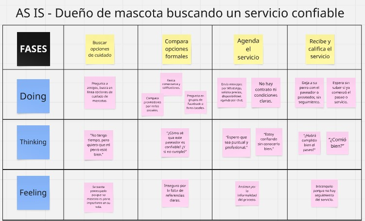

### Escenario As-Is: Carla buscando clientes sin plataforma especializada

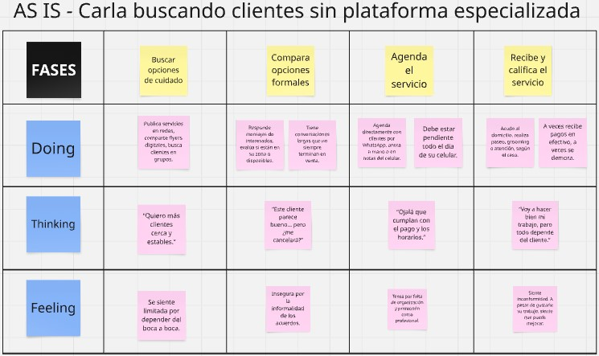

## 2.4. Ubiquitous Language.

| **Término (en inglés)**               | **Término (en español)**               | **Definición**              |
|---------------------------------------|----------------------------------------|-----------------------------|
|     Pet Owner     |     Dueño de mascota    |     Persona que tiene bajo su cuidado uno o más animales domésticos y requiere servicios para su bienestar.    |
|     Service Provider    |    Proveedor de servicios    |    Profesional o empresa que ofrece servicios para mascotas como veterinaria, grooming, paseo, adiestramiento, entre otros.     |
|     Verified Provider     |     Proveedor verificado     |     Profesional que ha sido validado por MascotaMatch mediante documentos y filtros de seguridad para garantizar su confiabilidad.     |
|     Pet Service     |    Servicio para mascotas     |     Cualquier tipo de atención o actividad dirigida al cuidado, salud, higiene o recreación de una mascota.     |
|     Appointment     |     Cita     |     Reserva hecha por un dueño de mascota para que un proveedor brinde un servicio en una fecha y hora determinada.     |
|     Service Rating     |     Calificación del servicio     |     Valoración que un usuario hace sobre la calidad del servicio recibido, basado en su experiencia.     |
|     Subscription Plan     |     Plan de suscripción     |     Modelo de pago recurrente (mensual, trimestral, etc.) que permite a los usuarios acceder a funciones premium de la app.     |
|Location Filter|Filtro de ubicación|Herramienta en la app que permite buscar servicios disponibles según la cercanía geográfica del usuario.|
|Pet Profile|Perfil de mascota|Información registrada de una mascota dentro de la app, incluyendo raza, edad, tamaño, condiciones de salud, etc.|
|Emergency Service|Servicio de emergencia|Atención inmediata brindada por un proveedor ante situaciones críticas de salud o riesgo para la mascota.|
|Trusted Network|Red confiable|Comunidad de proveedores y usuarios verificados que garantiza calidad, seguridad y buenas prácticas.|
|Service History|Historial de servicios|Registro de todas las citas y servicios pasados realizados a través de la plataforma.|
|Availability Schedule|Horario de disponibilidad|Tiempo en el que un proveedor está libre para ofrecer sus servicios y recibir reservas.|
|Customer Review|Reseña del cliente|Opinión escrita por el usuario sobre el proveedor o el servicio, visible para otros usuarios.|
|Pet Care Ecosystem|Ecosistema de cuidado de mascotas|Conjunto de actores, servicios y procesos que intervienen en la atención integral de los animales domésticos.|

# Capítulo III: Requirements Specification

## 3.1. To-Be Scenario Mapping.

-Dueños de Mascotas (Usuario):

-Proveedores Certificados (Veterinarios, Groomers, Paseadores)

  

## 3.2. User Stories 

| Epic / Story ID | Título | Descripción | Criterios de Aceptación | Relacionado con (Epic) |
|:----------------|:-------|:------------|:------------------------|:-----------------------|
| EPIC01 | Landing Page: Portada y Servicios | **Como** visitante nuevo, **Quiero** ver una portada atractiva y entender de inmediato de qué trata el sitio, **Para** decidir navegar en los servicios ofrecidos. |  | - |
| EPIC02 | Planes de Suscripción | **Como** visitante interesado, **Quiero** conocer y comparar los distintos planes de servicio, **Para** elegir el más adecuado para las necesidades de mi mascota. |  | - |
| EPIC03 | Sección de Preguntas Frecuentes (FAQ) | **Como** usuario con dudas, **Quiero** acceder fácilmente a preguntas frecuentes organizadas y claras, **Para** resolver mis dudas rápidamente sin necesidad de asistencia adicional. |  | - |
| EPIC04 | Navegación y estructura general | **Como** visitante del sitio, **Quiero** navegar de manera intuitiva entre secciones principales como Home, Services y FAQ, **Para** encontrar fácilmente lo que busco. |  | - |
| EPIC05 | Registro y Login | **Como** nuevo usuario o visitante, **Quiero** poder registrarme y hacer login de manera sencilla, **Para** proteger el acceso a la landing page y personalizar mi experiencia. |  | - |
| EPIC06 | Diseño Visual y Responsividad | **Como** visitante desde diferentes dispositivos, **Quiero** que el sitio se adapte visualmente a computadoras, tablets y celulares, **Para** tener una experiencia agradable y cómoda desde cualquier lugar. |  | - |
| HU01 | Mensaje de bienvenida visible | Como visitante, quiero ver un mensaje de bienvenida en la portada que me explique qué es MascotaMatch, para entender rápidamente el propósito del sitio. | **ESCENARIO 1:**  Dado que el usuario accede correctamente.  Cuando realiza la acción esperada.  Entonces el visitante ve un título principal que resume el propósito del sitio.  **ESCENARIO 2:**  Dado que el usuario aún no ha interactuado.  Cuando lo intenta por primera vez.  Entonces el sistema muestra un texto explicativo debajo. | EPIC01 |
| HU02 | Botón See Services | Como visitante, quiero hacer clic en el botón "See Services" en la portada para ir directamente a la sección de servicios. | **ESCENARIO 1:**  Dado que el usuario accede correctamente.  Cuando realiza la acción esperada.  Entonces ve el botón debajo del mensaje principal.  **ESCENARIO 2:**  Dado que el usuario aún no ha interactuado.  Cuando lo intenta por primera vez.  Entonces al hacer clic, va a la sección de servicios. | EPIC01 |
| HU03 | Visualizar tarjetas de servicios | Como visitante, quiero visualizar tarjetas de servicios para conocer opciones disponibles para mi mascota. | **ESCENARIO 1:**  Dado que el usuario accede correctamente.  Cuando realiza la acción esperada.  Entonces el sistema muestra 4 servicios claros (paseos, grooming, emergencias, recordatorios).  **ESCENARIO 2:**  Dado que el usuario aún no ha interactuado.  Cuando lo intenta por primera vez.  Entonces las tarjetas contienen imagen, título y descripción breve. | EPIC01 |
| HU04 | Descripción clara de servicios | Como visitante, quiero leer una breve descripción debajo de cada servicio para entender qué incluye y decidir si es relevante para mí. | **ESCENARIO 1:**  Dado que el usuario accede correctamente.  Cuando realiza la acción esperada.  Entonces cada tarjeta contiene un texto de resumen comprensible.  **ESCENARIO 2:**  Dado que el usuario aún no ha interactuado.  Cuando lo intenta por primera vez.  Entonces el sistema se enfoca en el beneficio directo para el cliente. | EPIC01 |
| HU05 | Imágenes representativas en servicios | Como visitante, quiero que cada servicio tenga una imagen visual que lo represente para reconocerlo rápidamente sin leer demasiado texto. | **ESCENARIO 1:**  Dado que el usuario accede correctamente.  Cuando realiza la acción esperada.  Entonces todas las tarjetas tienen íconos claros.  **ESCENARIO 2:**  Dado que el usuario aún no ha interactuado.  Cuando lo intenta por primera vez.  Entonces las imágenes están relacionadas con el servicio. | EPIC01 |
| HU06 | Ver planes de suscripción | Como visitante, quiero visualizar los distintos planes (VIP, Completo, Mini) para comparar opciones y elegir el mejor para mi mascota. | **ESCENARIO 1:**  Dado que el usuario accede correctamente.  Cuando realiza la acción esperada.  Entonces el sistema muestra 3 tarjetas de planes con nombre, imagen y contenido.  **ESCENARIO 2:**  Dado que el usuario aún no ha interactuado.  Cuando lo intenta por primera vez.  Entonces cada plan está diferenciado visualmente. | EPIC02 |
| HU07 | Beneficios por plan en lista | Como visitante, quiero ver los beneficios de cada plan organizados en listas para entender claramente qué incluye cada uno. | **ESCENARIO 1:**  Dado que el usuario accede correctamente.  Cuando realiza la acción esperada.  Entonces cada plan tiene viñetas con beneficios claros.  **ESCENARIO 2:**  Dado que el usuario aún no ha interactuado.  Cuando lo intenta por primera vez.  Entonces las listas permiten comparar fácilmente. | EPIC02 |
| HU08 | Imagen por plan | Como visitante, quiero que cada plan tenga una imagen para diferenciarlo visualmente de los demás. | **ESCENARIO 1:**  Dado que el usuario accede correctamente.  Cuando realiza la acción esperada.  Entonces cada tarjeta de plan tiene una imagen distinta.  **ESCENARIO 2:**  Dado que el usuario aún no ha interactuado.  Cuando lo intenta por primera vez.  Entonces la imagen se ubica en la parte superior de cada plan. | EPIC02 |
| HU09 | Botón Read more en cada plan | Como visitante, quiero hacer clic en un botón 'Read more' para ver una página con información completa sobre ese plan. | **ESCENARIO 1:**  Dado que el usuario accede correctamente.  Cuando realiza la acción esperada.  Entonces debajo de cada plan hay un botón funcional.  **ESCENARIO 2:**  Dado que el usuario aún no ha interactuado.  Cuando lo intenta por primera vez.  Entonces al hacer clic se accede a plan_vip.html, plan_complete.html o plan_mini.html. | EPIC02 |
| HU10 | Acceso a sección FAQ | Como visitante, quiero ver una sección de preguntas frecuentes (FAQ) con íconos y respuestas simples para resolver dudas rápidamente. | **ESCENARIO 1:**  Dado que el usuario accede correctamente.  Cuando realiza la acción esperada.  Entonces hay 6 preguntas frecuentes en tarjetas organizadas.  **ESCENARIO 2:**  Dado que el usuario aún no ha interactuado.  Cuando lo intenta por primera vez.  Entonces cada tarjeta incluye un ícono representativo y texto explicativo. | EPIC03 |
| HU11 | Visualización del logo | Como visitante, quiero ver el logo de MascotaMatch en la parte superior izquierda para confirmar que estoy en el sitio correcto. | **ESCENARIO 1:**  Dado que el usuario accede correctamente.  Cuando realiza la acción esperada.  Entonces el logo está visible en el header.  **ESCENARIO 2:**  Dado que el usuario aún no ha interactuado.  Cuando lo intenta por primera vez.  Entonces el logo se mantiene en todas las páginas. | EPIC04 |
| HU12 | Menú de navegación | Como visitante, quiero tener acceso a un menú con secciones como Home, Services, Plans y FAQ para moverme rápidamente por el sitio. | **ESCENARIO 1:**  Dado que el usuario accede correctamente.  Cuando realiza la acción esperada.  Entonces el menú está en la parte superior.  **ESCENARIO 2:**  Dado que el usuario aún no ha interactuado.  Cuando lo intenta por primera vez.  Entonces cada enlace funciona como ancla a la sección respectiva. | EPIC04 |
| HU13 | Footer con contacto y secciones | Como visitante, quiero ver en el pie de página opciones de contacto, ayuda, distritos y un formulario de correo para comunicarme si necesito más información. | **ESCENARIO 1:**  Dado que el usuario accede correctamente.  Cuando realiza la acción esperada.  Entonces el footer incluye tres columnas con información.  **ESCENARIO 2:**  Dado que el usuario aún no ha interactuado.  Cuando lo intenta por primera vez.  Entonces hay campo para ingresar correo. | EPIC04 |
| HU14 | Pantalla de login obligatoria | Como visitante, quiero iniciar sesión en una pantalla previa para poder ingresar a la landing page y que el contenido esté protegido. | **ESCENARIO 1:**  Dado que el usuario accede correctamente.  Cuando realiza la acción esperada.  Entonces el login está en index.html y es obligatorio.  **ESCENARIO 2:**  Dado que el usuario aún no ha interactuado.  Cuando lo intenta por primera vez.  Entonces no se puede acceder a la landing sin estar logueado. | EPIC05 |
| HU15 | Registrarme si no tengo cuenta | Como visitante, quiero registrarme fácilmente si aún no tengo una cuenta para poder acceder al contenido del sitio. | **ESCENARIO 1:**  Dado que el usuario accede correctamente.  Cuando realiza la acción esperada.  Entonces el login incluye la opción 'register here'.  **ESCENARIO 2:**  Dado que el usuario aún no ha interactuado.  Cuando lo intenta por primera vez.  Entonces el registro permite luego acceder a la landing. | EPIC05 |
| HU16 | Diseño uniforme visualmente agradable | Como visitante, quiero navegar por un sitio con una tipografía, paleta de colores y estilo visual uniforme para sentir confianza y comodidad. | **ESCENARIO 1:**  Dado que el usuario accede correctamente.  Cuando realiza la acción esperada.  Entonces todo el sitio usa fondo degradado azul.  **ESCENARIO 2:**  Dado que el usuario aún no ha interactuado.  Cuando lo intenta por primera vez.  Entonces los botones verdes son consistentes. | EPIC06 |
| HU17 | Visualización responsiva | Como visitante, quiero que el sitio se vea bien en mi computadora o celular para poder explorarlo cómodamente. | **ESCENARIO 1:**  Dado que el usuario accede correctamente.  Cuando realiza la acción esperada.  Entonces el sitio adapta los contenidos a diferentes tamaños.  **ESCENARIO 2:**  Dado que el usuario aún no ha interactuado.  Cuando lo intenta por primera vez.  Entonces las secciones están alineadas y centradas. | EPIC06 |
| HU18 | Acceso a páginas de detalle por plan | Como visitante, quiero poder acceder a una página individual con todos los detalles del plan VIP, Completo o Mini desde su botón “Read more”. | **ESCENARIO 1:**  Dado que el usuario accede correctamente.  Cuando realiza la acción esperada.  Entonces cada plan tiene su página independiente.  **ESCENARIO 2:**  Dado que el usuario aún no ha interactuado.  Cuando lo intenta por primera vez.  Entonces se incluye imagen grande, descripción extensa y lista de beneficios. | EPIC02 |

| User Story ID | Título | Descripción | Criterios de Aceptación |
|:---|:---|:---|:---|
| TS01 | GET servicios disponibles | **Como** desarrollador, **quiero** conectar con la API para obtener los servicios disponibles **para** que el usuario pueda ver las opciones de MascotaMatch. | **Escenario 1:** Dado que accedo a los servicios, Cuando solicito la información, Entonces veo los servicios cargados.  **Escenario 2:** Dado que no hay servicios, Cuando solicito la información, Entonces veo un mensaje indicando que no hay servicios disponibles. |
| TS02 | GET planes de suscripción | **Como** desarrollador, **quiero** conectar con la API para obtener los planes disponibles **para** que el usuario pueda elegir el mejor plan. | **Escenario 1:** Dado que accedo a los planes, Cuando solicito la información, Entonces veo todos los planes disponibles.  **Escenario 2:** Dado que no existen planes, Cuando solicito la información, Entonces recibo un mensaje informativo. |
| TS03 | GET preguntas frecuentes | **Como** desarrollador, **quiero** conectar con la API para obtener las preguntas frecuentes **para** resolver las dudas comunes de los usuarios. | **Escenario 1:** Dado que accedo a las preguntas, Cuando solicito la información, Entonces veo todas las preguntas y respuestas.  **Escenario 2:** Dado que no hay preguntas, Cuando solicito la información, Entonces veo un mensaje indicando que no hay preguntas disponibles. |
| TS04 | POST registro de usuarios | **Como** desarrollador, **quiero** enviar información a la API para registrar nuevos usuarios **para** que puedan crear su cuenta en MascotaMatch. | **Escenario 1:** Dado que un usuario llena sus datos correctamente, Cuando envía su información, Entonces su cuenta se registra exitosamente.  **Escenario 2:** Dado que un usuario llena datos incorrectos, Cuando intenta registrarse, Entonces recibe un mensaje de error. |
| TS05 | POST inicio de sesión de usuarios | **Como** desarrollador, **quiero** enviar información a la API para permitir que los usuarios inicien sesión **para** acceder a sus servicios personalizados. | **Escenario 1:** Dado que un usuario ingresa datos correctos, Cuando envía su acceso, Entonces puede ingresar correctamente.  **Escenario 2:** Dado que un usuario ingresa datos incorrectos, Cuando intenta acceder, Entonces recibe un error de acceso. |
| TS06 | GET perfil de usuario | **Como** desarrollador, **quiero** obtener desde la API la información del perfil del usuario autenticado **para** mostrar sus datos personales en la página. | **Escenario 1:** Dado que el usuario ya ingresó, Cuando accede a su perfil, Entonces ve su nombre, correo y mascotas registradas.  **Escenario 2:** Dado que el usuario no ha ingresado, Cuando intenta ver su perfil, Entonces se le pide iniciar sesión. |
| TS07 | POST agendar citas | **Como** desarrollador, **quiero** enviar información a la API para registrar una cita de servicio para la mascota **para** facilitar la organización de los servicios. | **Escenario 1:** Dado que el usuario llena los datos de cita, Cuando envía la información, Entonces su cita queda registrada.  **Escenario 2:** Dado que el usuario llena los datos de manera incorrecta, Cuando intenta enviar, Entonces ve un mensaje de error. |
| TS08 | GET citas agendadas | **Como** desarrollador, **quiero** obtener desde la API la lista de citas agendadas del usuario **para** que pueda ver sus próximas reservas. | **Escenario 1:** Dado que el usuario tiene citas agendadas, Cuando accede a sus citas, Entonces puede verlas listadas.  **Escenario 2:** Dado que no tiene citas, Cuando accede, Entonces ve un mensaje indicando que no tiene citas. |

## 3.3 Impact Mapping

## 3.4. Product Backlog.

El Product Backlog es una lista priorizada de todas las funcionalidades, mejoras, correcciones y tareas necesarias para desarrollar un producto. Cada ítem del backlog, como las User Stories y Technical Stories, representa algo que aporta valor al proyecto. El backlog se actualiza constantemente y sirve como guía para el equipo, asegurando que se enfoque en construir lo que realmente necesita el usuario o cliente final.

| # Orden | User Story ID | Título | Descripción | Story Points (1/2/3/5/8) |
|:-------:|:-------------:|:------:|:------------|:------------------------:|
| 1 | HU14 | Pantalla de Login obligatoria | Como visitante, deseo iniciar sesión en una pantalla previa para acceder al contenido protegido. | 5 |
| 2 | HU15 | Registrarse si no tiene cuenta | Como visitante, deseo registrarme fácilmente si aún no tengo cuenta para ingresar al contenido. | 5 |
| 3 | HU01 | Mensaje de bienvenida | Como visitante, deseo ver un mensaje de bienvenida para entender rápidamente el propósito del sitio. | 3 |
| 4 | HU02 | Botón See Services | Como visitante, deseo hacer clic en "See Services" para ir directamente a la sección de servicios. | 3 |
| 5 | HU03 | Visualizar tarjetas de servicios | Como visitante, deseo visualizar las tarjetas de servicios ofrecidos para conocer las opciones disponibles. | 5 |
| 6 | HU04 | Descripción clara de servicios | Como visitante, deseo leer una breve descripción debajo de cada servicio para entender qué incluye. | 3 |
| 7 | HU05 | Imágenes representativas de servicios | Como visitante, deseo que cada servicio tenga una imagen visual para reconocerlo rápidamente. | 2 |
| 8 | HU06 | Ver planes de suscripción | Como visitante, deseo visualizar los distintos planes para comparar opciones y elegir el mejor. | 5 |
| 9 | HU07 | Beneficios organizados en lista | Como visitante, deseo ver los beneficios de cada plan organizados en listas para entender qué incluye cada uno. | 3 |
| 10 | HU09 | Botón Read More en cada plan | Como visitante, deseo hacer clic en un botón "Read More" para ver una página con información completa. | 2 |
| 11 | HU18 | Acceso a páginas de detalle por plan | Como visitante, deseo poder acceder a una página individual con todos los detalles del plan. | 3 |
| 12 | HU10 | Acceso a sección FAQ | Como visitante, deseo ver una sección de preguntas frecuentes con íconos y respuestas simples para resolver dudas. | 3 |
| 13 | HU11 | Visualización del logo | Como visitante, deseo ver el logo de MascotaMatch en la parte superior izquierda para confirmar que estoy en el sitio correcto. | 1 |
| 14 | HU12 | Menú de navegación | Como visitante, deseo tener acceso a un menú con secciones principales para moverme rápidamente por el sitio. | 2 |
| 15 | HU13 | Footer con contacto | Como visitante, deseo ver en el pie de página opciones de contacto y ayuda para comunicarme si necesito información. | 2 |
| 16 | HU16 | Diseño uniforme | Como visitante, deseo navegar en un sitio con diseño uniforme para sentir confianza y comodidad. | 2 |
| 17 | HU17 | Visualización responsiva | Como visitante, deseo que el sitio se vea bien en mi computadora o celular para poder explorarlo cómodamente. | 3 |
| 18 | HU08 | Imagen por plan | Como visitante, deseo que cada plan tenga una imagen para diferenciarlo visualmente. | 2 |
| 19 | TS04 | POST Registro de usuario | Como desarrollador, deseo enviar información a la API para registrar nuevos usuarios. | 5 |
| 20 | TS05 | POST Inicio de sesión | Como desarrollador, deseo enviar información a la API para permitir el inicio de sesión. | 5 |
| 21 | TS01 | GET Servicios disponibles | Como desarrollador, deseo conectar con la API para obtener los servicios disponibles. | 3 |
| 22 | TS02 | GET Planes disponibles | Como desarrollador, deseo conectar con la API para obtener los planes de suscripción. | 3 |
| 23 | TS03 | GET Preguntas frecuentes | Como desarrollador, deseo conectar con la API para obtener las preguntas frecuentes. | 2 |
| 24 | TS07 | POST Agendar citas | Como desarrollador, deseo enviar información a la API para registrar una cita de servicio. | 5 |
| 25 | TS08 | GET Citas agendadas | Como desarrollador, deseo obtener desde la API la lista de citas agendadas del usuario. | 3 |
| 26 | TS06 | GET Perfil de usuario | Como desarrollador, deseo obtener desde la API la información del perfil del usuario autenticado. | 3 |

### 4. UX/UI Design

### 4.1 Style Guidelines
### Branding:
MascotaMatch es una plataforma que conecta a dueños de mascotas con profesionales certificados del cuidado animal, y su estilo visual refleja los valores de bienestar, confianza y accesibilidad. El diseño busca inspirar tranquilidad y cercanía, utilizando una interfaz limpia, moderna y emocionalmente cálida. Con una paleta de colores suaves y elementos ilustrativos amigables, la aplicación facilita la navegación, la toma de decisiones y la conexión con los servicios esenciales para el bienestar de las mascotas.

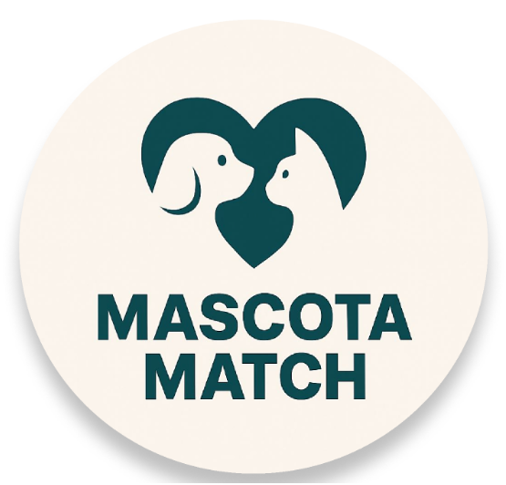

### Typography:
Se utiliza la tipografía "Nunito", una fuente redondeada, amigable y altamente legible. Su estructura moderna y fluida se adapta perfectamente a textos largos, botones y encabezados. Además, brinda una experiencia visual cómoda y cercana, ideal para transmitir confianza y afecto. En algunos casos, se combina con "Inter" para contenidos secundarios o informativos.

  
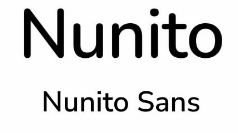

### Colors:
Para nuestra versión de  landing page hemos utilizado un fondo azul degradado que transmite calma y profesionalismo, combinado con acentos en verde neón que llaman la atención de forma positiva.

### Principal:
#3B82F6 – Azul Claro: fondo principal de la hero section.

#34D399 – Verde Menta: botones y llamados a la acción

### Fondo:
#FFFFFF – Blanco: áreas de contenido y tarjetas.

#F3F4F6 – Gris muy claro: fondo alternativo y separación sutil.

.png)

.png)

### Detalles:
#111827 – Gris oscuro: texto principal y títulos.

#6366F1 – Azul/violeta para íconos y detalles informativos.

#2563EB – Azul secundario para navegación y resaltes.

.png)

### Tone of Communication:
El tono de MascotaMatch es positivo, empático y claro, adaptándose según la sección:

Informativo y directo en preguntas frecuentes y descripciones de planes.

Motivador y cálido en los llamados a la acción y presentación de servicios.

Tranquilizador y profesional en servicios como urgencias veterinarias.

  
### 4.1.2. Web Style Guidelines

La web de MascotaMatch está enfocada en ser una entrada clara y amigable para el usuario. Utiliza una landing con estructura simple, encabezado directo, visual principal con mascota, CTA visible (“See Services”) y tarjetas explicativas de servicios. Los planes están presentados con imágenes reales que aportan confianza, mientras que las preguntas frecuentes usan íconos grandes y textos concretos para resolver dudas comunes.

En el diseño de la web se evita la sobrecarga de contenido y se prioriza la jerarquía visual a través del uso de espacios amplios, tarjetas modulares y una navegación intuitiva. La estructura está pensada para acompañar al usuario paso a paso, facilitando la comprensión de los planes de suscripción, servicios disponibles y preguntas frecuentes.
La página de inicio (landing page) cumple una función de presentación general: presenta el valor diferencial de la plataforma, sus beneficios clave, y los distintos planes con imágenes amigables y testimonios visuales. Aunque la funcionalidad completa de MascotaMatch se encuentra en la app, la web sirve como vitrina digital que guía al usuario hacia su descarga y registro.

### Características destacadas:

Navegación superior clara (Home, Services, Plans, FAQ).

Fondo degradado azul que da identidad y profundidad visual.

Botones verdes para destacar acciones clave.

Uso de íconos ilustrativos y fotografía humana para conexión emocional.

Footer organizado por secciones útiles (ayuda, contacto, distritos).

## 4.2 Information Architecture
La arquitectura de la información de MascotaMatch ha sido diseñada para ofrecer una experiencia clara, fluida y accesible, enfocada en conectar a dueños de mascotas con profesionales certificados. La organización y etiquetado del contenido permite guiar a los usuarios desde su ingreso hasta la elección de servicios y planes, priorizando la simplicidad, personalización y bienestar animal. Esta arquitectura se implementa mediante jerarquías visuales limpias, categorización por secciones, acciones intuitivas y navegación orientada a la acción.

### 4.2.1 Organization Systems

El sistema de organización de MascotaMatch ha sido diseñado para brindar una experiencia intuitiva y eficiente, diferenciando las necesidades de dos tipos de usuarios: dueños de mascotas (clientes) y profesionales del cuidado animal (proveedores). Aunque ambas audiencias acceden a secciones similares, el enfoque y la funcionalidad varían según el tipo de usuario.

#### Dueños de Mascotas

Los usuarios acceden a una interfaz centrada en la salud y el cuidado de su mascota. Se utiliza una estructura jerárquica que resalta primero la información más relevante, como los servicios disponibles, los recordatorios de salud y el historial de atenciones.

- **Inicio:** Se presenta una organización matricial con módulos visuales a un mismo nivel: servicios destacados, próximos recordatorios, acceso a cuidadores y planes activos. Cada bloque tiene una función clara, y su distribución facilita la navegación.
- **Planes:** Visualización jerárquica. Muestra los planes disponibles con beneficios específicos y permite su comparación directa. La organización prioriza la elección rápida mediante botones de acción.
- **Servicios contratados:** Organización secuencial. Lista los servicios contratados y programados, incluyendo detalles como fecha, tipo de servicio y profesional asignado.
- **Historial del animal:** Organización cronológica, con acceso al historial de vacunación, chequeos y notas del profesional. Se prioriza lo más reciente.
- **FAQ / Emergencias:** Organización por temas frecuentes. Se destacan preguntas sobre funcionamiento del servicio, cambios de plan y asistencia en emergencias.

#### Proveedores

El módulo para proveedores está centrado en la gestión operativa y profesional. Se aplica una estructura organizativa matricial para facilitar la administración de servicios, agenda y formación continua.

- **Agenda diaria:** Vista visual tipo calendario, organizada por zonas y horas. Permite una rápida visualización de citas próximas y servicios a brindar.
- **Perfil profesional:** Organización jerárquica. Sección destacada con información pública del proveedor, servicios ofrecidos y puntuación recibida.
- **Clientes asignados:** Organización secuencial. Lista de mascotas y dueños asignados, con opciones para ver historial o contactar.
- **Capacitación:** Organización temática por niveles. Acceso a módulos según la categoría del proveedor (groomer, paseador, veterinario).
- **Bonos y beneficios:** Vista de recompensas, promociones internas y medallas por desempeño. Organización visual tipo tarjetas.

### 4.2.2 Labeling Systems

Las etiquetas usadas en la plataforma priorizan la claridad, simplicidad y orientación a la acción. Se evita el uso de términos técnicos, optando por palabras clave comprensibles y directas.

#### Landing Page

| Etiqueta         | Descripción                                                                 |
|------------------|------------------------------------------------------------------------------|
| Home             | Presenta la propuesta de valor general y acceso a servicios                  |
| Services         | Acceso directo a los cuatro servicios principales de la app                  |
| Plans            | Visualización de los planes disponibles, con descripción y botón de acción   |
| FAQ              | Sección de preguntas frecuentes sobre el uso del servicio                    |
| See Services     | Botón CTA para navegar a la sección de servicios                             |
| Read more        | Botones para expandir información de cada plan                               |
| Contact Support  | Campo para ingresar correo y enviar consulta                                 |
| Login / Register | Accesos rápidos para crear cuenta o iniciar sesión                           |

#### Interfaces Login / Register

| Etiqueta     | Descripción                                     |
|--------------|--------------------------------------------------|
| Email        | Campo de ingreso para correo electrónico         |
| Password     | Campo de ingreso para contraseña                 |
| Login        | Botón de acceso para usuarios registrados        |
| Register     | Botón para crear cuenta                          |
| Register here / Login | Enlaces alternos para navegar entre ambas interfaces |

### 4.2.3 SEO Tags and Meta Tags

**Landing Page**
- **Title:** MascotaMatch – Cuida a tu mascota con profesionales certificados
- **Meta Description:** Plataforma integral de servicios para mascotas. Conecta con veterinarios, paseadores y groomers cerca de ti. Suscríbete al plan que mejor se adapte a ti.
- **Keywords:** mascotas, veterinarios, paseadores, cuidado de mascotas, planes para mascotas, grooming, servicios para mascotas Perú
- **Author:** MascotaMatch Team

**Planes**
- **Title:** Planes MascotaMatch – Encuentra el cuidado ideal para tu mascota
- **Meta Description:** Compara planes y accede a beneficios como atención veterinaria, paseos, grooming y emergencias 24/7.
- **Keywords:** planes de mascotas, atención veterinaria, paseos de perros, suscripción mascotas, MascotaMatch

**Servicios**
- **Title:** Servicios MascotaMatch – Paseos, Chequeos, Grooming y Emergencias
- **Meta Description:** Descubre todos los servicios incluidos en tu suscripción mensual. Cuidado integral para tu mascota con expertos certificados.
- **Keywords:** paseos seguros, grooming mascotas, veterinario domicilio, atención de emergencias para mascotas

### 4.2.4 Searching Systems

| Filtro            | Descripción                                                                 |
|-------------------|------------------------------------------------------------------------------|
| Buscar en FAQ     | Permite ingresar palabras clave relacionadas a suscripciones, cancelaciones o servicios |
| Filtrar por Plan  | Permite ver únicamente los beneficios asociados al plan seleccionado (VIP, Complete, Mini) |
| Buscar Servicio   | Navegación rápida por los servicios destacados (Paseos, Chequeos, Grooming, Emergencias) |

### 4.2.5 Navigation Systems

El sistema de navegación de MascotaMatch ha sido diseñado para facilitar el recorrido del usuario tanto en la landing page como dentro de la aplicación, garantizando una experiencia fluida, clara y centrada en el cumplimiento de objetivos. La navegación se basa en principios de diseño centrado en el usuario y estructuras modernas que aseguran accesibilidad, claridad y bajo esfuerzo cognitivo.

#### Landing Page

- **Estructura:** Presentación general de MascotaMatch con llamada a la acción visible, acceso a servicios, planes, preguntas frecuentes y contacto.
- **Incluye acceso rápido a:**
  - Registro / Inicio de sesión
  - Servicios destacados
  - Comparación de planes disponibles
  - Preguntas frecuentes (FAQ)
  - Contacto / soporte
- **Acción del Usuario:** Explorar contenido, comparar opciones y tomar decisiones como registrarse, consultar servicios o resolver dudas.

#### Aplicación Web – Clientes

- **Inicio:**
  - Muestra servicios activos, recordatorios próximos y acceso rápido a cuidadores.
  - Organización matricial con tarjetas de acción.
- **Planes:**
  - Vista jerárquica con opciones comparativas.
  - Botón de contratación rápida.
- **Historial de mascota:**
  - Lista cronológica con información médica y servicios pasados.
- **Emergencias:**
  - Acceso directo desde el menú principal, disponible en todo momento.

#### Aplicación Web – Proveedores

- **Inicio:**
  - Vista resumida del día: citas próximas, zonas asignadas y alertas.
- **Agenda:**
  - Calendario semanal organizado por hora y tipo de servicio.
- **Clientes asignados:**
  - Lista detallada por día, con accesos al historial del animal.
- **Perfil profesional:**
  - Navegación hacia configuraciones, reputación pública y certificaciones.
- **Bonos / Recompensas:**
  - Acceso a promociones y beneficios organizados por categorías.

## 4.3. Landing Page UI Design

El diseño de la landing page de MascotaMatch se enfocó en ofrecer una experiencia clara, accesible y centrada en el bienestar animal, dirigida tanto a dueños de mascotas como a profesionales del cuidado animal. Se organizó el contenido siguiendo principios de jerarquía visual, arquitectura de la información orientada a la acción y experiencia de usuario intuitiva. Cada sección está diseñada para reforzar la propuesta de valor de MascotaMatch: facilitar el acceso a servicios de calidad para mascotas urbanas.

## 4.3.1. Landing Page Wireframe

La navegación principal está compuesta por secciones clave: Home, Services, Plans, FAQ y Contact Support, complementadas con botones visibles de Login y Register, permitiendo que los usuarios accedan fácilmente a sus cuentas o se registren según su necesidad. Cada sección fue estructurada para responder preguntas esenciales del usuario: primero entender qué ofrece MascotaMatch, luego qué servicios están disponibles y cómo suscribirse.

### Desktop Web Browser

Se presentan las siguientes secciones:

- **Navbar:** Fijo en la parte superior con acceso directo a Home, Services, Plans, FAQ, y botones de Login/Register.
- **Hero Section:** Mensaje central con un eslogan claro (“Comprehensive care for your pet”), imagen representativa (un perro) y botón de llamada a la acción ("See Services").

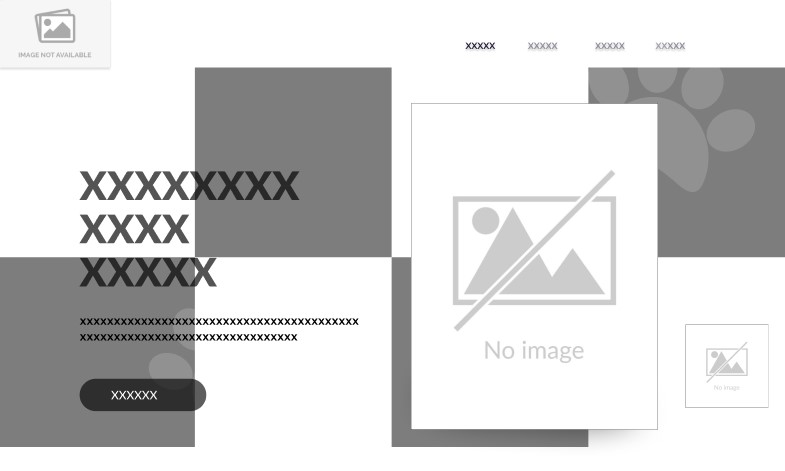

- **Our Services:** Cards o bloques visuales que describen los servicios clave (Safe Walks, Veterinary Check-Ups, Grooming, Emergencies) acompañados de íconos ilustrativos y texto breve.

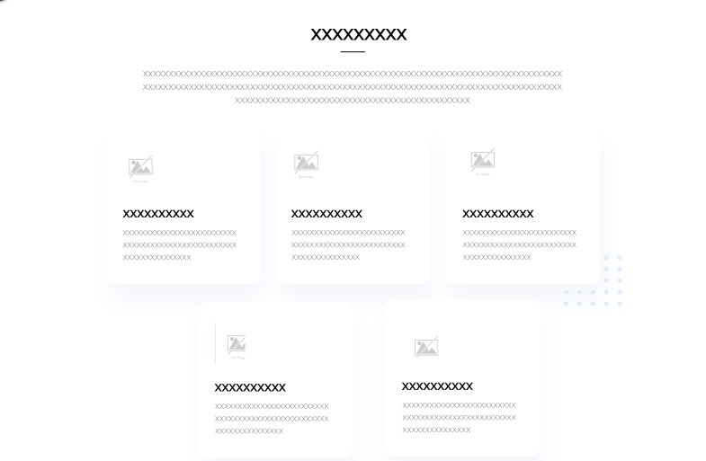

- **Plans Section:** Presenta los planes disponibles (VIP Plan, Complete Plan, Mini Plan) en tarjetas visuales con breve descripción de beneficios y botones para "Read more".

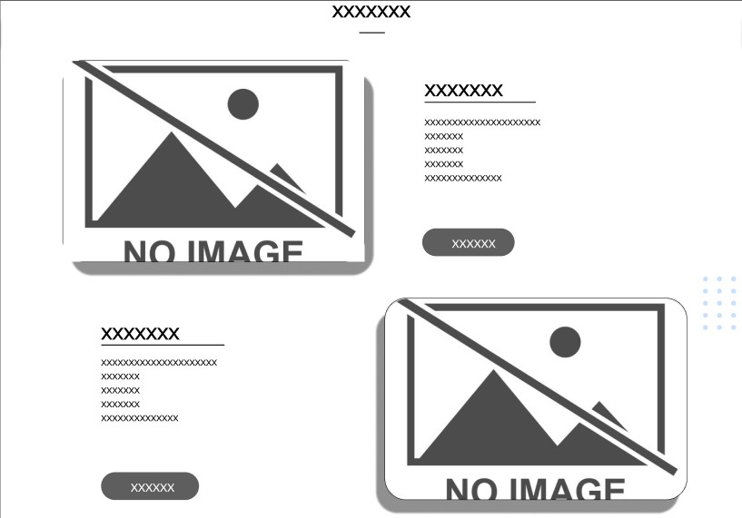

- **FAQ Section:** Cards individuales que responden a preguntas frecuentes relevantes sobre servicios, suscripciones, cambios de plan y emergencias veterinarias.

- **Contact Support:** Formulario simple para ingresar un correo electrónico y solicitar asistencia directa.

- **Footer:** Información básica de la empresa, zonas de cobertura (Surquillo, San Borja, San Isidro) y enlaces rápidos de ayuda.

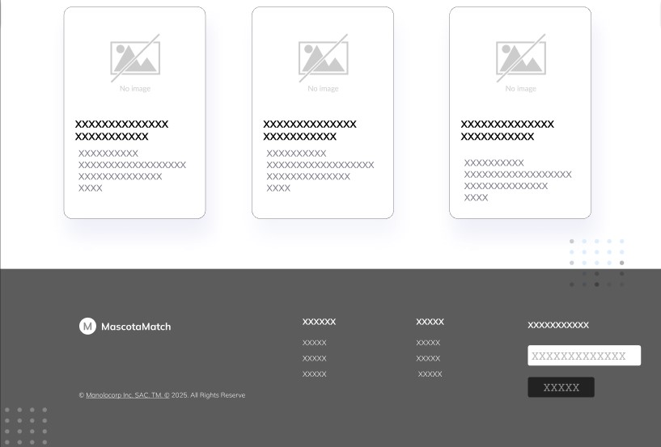

## 4.3.2. Landing Page Mock-up
El mock-up de la landing page de MascotaMatch presenta una interfaz limpia, moderna y funcional, organizada en una estructura vertical con navegación fija superior. Las secciones Home, Services, Plans y FAQs se muestran claramente en el navbar, acompañadas de botones visibles para Login y Register.

Visualmente se usaron colores frescos (degradado celeste), tipografías legibles y gráficos amigables que refuerzan la identidad de MascotaMatch como plataforma confiable para el cuidado de mascotas. La paleta clara y los accesos rápidos mejoran la experiencia del usuario.

### Desktop Web Browser

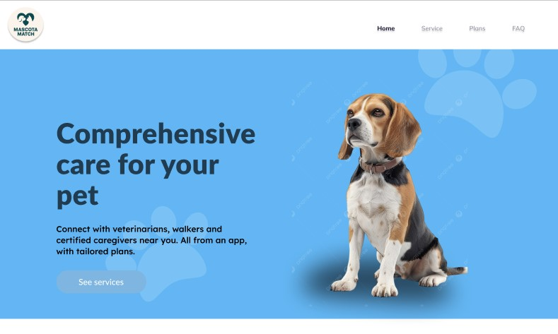
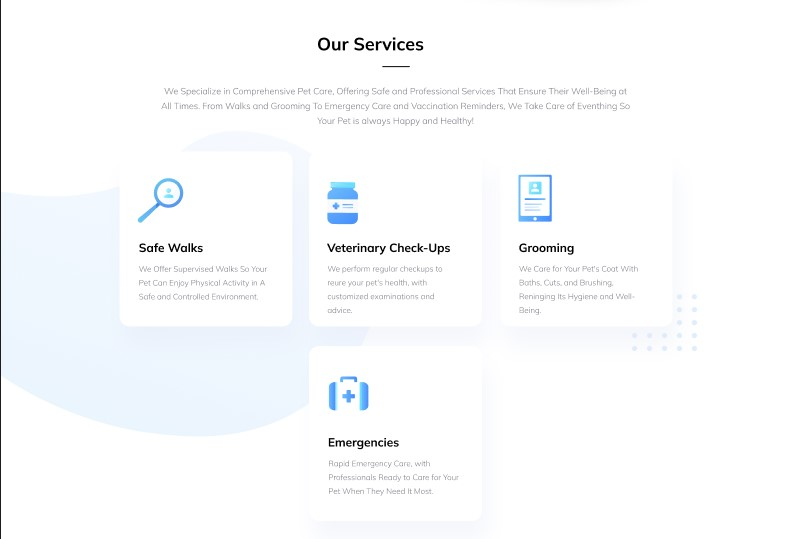
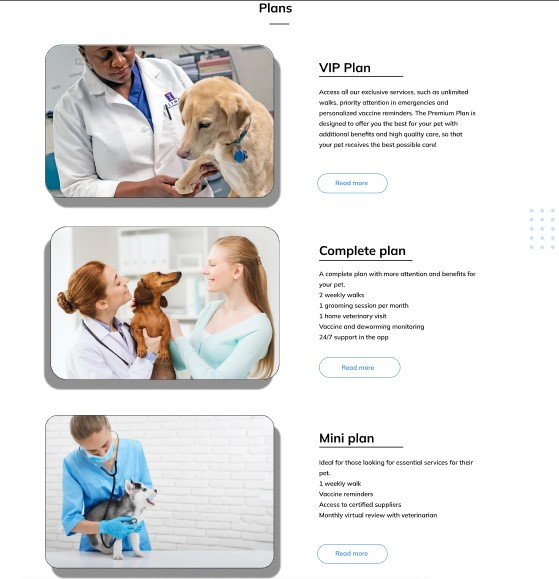
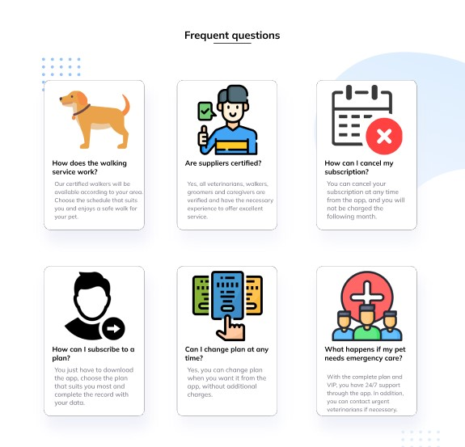
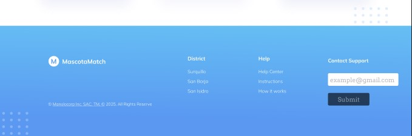

## 4.4.1 Web Applications Wireframes

### Iniciar sesión
- Para iniciar sesión en la aplicación, los usuarios que ya se hayan registrado deberán proporcionar la información requerida para verificar su identidad.

  
 

### Registrarse
- La imagen muestra la sección de "registro de Mascota Match", donde los usuarios ingresarán la información para crear su cuenta y disfrutar de los beneficios de Mascota Match.

  

### Pantalla principal
- La imagen muestra la sección de pantalla principal, donde los usuarios podrán navegar brevemente por el espacio mostrado.

  

### Nuestros servicios
- La imagen muestra la sección de nuestros servicios, donde el usuario podrá ver los servicios que podemos ofrecerle como empresa.

  

### Planes
- La imagen muestra la sección de nuestros planes, donde el usuario podrá ver los planes que podemos ofrecerle como empresa para una mejor atención.

  

### Preguntas Frecuentes
- La imagen muestra la sección de preguntas frecuentes, donde el usuario podrá ver las preguntas frecuentes que tienen otros usuarios y resolver sus dudas.

  

### 4.4.2. Web Applications Wireflow Diagrams.

## User Goal:

Como usuario, quiero registrarme fácilmente en la aplicación, colocando mi nombre, apellidos, correo electrónico y contraseña para validar mi identidad. De esta manera, crear una cuenta que me permita navegar de forma rápida y segura. Además, me gustaría poder registrarme con las cuentas de otras plataformas que suelo utilizar.

## Happy Path:

### 1.	Pantalla de Inicio:
   
o	El usuario abre la aplicación Mascota Match.

o	Visualiza la paleta de colores y el logo de la aplicación.

o	Se presentan los campos "Email" y "Contraseña" para iniciar sesión.

o	Se visualizan los botones principales: "Iniciar Sesión" y "Registrarse".

o	Interpretación del wireframe: Se infiere la presencia de estos elementos, aunque no estén explícitamente etiquetados como botones en el primer recuadro.

### 2.	Pantalla de Registro:
   
o	El usuario selecciona el botón "Registrarse".

o	Es dirigido a una nueva pantalla con los campos: "Nombre", "Apellidos", "Email" y "Contraseña".

o	El usuario llena todos los datos solicitados correctamente.

o	Oprime el botón "Registrarse".

o	Interpretación del wireframe: El tercer recuadro muestra claramente estos campos y el botón "Register".

### 3.	Pantalla de Confirmación de Registro:
   
o	Una vez que el usuario oprime el botón "Registrarse" con la información válida, la aplicación muestra un mensaje de confirmación.

o	Interpretación del wireframe: El cuarto recuadro muestra una ventana emergente superpuesta que indica “Registration successful Please check your email to verify your account." y un botón "Close".

## Unhappy Path:

### 1.	Errores en el Registro:
   
o	Campos Vacíos: El usuario intenta registrarse dejando campos obligatorios vacíos (Nombre, Apellidos, Email o Contraseña). La aplicación muestra un mensaje de error indicando qué campos deben ser completados.

o	Interpretación del wireframe: No se visualizan mensajes de error específicos en el wireframe, pero se infiere su necesidad para una correcta validación.

o	Formato de Email Inválido: El usuario ingresa un correo electrónico con un formato incorrecto. La aplicación muestra un mensaje de error indicando el formato esperado.

o	Interpretación del wireframe: Similar al caso anterior, se infiere la necesidad de esta validación.

o	Contraseñas no Coinciden (si aplica): Si hubiera un campo de "Confirmar Contraseña" (que no se visualiza en el wireframe), y las contraseñas no coinciden, la aplicación mostraría un mensaje de error.

o	Interpretación del wireframe: No aplica directamente, pero es un escenario común en registros.

o	Email ya Registrado: El usuario intenta registrarse con un correo electrónico que ya existe en la base de datos. La aplicación muestra un mensaje indicando que el email ya está registrado y puede iniciar sesión o solicitar recuperar su contraseña.

o	Interpretación del wireframe: No se visualiza este mensaje, pero es crucial para la gestión de cuentas.

### 2.	Errores al Iniciar Sesión:

o	Email o Contraseña Incorrectos: El usuario ingresa un email o contraseña incorrectos. La aplicación muestra un mensaje de error indicando que las credenciales son inválidas y le pide que intente nuevamente o recupere su contraseña.

o	Interpretación del wireframe: El segundo recuadro muestra un mensaje "Invalid credentials. Please try again." junto a un botón "Forgot?" (¿Olvidó su contraseña?).

## User Goal:

Como usuario, quiero explorar los servicios ofrecidos por Mascota Match y seleccionar un plan de cuidado para mi mascota que se ajuste a mis necesidades, para así asegurar su bienestar integral.

## Happy Path:

### 1.	Pantalla de Inicio (Desktop - 5):

o	El usuario accede a la página principal de Mascota Match en su navegador de escritorio.

o	Visualiza el logo de Mascota Match en la esquina superior izquierda.

o	Observa el título principal "Cuidado integral para tu mascota" y un texto descriptivo sobre los servicios ofrecidos.

o	Ve una imagen destacada de una mascota (un beagle).

o	Interactúa con el botón de llamada a la acción "Ver servicios".

### 2.	Pantalla de Nuestros Servicios (Desktop - 6):

o	Al hacer clic en "Ver servicios", el usuario es redirigido a la sección "Our Services".

o	Visualiza un menú con diferentes categorías de servicios: "Safe Walks", "Veterinary Check-ups", "Grooming", y otros (parcialmente visibles).

o	Explora brevemente las descripciones de cada servicio.

o	Interactúa con el botón "Ver planes" ubicado en la parte inferior de la sección de servicios.

### 3.	Pantalla de Planes (Desktop - 7):

o	Al hacer clic en "Ver planes", el usuario llega a la sección "Plans".

o	Visualiza diferentes planes de suscripción: "VIP Plan", "Premium Plan", y "Basic Plan".

o	Lee la descripción de los beneficios incluidos en cada plan.

o	Selecciona el botón "Ver más" o similar asociado a un plan específico que le interesa (por ejemplo, el "VIP Plan").

### 4.	Detalle del Plan (Interpretado de la flecha hacia la derecha):

o	Al hacer clic en "Ver más", el usuario accede a una página o sección con información detallada del plan seleccionado.

o	Interpretación: Aunque la pantalla específica no se muestra, se infiere que aquí encontrará precios, coberturas completas, términos y condiciones, y posiblemente un botón para contratar el plan.

## Unhappy Path:

### 1.	Navegación sin Acción:

o	El usuario accede a la página de inicio pero no hace clic en el botón "Ver servicios" y abandona la página.

o	El usuario accede a la sección "Our Services" pero no encuentra un servicio que le interese o no hace clic en "Ver planes".

o	El usuario accede a la sección "Plans" pero no encuentra un plan adecuado para su mascota o no hace clic en "Ver más" en ningún plan.

### 2.	Información Insuficiente en la Vista General:

o	Las descripciones de los servicios en la pantalla "Our Services" son demasiado breves y no proporcionan suficiente información para que el usuario decida explorar los planes.

o	Las descripciones de los planes en la pantalla "Plans" son vagas y no resaltan los beneficios clave, lo que impide que el usuario haga clic en "Ver más".

### 3.	Falta de Claridad en los Botones:

o	Los botones de llamada a la acción ("Ver servicios", "Ver planes", "Ver más") no son lo suficientemente llamativos o claros en su propósito, lo que dificulta la navegación del usuario.

### 4.	Errores de Carga o Rendimiento:

o	La página web tarda demasiado en cargar, lo que frustra al usuario y lo lleva a abandonar el sitio.

o	Las imágenes de las mascotas o los iconos de los servicios no se cargan correctamente, afectando la experiencia visual.

## User Goal:

Como usuario que ha explorado los planes, quiero revisar los detalles específicos de un plan de cuidado para mascotas (Complete Plan o Vive Plan) para comprender sus beneficios y decidir si se ajusta a las necesidades de mi mascota.
Happy Path:

### 1.	Selección del Plan (Asumiendo desde la pantalla anterior - Desktop 7):

o	El usuario, desde la pantalla de "Plans", hace clic en el botón "Ver más" o similar asociado a uno de los planes que le interesa: "Complete Plan" (Desktop - 9) o "Mini Plan" (Desktop - 10).

### 2.	Visualización de Detalles del "Complete Plan" (Desktop - 9):

o	El usuario es dirigido a la página de detalles del "Complete Plan".

o	Observa el nombre del plan: "Complete Plan" y su precio: "$199.90/month".

o	Lee la "Full description" del plan, que detalla los servicios y el enfoque del cuidado integral (revisiones regulares, vacunación, apoyo 24/7, etc.).

o	Revisa la sección de "Included Benefits", que lista específicamente los servicios incluidos (dos walks al mes, grooming básico, chequeos virtuales, etc.).

### 3.	Visualización de Detalles del "Mini Plan" (Desktop - 10):

o	El usuario es dirigido a la página de detalles del "Mini Plan".

o	Observa el nombre del plan: "Mini Plan" y su precio: "$94.90/month".

o	Lee la "Full description" del plan, que describe un enfoque en el bienestar mental y físico, consultas virtuales y soporte.

o	Revisa la sección de "Included Benefits", que lista los servicios incluidos (walks según necesidad, soporte mental y emocional, consultas virtuales, etc.).

### 4.	Decisión (Implícita):

o	Después de revisar los detalles y los beneficios incluidos en uno de los planes (o comparando ambos), el usuario tiene la información necesaria para decidir si desea contratar ese plan o volver a la lista de planes.

o	Interpretación: Aunque no se visualiza un botón de "Contratar" en estas pantallas, se asume que estaría presente o que el usuario tendría una forma de avanzar para la contratación.

## Unhappy Path:

### 1.	Información Insuficiente o Poco Clara:

o	La descripción completa del plan no es lo suficientemente clara o detallada para que el usuario comprenda completamente los servicios ofrecidos.

o	Los beneficios incluidos no están bien explicados o son ambiguos.

o	El usuario no puede entender la diferencia clave entre los planes "Complete" y "Vive" basándose en la información proporcionada.

### 2.	Precio Considerado Alto:

o	El precio mensual de alguno de los planes (o ambos) es percibido como demasiado elevado por el usuario en relación con los beneficios ofrecidos o su presupuesto.

### 3.	Beneficios No Relevantes:

o	Los beneficios incluidos en un plan específico no son relevantes para las necesidades particulares de la mascota del usuario. Por ejemplo, si el usuario no necesita paseos, un plan que los incluye como beneficio principal puede no ser atractivo.

### 4.	Falta de Opción de Personalización:

o	El usuario puede sentir que los planes son demasiado rígidos y no se adaptan a las necesidades específicas de su mascota, y no encuentra opciones para personalizar o añadir servicios adicionales.

### 5.	Ausencia de Llamada a la Acción Clara:

o	La falta de un botón visible de "Contratar", "Seleccionar este plan" o similar en estas pantallas podría generar confusión en el usuario sobre cómo proceder si desea adquirir el plan.

## User Goal:

Como usuario con dudas sobre los servicios, suscripciones o planes de Mascota Match, quiero encontrar respuestas rápidas a mis preguntas frecuentes para aclarar mis inquietudes y poder tomar una decisión informada.

## Happy Path:

### 1.	Acceso a la Sección de Preguntas Frecuentes:

o	El usuario navega hasta la sección de "Frequently Asked Questions" (Preguntas Frecuentes), ya sea a través de un enlace en el pie de página, en la página de planes, o en otra sección relevante del sitio web.

o	Interpretación del wireframe: La pantalla Desktop - 11 muestra directamente esta sección.

### 2.	Visualización de las Preguntas Frecuentes:

o	El usuario observa una lista de preguntas comunes presentadas de forma clara y organizada. Las preguntas visibles incluyen: 

	"¿How does the walking service work?" (¿Cómo funciona el servicio de paseo?)

	"¿Are suppliers certified?" (¿Están certificados los proveedores?)

	"¿How can I cancel my subscription?" (¿Cómo puedo cancelar mi suscripción?)

	"¿How can I subscribe to a plan?" (¿Cómo puedo suscribirme a un plan?)

	"¿Can I change plans at any time?" (¿Puedo cambiar de plan en cualquier momento?)

	"¿What happens if my pet needs emergency care?" (¿Qué sucede si mi mascota necesita atención de emergencia?)

### 3.	Selección de una Pregunta:

o	El usuario identifica una pregunta que coincide con su duda y hace clic en ella.

### 4.	Visualización de la Respuesta:

o	Al hacer clic en la pregunta, se despliega o se muestra la respuesta concisa debajo de la pregunta. Por ejemplo, para "¿How does the walking service work?", se ofrece una breve explicación sobre la programación, los walks seguros y los reportes.

### 5.	Resolución de la Duda (Implícito):

o	El usuario lee la respuesta y encuentra la información que necesitaba para aclarar su duda. Esto le permite sentirse más seguro para continuar explorando los planes o contactar con soporte si su pregunta no fue respondida.

## Unhappy Path:

### 1.	Pregunta No Encontrada:

o	La pregunta específica del usuario no se encuentra dentro de la lista de preguntas frecuentes.

### 2.	Respuesta Insuficiente o Poco Clara:

o	La respuesta proporcionada a una pregunta es demasiado breve, ambigua o no aborda completamente la inquietud del usuario.

### 3.	Dificultad para Encontrar la Sección de FAQ:

o	El enlace o la forma de acceder a la sección de "Frequently Asked Questions" no es intuitiva o está oculta en la navegación del sitio.

### 4.	Formato o Diseño Poco Amigable:

o	La presentación de las preguntas y respuestas es confusa, con mucho texto o sin una jerarquía clara, lo que dificulta la lectura y la búsqueda de información.

### 5.	Falta de Opción de Contacto Directo:

o	Si la pregunta del usuario no está en la lista de FAQ, no se ofrece una forma clara y visible de contactar directamente con el soporte al cliente desde esta sección (aunque se visualiza información de "Contact Support" en el pie de página).

### 6.	Información Desactualizada:

o	Las respuestas proporcionadas en la sección de FAQ están desactualizadas y no reflejan los procesos o políticas actuales de Mascota Match.

## 4.4.2 Web Applications Mock-ups

### Iniciar sesión
- Para iniciar sesión en la aplicación, los usuarios que ya se hayan registrado deberán proporcionar la información requerida para verificar su identidad.
  

	

### Registrarse
- La imagen muestra la sección de "registro de Mascota Match", donde los usuarios ingresarán la información para crear su cuenta y disfrutar de los beneficios de Mascota Match.

### Pantalla principal
- La imagen muestra la sección de pantalla principal, donde los usuarios podrán navegar brevemente por el espacio mostrado.

### Nuestros servicios
- La imagen muestra la sección de nuestros servicios, donde el usuario podrá ver los servicios que podemos ofrecerle como empresa.

### Planes
- La imagen muestra la sección de nuestros planes, donde el usuario podrá ver los planes que podemos ofrecerle como empresa para una mejor atención.

  

### Preguntas Frecuentes
- La imagen muestra la sección de preguntas frecuentes, donde el usuario podrá ver las preguntas frecuentes que tienen otros usuarios y resolver sus dudas.

### 4.4.3 Web Applications User Flow Diagrams.

### User Goal: Iniciar Sesión

### User Persona: Usuario

Explicación del flujo: El proceso de inicio de sesión se inicia cuando el usuario intenta acceder a la aplicación, lo que requiere el llenado de sus credenciales. El sistema verifica estos datos ingresados y, si son correctos, confirma la identidad del usuario, permitiéndole el acceso a la pantalla principal. En caso de que la verificación falle debido a credenciales incorrectas o inexistentes, el sistema indica al usuario que debe pasar por el proceso de registro para crear una nueva cuenta.

### 🟩 Happy Path (Desde "Iniciar sesión"):

1.	El usuario accede a la opción de "Iniciar sesión".
   
2.	Realiza el "Relleno de datos" con sus credenciales correctas (usuario/email y contraseña).
   
3.	El sistema "Verifica los datos ingresados" y los encuentra válidos.
   
4.	La condición "Confirma los datos" es "Sí".
   
5.	"Le muestra la pantalla principal" al usuario.

### 🟩 Unhappy Path (Desde "Iniciar sesión"):

1.	El usuario accede a la opción de "Iniciar sesión".
   
2.	Realiza el "Relleno de datos" con credenciales incorrectas o correspondientes a una cuenta inexistente.
   
3.	El sistema "Verifica los datos ingresados" y no encuentra una coincidencia válida.
   
4.	La condición "Confirma los datos" es "No".
   
5.	El usuario es dirigido a "Debe pasar por la parte del registro".

### User Goal: Registro

### User Persona: Usuario

Explicación del flujo: El proceso de registro se inicia cuando un usuario accede a la opción de "Registro". A continuación, se le solicita el "Relleno de datos", donde deberá ingresar la información necesaria para crear una cuenta. El sistema luego "Verifica si ya tiene una cuenta existente" utilizando los datos proporcionados. Si el sistema "Confirma los datos" y determina que ya existe una cuenta asociada a esa información ("sí"), "Lo lleva a la página del login para que pueda entrar". Si, por el contrario, no se encuentra una cuenta existente ("no"), el sistema "Rellena sus datos, se registra y lo manda al login para ingresar su cuenta y mostrar la página principal". En resumen, el flujo permite tanto a usuarios nuevos registrarse y ser dirigidos al inicio de sesión, como a usuarios existentes ser redirigidos directamente a la página de inicio de sesión si sus datos ya están en el sistema.

### 🟩 Happy Path (Desde "Inicio de la opción Registro"):

1.	El usuario accede a la opción de "Registro".
   
2.	Realiza el "Relleno de datos" con la información requerida para crear una nueva cuenta.
   
3.	El sistema "Verifica si ya tiene una cuenta existente" con los datos proporcionados y determina que no existe una cuenta.
   
4.	La condición implícita (¿Cuenta existente?) es "No".
   
5.	El sistema "Rellena sus datos, se registra y lo manda al login para ingresar su cuenta y mostrar la página principal".

### 🟩 Unhappy Path (Desde "Inicio de la opción Registro"):

1.	El usuario accede a la opción de "Registro".
   
2.	Realiza el "Relleno de datos" con información que ya está asociada a una cuenta existente en el sistema.
   
3.	El sistema "Verifica si ya tiene una cuenta existente" y determina que sí existe una cuenta con esos datos.
   
4.	La condición implícita (¿Cuenta existente?) es "Sí".
   
5.	"Lo lleva a la página del login para que pueda entrar" (implicando que debe iniciar sesión con su cuenta existente en lugar de crear una nueva).

### 🟩 Happy Path (Desde "Inicio de la opción Registro"):

1.	El usuario accede a la opción de "Registro".
   
2.	Realiza el "Relleno de datos" con la información requerida para crear una nueva cuenta.
   
3.	El sistema "Verifica si ya tiene una cuenta existente" con los datos proporcionados y determina que no existe una cuenta.
   
4.	La condición implícita (¿Cuenta existente?) es "No".
   
5.	El sistema "Rellena sus datos, se registra y lo manda al login para ingresar su cuenta y mostrar la página principal".

### 🟩 Unhappy Path (Desde "Inicio de la opción Registro"):

1.	El usuario accede a la opción de "Registro".
   
2.	Realiza el "Relleno de datos" con información que ya está asociada a una cuenta existente en el sistema.
   
3.	El sistema "Verifica si ya tiene una cuenta existente" y determina que sí existe una cuenta con esos datos.
   
4.	La condición implícita (¿Cuenta existente?) es "Sí".
   
5.	"Lo lleva a la página del login para que pueda entrar" (implicando que debe iniciar sesión con su cuenta existente en lugar de crear una nueva).

### User Goal: Nuestros servicios

### User Persona: Usuario

Explicación del flujo: El flujo se inicia cuando el usuario selecciona la opción "Ver los servicios". Inicialmente, el usuario "Está en la página principal". Al seleccionar "Ver los servicios", el sistema navega a "Vamos a la sección de nuestros servicios". Luego, se evalúa si "Estamos en la página" de servicios. Si la respuesta es "sí", entonces "Se muestra todos los servicios que ofrecemos". Si por alguna razón no se llega correctamente a la página de servicios ("no"), entonces la consecuencia es que "Si no se muestra todos los servicios que ofrecemos". En resumen, el flujo describe la navegación desde la página principal hacia la sección de servicios, verificando que la transición sea exitosa para mostrar la lista completa de servicios disponibles.

### 🟩 Happy Path (Desde la "Página principal"):
1.	El usuario se encuentra en la "Página principal".
	
2.	Selecciona la opción "Ver los servicios".
	
3.	El sistema navega a "Vamos a la sección de nuestros servicios".
	
4.	La condición "¿Estamos en la página?" es "Sí".
	
5.	"Se muestra todos los servicios que ofrecemos" al usuario.

### 🟩 Unhappy Path (Desde la "Página principal"):

1.	El usuario se encuentra en la "Página principal".
   
2.	Selecciona la opción "Ver los servicios".
   
3.	El sistema intenta navegar a "Vamos a la sección de nuestros servicios", pero ocurre un error técnico o de navegación.
   
4.	La condición "¿Estamos en la página?" es "No".
   
5.	"Si no se muestra todos los servicios que ofrecemos" (el usuario no puede ver la lista de servicios).

### User Goal: Planes

### User Persona: Usuario

Explicación del flujo: El flujo comienza cuando el usuario selecciona la opción "Ver los planes". Inicialmente, el usuario "Está en la página principal". Al seleccionar "Ver los planes", el sistema navega a "Vamos a la sección de Planes". Luego, se evalúa si "Estamos en la página" de planes. Si la respuesta es "sí", entonces "Se muestra todos los planes que ofrecemos". Si por alguna razón no se llega correctamente a la página de planes ("no"), entonces la consecuencia es que "Si no se muestra todos los planes que ofrecemos". En resumen, el flujo describe la navegación desde la página principal hacia la sección de planes, verificando que la transición sea exitosa para mostrar la lista completa de planes disponibles.

### 🟩 Happy Path (Desde la "Página principal"):

1.	El usuario se encuentra en la "Página principal".
   
2.	Selecciona la opción "Ver los planes".
   
3.	El sistema navega a "Vamos a la sección de Planes".
   
4.	La condición "¿Estamos en la página?" es "Sí".
   
5.	"Se muestra todos los planes que ofrecemos" al usuario.

### 🟩 Unhappy Path (Desde la "Página principal"):

1.	El usuario se encuentra en la "Página principal".
   
2.	Selecciona la opción "Ver los planes".
   
3.	El sistema intenta navegar a "Vamos a la sección de Planes", pero ocurre un error técnico o de navegación.
   
4.	La condición "¿Estamos en la página?" es "No".
   
5.	"Si no se muestra todos los planes que ofrecemos" (el usuario no puede ver la lista de planes).

### User Goal: Preguntas Frecuentes

### User Persona: Usuario

Explicación del flujo: El flujo se inicia cuando el usuario selecciona la opción "Ver las preguntas frecuentes". Inicialmente, el usuario "Está en la página principal". Al seleccionar "Ver las preguntas frecuentes", el sistema navega a "Vamos a la sección de preguntas frecuentes". Luego, se evalúa si "Estamos en la página" de preguntas frecuentes. Si la respuesta es "sí", entonces "Se muestra todas las preguntas frecuentes de otros usuarios". Si por alguna razón no se llega correctamente a la página de preguntas frecuentes ("no"), entonces la consecuencia es que "Si no se muestra las preguntas frecuentes de otros usuarios". En resumen, el flujo describe la navegación desde la página principal hacia la sección de preguntas frecuentes, verificando que la transición sea exitosa para mostrar el listado de preguntas y respuestas de otros usuarios.

### 🟩 Happy Path (Desde la "Página principal"):

1.	El usuario se encuentra en la "Página principal".
   
2.	Selecciona la opción "Ver las preguntas frecuentes".
   
3.	El sistema navega a "Vamos a la sección de preguntas frecuentes".
   
4.	La condición "¿Estamos en la página?" es "Sí".
   
5.	"Se muestra todas las preguntas frecuentes de otros usuarios" al usuario.

### 🟩 Unhappy Path (Desde la "Página principal"):

1.	El usuario se encuentra en la "Página principal".
   
2.	Selecciona la opción "Ver las preguntas frecuentes".
   
3.	El sistema intenta navegar a "Vamos a la sección de preguntas frecuentes", pero ocurre un error técnico o de navegación.
   
4.	La condición "¿Estamos en la página?" es "No".
   
5.	"Si no se muestra las preguntas frecuentes de otros usuarios" (el usuario no puede ver la lista de preguntas frecuentes).

Enlace: https://lucid.app/lucidchart/d55fe3f4-9615-4091-a3e3-c715169b2df1/edit?viewport_loc=-36%2C283%2C1933%2C871%2C0_0&invitationId=inv_b17c5844-c165-436e-bd0a-4f6c24433e82 

## 4.5. Web Applications Prototyping

Para el desarrollo de los prototipos de interfaz de usuario, tanto para escritorio como para navegadores móviles, se consideraron varios principios esenciales, entre ellos:

1.	Simplicidad y Comprensión: Se buscó que la navegación dentro de la aplicación fuera clara e intuitiva, permitiendo que los usuarios comprendan con facilidad las funcionalidades principales, como el registro de procesos y la consulta de reportes estadísticos.
   
2.	Adaptabilidad del Diseño: Se priorizó un enfoque de diseño adaptable o responsive, asegurando que la interfaz se visualice correctamente en distintos tamaños de pantalla y dispositivos, brindando una experiencia consistente sin importar el equipo utilizado.
   
3.	Enfoque en lo Esencial: El diseño se centró en mostrar únicamente la información más relevante para el público objetivo, facilitando así una interacción más directa y eficiente con la aplicación.
   
LINK: https://youtu.be/L9YZMDfhDUc 

### FIGMA:
-	https://www.figma.com/design/Kki4rMGiITv5IylQMlT7u6/Web-Applications-UX-UI-Design?m=auto&t=P9LBuwLdRwt8ezJy-6 
-	https://www.figma.com/design/0NFSnZZMYlf8GnUl0M5M4K/Web-Applications-Wireframes?m=auto&t=P9LBuwLdRwt8ezJy-6 
-	https://www.figma.com/design/c4bfohm4ieVACqzJKjsoLw/Web-Applications-Mock-ups?m=auto&t=P9LBuwLdRwt8ezJy-6
-	https://www.figma.com/design/m0wCmL072lpSwNI1j2okPd/Web-Applications-Wireflow-Diagrams.?m=auto&t=P9LBuwLdRwt8ezJy-6
-	https://www.figma.com/design/ul4NEPHMmQiqoXuBLgIwkA/Web-Applications-Prototyping?m=auto&t=P9LBuwLdRwt8ezJy-6
-	https://www.figma.com/design/qk6azbZrE6A5AfY629JCGE/Mobile-Applications-Prototyping?m=auto&t=P9LBuwLdRwt8ezJy-6 

## 4.6. Domain-Driven Software Arquitecture

### 4.6.1. Software Architecture Context Diagram 

El diagrama de contexto proporciona una visión general de alto nivel sobre cómo el sistema MascotaMatch interactúa con sus distintos tipos de usuarios y, si corresponde, con sistemas externos relacionados.

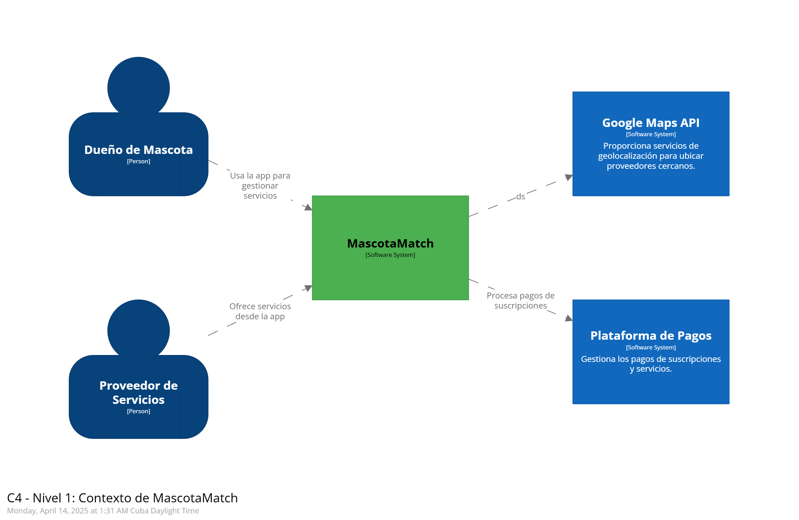

### 4.6.2. Software Architecture Container Diagram

El diagrama de contenedores presenta una vista general de alto nivel sobre cómo interactúan las aplicaciones y las fuentes de datos que intervienen en la operación del sistema MascotaMatch.

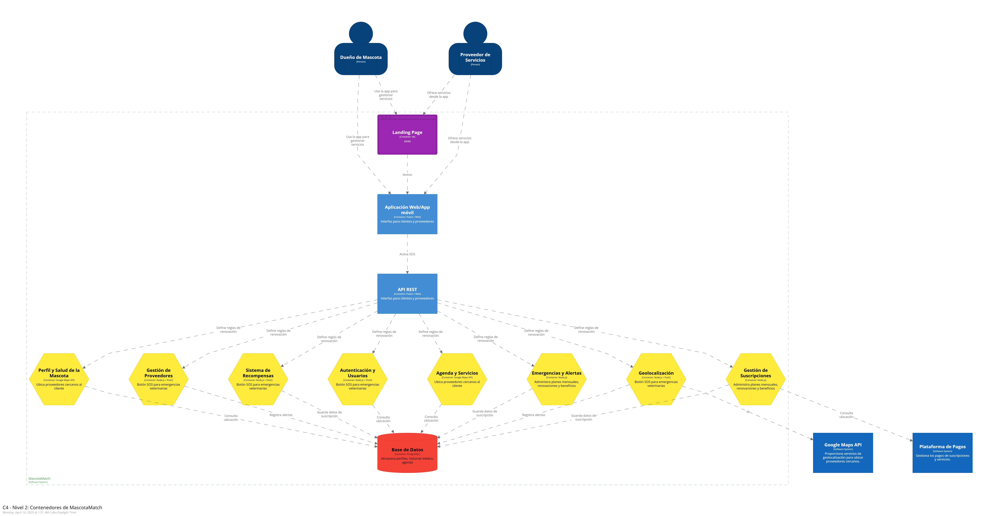

### 4.6.3. Software Architecture Component Diagram

Los diagramas de componentes ilustran las relaciones entre los principales elementos del sistema MascotaMatch, detallando cómo se implementan los módulos funcionales dentro del programa.

En esta sección se detallan los componentes asociados al componente Pet Profile and Health.
  
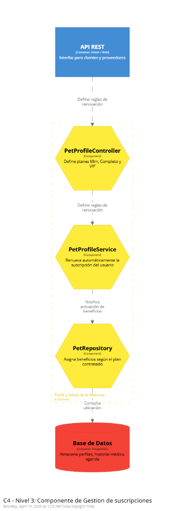

En esta sección se detallan los componentes asociados al componente Provider Management.
  
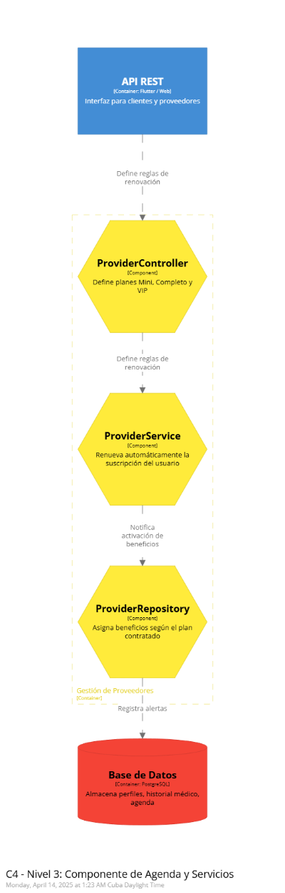

En esta sección se detallan los componentes asociados al componente Rewards System.
  

   
En esta sección se detallan los componentes asociados al componente Authentication and User.
  
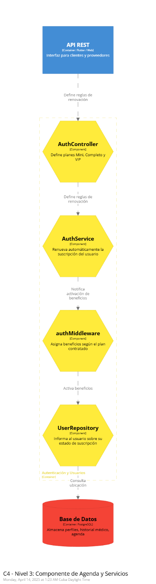
   
En esta sección se detallan los componentes asociados al componente Appointment and Services.
  
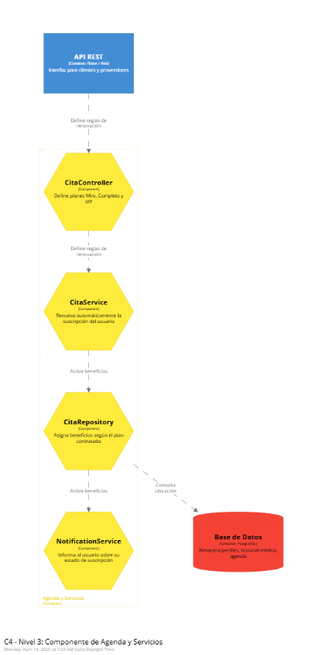
   
En esta sección se detallan los componentes asociados al componente Emergency and Alerts.
  
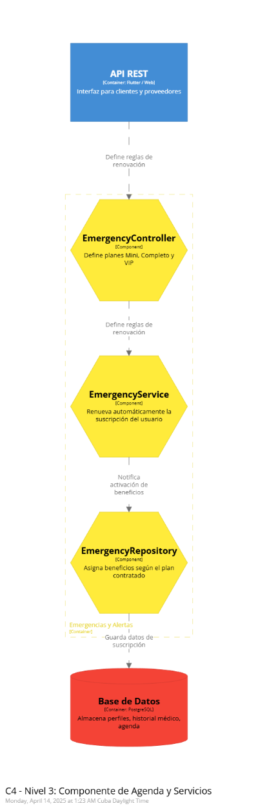
   
En esta sección se detallan los componentes asociados al componente Geolocation.
  
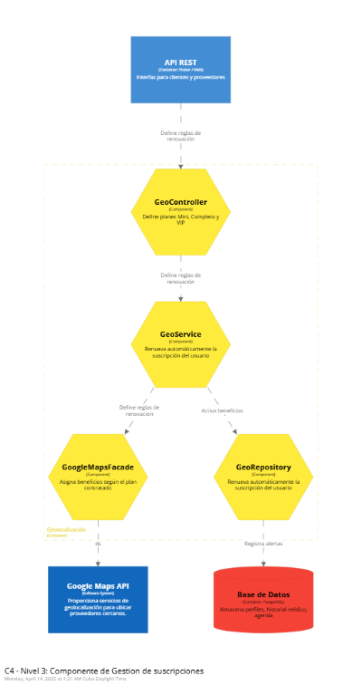

En esta sección se detallan los componentes asociados al componente Subscription Management.
  
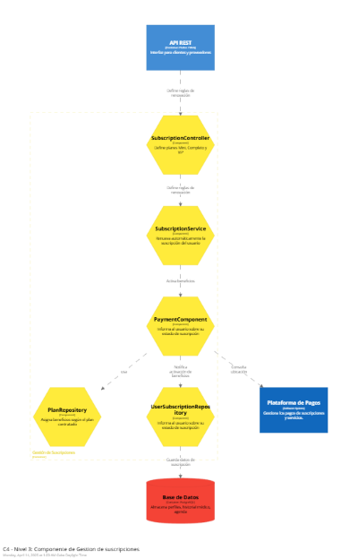

## 4.7. Software Object-Oriented Design.

### 4.7.1. Class Diagrams.

Diagrama de clases(PlantUML):

### 4.7.2. Class Dictionary

<table border="0" width="50%">
  <tr>
    <td colspan="3" valign="top">Usuario</td>
  </tr>
  <tr>
    <td colspan="1" valign="top" width="40%">Attribute</td>
    <td colspan="1" valign="top" width="40%">Type</td>
    <td colspan="2" valign="top">Description</td>
  </tr>
  <tr>
    <td colspan="1" valign="top">id</td>
    <td colspan="1" valign="top">int</td>
    <td colspan="2" valign="top">Identificador único del usuario</td>
  </tr>
 <tr>
    <td colspan="1" valign="top">nombre</td>
    <td colspan="1" valign="top">string</td>
    <td colspan="2" valign="top">Nombre completo del usuario</td>
  </tr>
  <tr>
    <td colspan="1" valign="top">correo</td>
    <td colspan="1" valign="top">string</td>
    <td colspan="2" valign="top">Correo electrónico del usuario.</td>
  </tr>
  <tr>
    <td colspan="1" valign="top">contraseña</td>
    <td colspan="1" valign="top">string</td>
    <td colspan="2" valign="top">Contraseña para acceder al sistema.</td>
  </tr>
  <tr>
    <td colspan="1" valign="top">direccion</td>
    <td colspan="1" valign="top">string</td>
    <td colspan="2" valign="top">Dirección física del usuario</td>
  </tr>
  <tr>
    <td colspan="1" valign="top">numeroTelefono</td>
    <td colspan="1" valign="top">string</td>
    <td colspan="2" valign="top">Número de teléfono del usuario.</td>
  </tr>
</table>

<table border="0" width="50%">
  <tr>
    <td colspan="3" valign="top">Plan</td>
  </tr>
   <tr>
    <td colspan="1" valign="top" width="40%">Attribute</td>
    <td colspan="1" valign="top" width="40%">Type</td>
    <td colspan="2" valign="top">Description</td>
  </tr>
  <tr>
    <td colspan="1" valign="top">id</td>
    <td colspan="1" valign="top">int</td>
    <td colspan="2" valign="top">Identificador único del plan</td>
  </tr>
 <tr>
    <td colspan="1" valign="top">nombre</td>
    <td colspan="1" valign="top">string</td>
    <td colspan="2" valign="top">Nombre completo del plan</td>
  </tr>
  <tr>
    <td colspan="1" valign="top">descripcion</td>
    <td colspan="1" valign="top">string</td>
    <td colspan="2" valign="top">Detalles y beneficios del plan.</td>
  </tr>
  <tr>
    <td colspan="1" valign="top">precio</td>
    <td colspan="1" valign="top">double</td>
    <td colspan="2" valign="top">Costo del plan.</td>
  </tr>
</table>

<table border="0" width="50%">
  <tr>
    <td colspan="3" valign="top">Suscripcion</td>
  </tr>
   <tr>
    <td colspan="1" valign="top" width="40%">Attribute</td>
    <td colspan="1" valign="top" width="40%">Type</td>
    <td colspan="2" valign="top">Description</td>
  </tr>
  <tr>
    <td colspan="1" valign="top">id</td>
    <td colspan="1" valign="top">int</td>
    <td colspan="2" valign="top">Identificador único de la suscripción</td>
  </tr>
 <tr>
    <td colspan="1" valign="top">fehcaInicio</td>
    <td colspan="1" valign="top">string</td>
    <td colspan="2" valign="top">Fecha de inicio de la suscripción.</td>
  </tr>
  <tr>
    <td colspan="1" valign="top">fechaFin</td>
    <td colspan="1" valign="top">string</td>
    <td colspan="2" valign="top">Fecha de finalización de la suscripción.</td>
  </tr>
  <tr>
    <td colspan="1" valign="top">estado</td>
    <td colspan="1" valign="top">bool</td>
    <td colspan="2" valign="top">Estado actual (activa/inactiva) de la suscripción.</td>
  </tr>
  <tr>
    <td colspan="1" valign="top">idUsuario</td>
    <td colspan="1" valign="top">int</td>
    <td colspan="2" valign="top">ID del usuario asociado a la suscripción.</td>
  </tr>
  <tr>
    <td colspan="1" valign="top">idPlan</td>
    <td colspan="1" valign="top">int</td>
    <td colspan="2" valign="top">ID del plan seleccionado</td>
  </tr>
</table>

<table border="0" width="50%">
  <tr>
    <td colspan="3" valign="top">Mascota</td>
  </tr>
  <tr>
    <td colspan="1" valign="top" width="40%">Attribute</td>
    <td colspan="1" valign="top" width="40%">Type</td>
    <td colspan="2" valign="top">Description</td>
  </tr>
  <tr>
    <td colspan="1" valign="top">id</td>
    <td colspan="1" valign="top">int</td>
    <td colspan="2" valign="top">Identificador único de la mascota.</td>
  </tr>
 <tr>
    <td colspan="1" valign="top">nombre</td>
    <td colspan="1" valign="top">string</td>
    <td colspan="2" valign="top">Nombre de la mascota</td>
  </tr>
  <tr>
    <td colspan="1" valign="top">especie</td>
    <td colspan="1" valign="top">string</td>
    <td colspan="2" valign="top">Tipo de especie (perro, gato, etc.).</td>
  </tr>
  <tr>
    <td colspan="1" valign="top">raza</td>
    <td colspan="1" valign="top">string</td>
    <td colspan="2" valign="top">Raza específica de la mascota.</td>
  </tr>
  <tr>
    <td colspan="1" valign="top">edad</td>
    <td colspan="1" valign="top">int</td>
    <td colspan="2" valign="top">Edad de la mascota.</td>
  </tr>
  <tr>
    <td colspan="1" valign="top">idUsuario</td>
    <td colspan="1" valign="top">string</td>
    <td colspan="2" valign="top">ID del dueño (usuario) de la mascota.</td>
  </tr>
</table>

<table border="0" width="50%">
  <tr>
    <td colspan="3" valign="top">Proveedor</td>
  </tr>
   <tr>
    <td colspan="1" valign="top" width="40%">Attribute</td>
    <td colspan="1" valign="top" width="40%">Type</td>
    <td colspan="2" valign="top">Description</td>
  </tr>
  <tr>
    <td colspan="1" valign="top">id</td>
    <td colspan="1" valign="top">int</td>
    <td colspan="2" valign="top">Identificador único del proveedor.</td>
  </tr>
 <tr>
    <td colspan="1" valign="top">nombre</td>
    <td colspan="1" valign="top">string</td>
    <td colspan="2" valign="top">Nombre del proveedor o especialista.</td>
  </tr>
  <tr>
    <td colspan="1" valign="top">especialidad</td>
    <td colspan="1" valign="top">string</td>
    <td colspan="2" valign="top">Tipo de servicio o área en la que se especializa</td>
  </tr>
  <tr>
    <td colspan="1" valign="top">certificado</td>
    <td colspan="1" valign="top">string</td>
    <td colspan="2" valign="top">Certificación o acreditación del proveedor.</td>
  </tr>
  <tr>
    <td colspan="1" valign="top">contacto</td>
    <td colspan="1" valign="top">string</td>
    <td colspan="2" valign="top">Información de contacto (teléfono o correo).</td>
  </tr>
</table>

<table border="0" width="50%">
  <tr>
    <td colspan="3" valign="top">Cita</td>
  </tr>
   <tr>
    <td colspan="1" valign="top" width="40%">Attribute</td>
    <td colspan="1" valign="top" width="40%">Type</td>
    <td colspan="2" valign="top">Description</td>
  </tr>
  <tr>
    <td colspan="1" valign="top">id</td>
    <td colspan="1" valign="top">int</td>
    <td colspan="2" valign="top">Identificador único de la cita.</td>
  </tr>
 <tr>
    <td colspan="1" valign="top">fechaHora</td>
    <td colspan="1" valign="top">date</td>
    <td colspan="2" valign="top">Fecha y hora programadas para la cita.</td>
  </tr>
  <tr>
    <td colspan="1" valign="top">tipoServicio</td>
    <td colspan="1" valign="top">string</td>
    <td colspan="2" valign="top">Tipo de servicio que se brindará en la cita.</td>
  </tr>
  <tr>
    <td colspan="1" valign="top">idMascota</td>
    <td colspan="1" valign="top">int</td>
    <td colspan="2" valign="top">ID de la mascota que recibirá el servicio.</td>
  </tr>
  <tr>
    <td colspan="1" valign="top">idProveedor</td>
    <td colspan="1" valign="top">int</td>
    <td colspan="2" valign="top">ID del proveedor que brindará el servicio.</td>
  </tr>
</table>

<table border="0" width="50%">
  <tr>
    <td colspan="3" valign="top">Servicio</td>
  </tr>
   <tr>
    <td colspan="1" valign="top" width="40%">Attribute</td>
    <td colspan="1" valign="top" width="40%">Type</td>
    <td colspan="2" valign="top">Description</td>
  </tr>
  <tr>
    <td colspan="1" valign="top">id</td>
    <td colspan="1" valign="top">int</td>
    <td colspan="2" valign="top">Identificador único del servicio.</td>
  </tr>
 <tr>
    <td colspan="1" valign="top">nombre</td>
    <td colspan="1" valign="top">string</td>
    <td colspan="2" valign="top">Nombre del servicio (baño, vacuna, etc.).</td>
  </tr>
  <tr>
    <td colspan="1" valign="top">descripción</td>
    <td colspan="1" valign="top">string</td>
    <td colspan="2" valign="top">Detalles del servicio ofrecido.</td>
  </tr>
</table>

<table border="0" width="50%">
  <tr>
    <td colspan="3" valign="top">ServicioPlan</td>
  </tr>
   <tr>
    <td colspan="1" valign="top" width="40%">Attribute</td>
    <td colspan="1" valign="top" width="40%">Type</td>
    <td colspan="2" valign="top">Description</td>
  </tr>
  <tr>
    <td colspan="1" valign="top">id</td>
    <td colspan="1" valign="top">int</td>
    <td colspan="2" valign="top">Identificador único del registro.</td>
  </tr>
 <tr>
    <td colspan="1" valign="top">nombre</td>
    <td colspan="1" valign="top">string</td>
    <td colspan="2" valign="top">ID del servicio incluido en el plan.</td>
  </tr>
</table>

# Capítulo V: Product Implementation, Validation & Deployment
## 5.1. Software Configuration Management

### 5.1.1. Software Development Environment Configuration

**Requirements Management**

**User Experience Design (UX/UI)**

**Project Managment**

1. Discord y WhatsApp: Estas plataformas fueron esenciales para la comunicación interna del equipo, siendo WhatsApp especialmente útil por su facilidad para gestionar grupos de trabajo.

2. Trello: Se utilizó para planificar y dar seguimiento al avance del proyecto mediante tableros que representaban el backlog del producto y otras tareas organizativas.

**Product UX/UI**

1. Figma: Herramienta principal para el diseño de wireframes y prototipos, tanto en versiones de escritorio como móviles.

2. Miro: Apoyo en la creación de los escenarios mapping y escenario mapping en ambos casos para ambos segmentos del objetivo en el desarrollo del proyecto.

**Software Development**

1. Visual Studio Code: Editor principal utilizado para programar el landing page.

2. Github y Git bash: Se emplearon para el control de versiones y el desarrollo colaborativo del repositorio del proyecto.

3.HTML y CSS: Lenguajes fundamentales utilizados para la estructura (HTML) y el diseño visual (CSS) del landing page.

**Software Documentation**

1. Google Drive: Plataforma utilizada para el almacenamiento compartido de documentación e informes colaborativos.
   
2. Google Meets y Zoom: Se usó Google Meets más que nada para las videoconferencias de reunión del equipo y el Zoom para las grabaciones de las entrevistas, y las presentaciones del trabajo en el desarrollo de este.
   
3. LucidChart: Herramienta utilizada para diagramas de flujo y modelado visual del diseño de la aplicación, incluyendo diagramas de clases.
   
4. Structuriz: Permite la creación del modelo C4 en sus tres niveles (contexto, contenedores, componentes), también trabajado en conjunto con Visual Studio Code.
   
5. Vertabello: Se empleó para el diseño de la base de datos y sus respectivos diagramas lógicos.

### 5.1.2. Source Code Management

Para el desarrollo de MascotaMatch, se implementará el modelo GitFlow como estándar de control de versiones, utilizando GitHub como plataforma central. Esta metodología permitirá una organización clara y sistemática del trabajo en equipo, facilitando la colaboración, el control de cambios y la integración continua. A continuación, se describe cómo se aplicará GitFlow dentro del proyecto y los enlaces relevantes a los repositorios de GitHub.

**GitFlow Workflow:**

- Ramas principales: main (para versiones estables de producción) y develop (para integrar el desarrollo en curso).
  
- Ramas de características (features): Cada nueva funcionalidad de MascotaMatch será desarrollada en una rama específica, siguiendo un esquema de nombres como feature/nombre-de-la-funcionalidad.
  
- Rama develop:  Es la rama base para el desarrollo de nuevas funcionalidades. Todo el trabajo en curso se integra primero en develop, y solo después de ser validado, se pasa a main.

**Repositorios de GitHub:**

- Enlace a la organización en GitHub: https://github.com/orgs/1ASI0730-2510-4374-G4-MASCOTAMATCH/repositories
  
- Enlace al repositorio de la **Landing Page**: +++++++++++++++++++++++++++++++++++++

**Estructura de Ramas (Branches) en GitFlow:**

1. **Rama main (Principal):** Es la rama principal del proyecto, contiene la versión más reciente y estable de MascotaMatch, apta para producción.
   
2. **Rama Develop (Desarrollo):** Su función es mantener el progreso continuo del proyecto. Aglutina el trabajo diario del equipo de desarrollo, sirviendo de base para integrar nuevas funcionalidades antes de su despliegue final.
   
3. **Ramas de Funcionalidad (Feature branches):** Cada funcionalidad nueva (por ejemplo, "registro de mascotas" o "búsqueda de adopciones") se trabajará en una rama independiente, la cual se fusionará en develop una vez completada y verificada.

**Convenciones de Commits:**

En el repositorio de GitHub del proyecto MascotaMatch, se siguió el estándar de convenciones de commits versión 1.1.0. Esta convención establece una sintaxis clara para los mensajes de commit con el siguiente formato:

<tipo>[alcance opcional]: <descripción>

1. Tipo: indica la naturaleza del cambio, como feat para nuevas funcionalidades, fix para correcciones, o docs para modificaciones en la documentación.

2. Alcance (opcional): especifica el área del código afectada por el cambio.

3. Descripción: resume brevemente lo que se ha hecho en ese commit.

### 5.1.3. Source Code Style Guide & Conventions

En el desarrollo de nuestra Landing Page, hemos seguido las mejores prácticas de diseño web, empleando HTML y CSS para estructurar y
estilizar el contenido de manera eficaz. Para organizar la información, utilizamos etiquetas HTML de encabezado, como "h1" para los 
títulos y "p" para los párrafos. Para personalizar el estilo visual, aplicamos el atributo styles.css en HTML, ajustando propiedades 
como el color, el tamaño de la fuente y el tipo de letra. Para resaltar ciertos elementos, usamos "strong" en el footer para énfasis 
adicional. En cuanto a la navegación, diseñamos una barra horizontal con css, lo que contribuye a una experiencia de usuario más fluida 
al explorar la página. Para hacer la página más interactiva, agregamos botones con efectos de hover utilizando css, tanto en secciones 
como planes y botones para register y login. Para facilitar el acceso entre diferentes secciones de productos también usamos css. Por 
último, en el pie de página, incluimos un formulario para contactarse con nuestro soporte, brindando a los usuarios una forma sencilla y 
directa de conectarse con nosotros y por nuestra parte estar al tanto de ellos.

**HTML Style Guide and Coding Conventions**

1. Se emplea una indentación de dos espacios para mantener una estructura clara y legible.

2. Las etiquetas HTML se escriben en minúsculas, al igual que sus atributos.

3. Se insertan comentarios breves y precisos en el código para facilitar su entendimiento por parte del equipo de desarrollo.

**CSS Style Guide (Based on Google HTML/CSS Style Guide)**

1. Las clases siguen el formato de guiones medios (por ejemplo, .main-container).

2. Las líneas de código se limitan a un máximo de 80 caracteres para mantener la legibilidad.

3. Se utilizan nombres descriptivos para clases e identificadores, facilitando la comprensión de su propósito.

**JavaScript Style Guide**

1. Las variables y funciones se nombran utilizando camelCase.

2. Se usa una indentación de dos espacios para mantener la uniformidad.

3. Las comillas simples (' ') son el estándar para definir strings.

4. Se incluyen comentarios explicativos para aclarar el comportamiento de las funciones y bloques clave.

**Gherkin Conventions for Readable Specifications**

1. Se redactan escenarios en lenguaje claro y comprensible, siguiendo la estructura Given - When - Then, para documentar de forma efectiva el comportamiento esperado del sistema.

### 5.1.4. Software Deployment Configuration. 

Para el alojamiento de nuestra Landing Page, utilizaremos GitHub Pages. Subiremos los archivos necesarios (como HTML y CSS) a un repositorio público en GitHub, de modo que la página sea accesible en línea y pueda ser visitada por cualquier usuario.

# 5.2. Landing Page, Services & Applications Implementation.

## 5.2.1. Sprint 1

### 5.2.1.1. Sprint Planning 1.

El Sprint Planning 1 establece la organización inicial del equipo para desarrollar el MVP de Mascota Match. Se definen el objetivo del Sprint, las User Stories que serán trabajadas, la capacidad del equipo, y los entregables esperados. Este proceso permite una planificación clara y el alineamiento de todo el equipo hacia un mismo objetivo para la entrega de valor.

| Campo | Información |
|:------|:------------|
| **Sprint #** | Sprint 1 |
| **Date** | 2024-04-18 |
| **Time** | 05:00 PM |
| **Location** | Virtual (Discord y Zoom) |
| **Prepared By** | Oscar Espinoza, Miguel Vidal, Stephano Landaurí, Fabian Oliva, Gianfranco Durand, Erick Vasquez |
| **Attendees (to planning meeting)** | Oscar Espinoza, Miguel Vidal, Stephano Landaurí, Fabian Oliva, Gianfranco Durand, Erick Vasquez |
| **Sprint n – 1 Review Summary** | No aplica (Primer Sprint del proyecto Mascota Match). |
| **Sprint n – 1 Retrospective Summary** | No aplica (Primer Sprint del proyecto Mascota Match). |
| **Sprint n Goal** | Finalizar la primera versión de Mascota Match, incluyendo registro de usuarios, login, navegación general, publicación de servicios, planes de suscripción, sección de FAQ, agendamiento de citas y perfil de usuario.  **Sprint Goal:** Our focus is on launching Mascota Match MVP. We believe it delivers essential functionality and first user experience. This will be confirmed when users can register, navigate, consult services, choose a plan, and book an appointment successfully. |
| **Sprint n Velocity** | 82 Story Points |
| **Sprint Goal & User Stories** | **User Stories:** HU01, HU02, HU03, HU04, HU05, HU06, HU07, HU08, HU09, HU10, HU11, HU12, HU13, HU14, HU15, HU16, HU17, HU18, TS01, TS02, TS03, TS04, TS05, TS06, TS07, TS08 |
| **Sum of Story Points** | **82 Story Points** |

### 5.2.1.2. Aspect Leaders and Collaborators

Para asegurar una ejecución eficiente del Sprint 1, se definieron líderes y colaboradores responsables de las principales áreas del proyecto. Cada miembro del equipo lidera o apoya aspectos específicos como el desarrollo de páginas, integración de funcionalidades, diseño visual y animaciones. Esta matriz garantiza una asignación clara de tareas y fomenta el trabajo colaborativo.

| Team Member | GitHub Username | Home | Index | Plan Complete | Plan Mini | Plan VIP | FAQ / Perfil / Agendamiento / Animaciones |
|:-----------:|:----------------|:----:|:-----:|:-------------:|:---------:|:--------:|:----------------------------------------:|
| Oscar Espinoza | OscarEspinoza5443 | L | C | C | C | C | C |
| Miguel Vidal | Gossk | C | L | C | C | C | C |
| Fabian Oliva | FabulousFabStar | C | C | L | C | C | C |
| Stephano Landaurí | Mayrzon02 | C | C | C | L | C | C |
| Gianfranco Durand | Azucarita | C | C | C | C | L | C |
| Erick Vasquez | erick580 | C | C | C | C | C | L |

### 5.2.1.3. Sprint Backlog 1 

El Sprint Backlog 1 consolida todas las funcionalidades principales de Mascota Match, enfocándose en completar toda la experiencia de usuario inicial: registro, login, navegación, servicios, planes de suscripción, sección FAQ, agendamiento de citas y consulta de perfiles.

| User Story | Work-Item / Task | Description | Estimation (Hours) | Assigned To | Status |
|:----------:|:----------------:|:-----------:|:------------------:|:-----------:|:------:|
| HU14 | T1 | Crear pantalla de Login | 5 | Stephano (Plan Mini) | Done |
| HU15 | T2 | Crear pantalla de Registro | 5 | Oscar (Home) | Done |
| TS04 | T3 | Programar POST registro API | 5 | Oscar (Home) | Done |
| TS05 | T4 | Programar POST login API | 5 | Miguel (Index) | Done |
| HU11 | T5 | Visualizar logo en navbar | 1 | Fabian (Plan Complete) | Done |
| HU12 | T6 | Menú de navegación principal | 2 | Miguel (Index) | Done |
| HU16 | T7 | Aplicar diseño uniforme | 2 | Fabian (Plan Complete) | Done |
| HU17 | T8 | Adaptar responsividad móvil | 3 | Erick (Animaciones) | Done |
| HU01 | T9 | Crear sección bienvenida | 3 | Oscar (Home) | Done |
| HU02 | T10 | Programar botón See Services | 3 | Miguel (Index) | Done |
| HU03 | T11 | Diseñar tarjetas de servicios | 5 | Miguel (Index) | Done |
| HU04 | T12 | Agregar descripción de servicios | 3 | Erick (Animaciones) | Done |
| HU05 | T13 | Insertar imágenes en servicios | 2 | Erick (Animaciones) | Done |
| TS01 | T14 | GET servicios disponibles API | 3 | Miguel (Index) | Done |
| HU06 | T15 | Crear tarjetas planes VIP, Completo, Mini | 5 | Fabian, Stephano, Gianfranco | Done |
| HU07 | T16 | Listar beneficios por plan | 3 | Fabian, Stephano, Gianfranco | Done |
| HU08 | T17 | Imagen única por plan | 2 | Erick (Animaciones) | Done |
| TS02 | T18 | GET planes de suscripción API | 3 | Miguel (Index) | Done |
| HU09 | T19 | Botón "Read More" en cada plan | 2 | Stephano (Plan Mini) | Done |
| HU18 | T20 | Crear páginas detalle de planes | 3 | Oscar (Home) | Done |
| HU10 | T21 | Crear sección FAQ | 3 | Erick (Animaciones) | Done |
| TS03 | T22 | GET preguntas frecuentes API | 2 | Miguel (Index) | Done |
| HU13 | T23 | Footer contacto y ayuda | 2 | Fabian (Plan Complete) | Done |
| TS06 | T24 | GET perfil de usuario API | 3 | Miguel (Index) | Done |
| TS07 | T25 | POST agendar cita API | 5 | Gianfranco (Plan VIP) | Done |
| TS08 | T26 | GET citas agendadas API | 3 | Gianfranco (Plan VIP) | Done |

 URL del Board Trello 

--> https://trello.com/invite/b/680d687b243945443095fd34/ATTIce7e124a2b8bc6835ae388ae521389d986676F9C/trabajo

### 5.2.1.4. Development Evidence for Sprint Review

| Repository      | Branch                | Commit ID | Commit Message                  | Commit Message Body | Committed on Date     |
|-----------------|------------------------|-----------|----------------------------------|----------------------|------------------------|
| MascotaMatch    | feature/animaciones     | 298c45a   | feat: add vc animaciones         | -                    | 26 de abril de 2025    |
| MascotaMatch    | feature/plan_vip        | e856efe   | feat:add plan_vip                | -                    | 26 de abril de 2025    |
| MascotaMatch    | feature/plan_mini       | d08a274   | feat:Add Plan_mini               | -                    | 26 de abril de 2025    |
| MascotaMatch    | feature/plan_complete   | b8fe11d   | feat: add PlanComplete           | -                    | 26 de abril de 2025    |
| MascotaMatch    | feature/index           | afe5753   | feat: landing page               | -                    | 26 de abril de 2025    |
| MascotaMatch    | feature/home            | b1a74fa   | Feature: add landing register-login | -                | 26 de abril de 2025    |

## Detalles
Cada feature fue desarrollado en una branch diferente siguiendo buenas prácticas de control de versiones y trabajo en equipo. Se utilizaron mensajes de commit descriptivos y cada cambio fue verificado.

### 5.2.1.5. Execution Evidence for Sprint Review.

Durante el Sprint 1, el equipo ejecutó las tareas de desarrollo de la Landing Page de MascotaMatch siguiendo el plan establecido. Se completó el objetivo de crear, implementar y desplegar la página con una estructura HTML básica, diseño UX/UI optimizado y estilos responsivos, todo dentro del plazo asignado.

-Enlace al Landing Page desplegado: ++++++++++++++++++++++++++

-Capturas de pantalla de la ejecución: 

### 5.2.1.6. Services Documentation Evidence for Sprint Review.

Durante el Sprint 1, el equipo de MascotaMatch se enfocó en el desarrollo de la Landing Page del proyecto, por lo que no se implementaron ni consumieron servicios (APIs) en esta etapa. La documentación de servicios se realizará en futuros sprints, conforme se avance en el desarrollo del backend y las funcionalidades dinámicas de la aplicación.

### 5.2.1.7. Software Deployment Evidence for Sprint Review.

En el Sprint 1 se realizó el lanzamiento de la primera versión del Landing Page, la cual fue publicada mediante GitHub Pages. A continuación, se muestran las evidencias correspondientes al despliegue.

Cómo acceder a la landing page:++++++++++++++++++++++++++++++++++++

Accedemos al dominio de la Landing Page, nos aseguramos que esta correctamente configurado y hacemos click en "guardar".

Imágenes de la pantalla del Landing Page:

### 5.2.1.8. Team Collaboration Insights during Sprint.

En el Sprint 1, el equipo se centró en el desarrollo, implementación y despliegue de la Landing Page de MascotaMatch. El trabajo se distribuyó de manera colaborativa, con cada miembro asumiendo responsabilidades en áreas clave como el desarrollo de la estructura HTML, el diseño de la interfaz y la experiencia de usuario, y la creación de estilos responsivos. Además, algunos miembros se encargaron del control de versiones y del despliegue en GitHub Pages.

La comunicación fue constante a través de plataforma usada: Discord, WhatsApp, Slack; y utilizamos herramientas como Trello, GitHub Projects para gestionar tareas y hacer seguimiento de los avances. La colaboración fue eficiente y fluida, pero se identificó la necesidad de mejorar la planificación temporal para optimizar la entrega de futuros sprints.

## Conclusiones

El desarrollo del proyecto *MascotaMatch* permitió aplicar de manera efectiva los principios de diseño UX/UI, así como el modelado de la interacción de los usuarios a través de wireframes, wireflows y prototipos.

Se logró diseñar una plataforma simple, amigable y adaptada a las necesidades de los usuarios, enfocándose en facilitar tareas comunes como registrarse, iniciar sesión, explorar servicios y seleccionar planes de atención para mascotas.  
El diseño aplicado en los mockups reflejó consistencia en la paleta de colores, tipografías y componentes visuales, mejorando la experiencia de navegación en diferentes dispositivos (desktop y mobile).

Además, se plantearon historias técnicas fáciles relacionadas a la conexión API, promoviendo una arquitectura ordenada para que los datos de servicios, planes, citas y perfiles de usuario puedan cargarse dinámicamente, reduciendo el mantenimiento manual y mejorando la escalabilidad.

---
## Bibliografía 
A continuación, se listan las fuentes que sirvieron como referencia o guía para el desarrollo del trabajo:

- [The Markdown Guide](https://www.markdownguide.org/)
- [Seriously, what’s your (startup’s) problem?](https://medium.com/@jakemendel/seriously-whats-your-startup-s-problem-b3a884c54ab4)
- [5W+2H - Técnica de análisis de problemas](https://www.progressalean.com/5w2h-tecnica-de-analisis-de-problemas/)
- [Ubiquitous Language (Martin Fowler)](https://martinfowler.com/bliki/UbiquitousLanguage.html)
- [Lean UX – Chapter 3](https://www.scribd.com/document/655516553/Leanux-Sampler)
- [Mike Cohn’s Mountain Goat Software Blog – User Stories](https://www.mountaingoatsoftware.com/blog/tag/user-stories)
- [User vs. Buyer Persona: Differences and Free Template](https://uxpressia.com/blog/user-persona-vs-buyer-persona-difference)
- [How to create an Impact Map in 4 easy steps](https://uxpressia.com/blog/build-impact-map-4-easy-steps)
- [As-is Scenario Map](https://www.ibm.com/design/thinking/page/toolkit/activity/as-is-scenario-map)
- [To-be Scenario Map](https://www.ibm.com/design/thinking/page/toolkit/activity/to-be-scenario-map)
- [Acceptance Criteria in Scrum: Explanation, Examples, and Template](https://dzone.com/articles/acceptance-criteria-in-software-explanation-exampl)
- [A Beginner’s Guide to finding User Needs](https://jdittrich.github.io/userNeedResearchBook/)
- [Scenario Mapping](http://www.uxforthemasses.com/scenario-mapping/)
- [What are User Flows in User Experience (UX) Design?](https://careerfoundry.com/en/blog/ux-design/what-are-user-flows/)
- [Design Systems 101](https://www.nngroup.com/articles/design-systems-101/)
- [Front-End Style-Guides](https://www.nngroup.com/articles/front-end-style-guides/)
- [HTML Style Guide and Coding Conventions (W3Schools)](https://www.w3schools.com/html/html5_syntax.asp)
- [Google HTML/CSS Style Guide](https://google.github.io/styleguide/htmlcssguide.html)
- [Gherkin Conventions for Readable Specifications](https://specflow.org/gherkin/gherkin-conventions-for-readable-specifications/)
- [How to Write a User Story for an API Product](https://sameera17w.medium.com/how-to-write-a-user-story-for-an-api-product7af6abd4ad2e)
