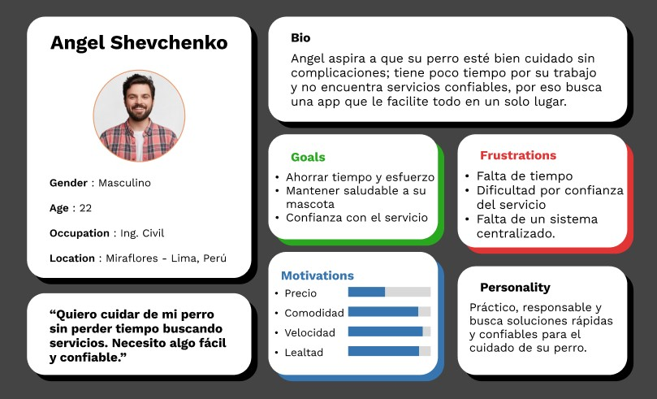
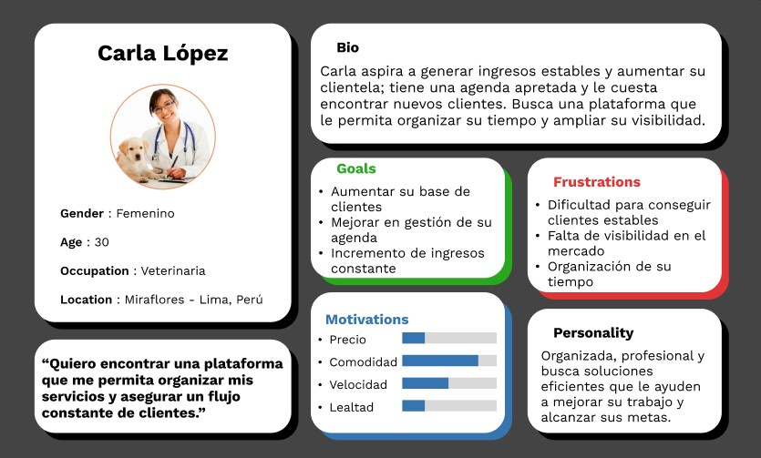
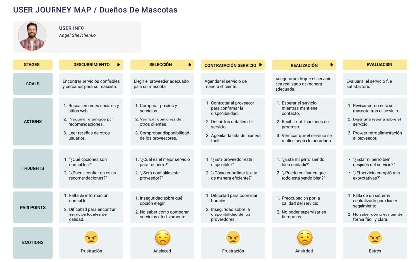
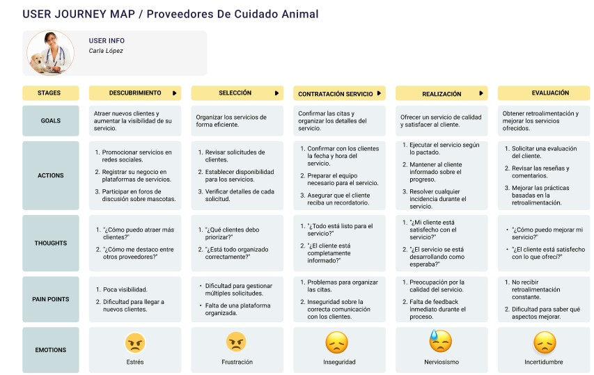
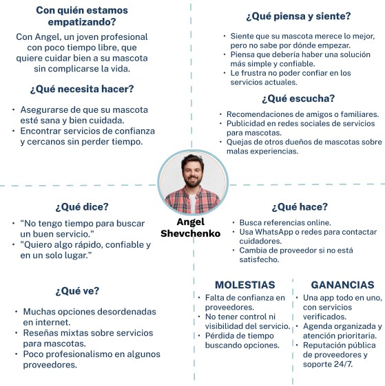
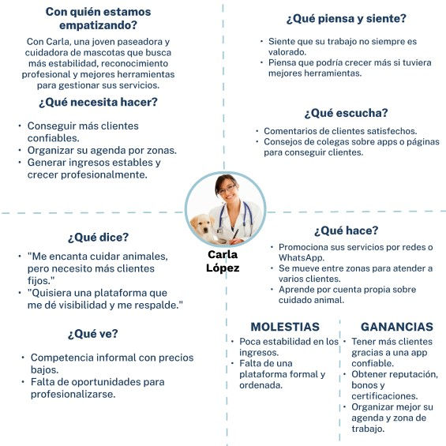

# Cap칤tulo II: Requirements Elicitation & Analysis

## 2.1. Competidores

**Dog Houser**: Dog Houser es una plataforma peruana que conecta a due침os de mascotas con familias cuidadoras que ofrecen hospedaje y guarder칤a en casa. Destaca por su ambiente familiar y personalizado, permitiendo elegir cuidadores seg칰n necesidades espec칤ficas.
**PaseaPerros.com**: PaseaPerros.com es una plataforma peruana que conecta a due침os de perros con paseadores y cuidadores en su zona. Ofrece servicios como paseo, guarder칤a y hospedaje, con perfiles calificados y rese침as de clientes.
**PetBacker**: PetBacker es una plataforma internacional con presencia en Per칰 que permite encontrar cuidadores independientes cercanos. Ofrece servicios como paseos, visitas y hospedaje, con un sistema de rese침as que brinda confianza.

### 2.1.1. An치lisis competitivo

### 쯇or qu칠 llevar a cabo este an치lisis?
Identificar fortalezas, debilidades y oportunidades frente a los principales competidores para mejorar el posicionamiento de MacotaMatch en el mercado del cuidado de mascotas.

| **Nombre de los Startups**     |                                              | **MacotaMatch** | **Dog Houser** | **PaseaPerros.com** | **PetBacker** |
|-------------------------------|----------------------------------------------|------------------|----------------|----------------------|----------------|
| **Perfil**                    | Overview                                     | Plataforma peruana que conecta due침os de mascotas con cuidadores verificados para paseo, guarder칤a y hospedaje. | Plataforma peruana que ofrece hospedaje y guarder칤a en casas particulares. | Plataforma local que enlaza due침os con paseadores y cuidadores certificados. | Plataforma internacional que conecta a due침os con cuidadores independientes. |
|                               | Ventaja competitiva / 쯈u칠 valor ofrece?     | Servicio seguro y personalizado, con verificaci칩n de usuarios y experiencia enfocada en el bienestar de las mascotas. | Atenci칩n familiar en ambientes hogare침os que reduce el estr칠s de las mascotas. | Diversidad de servicios con opiniones de clientes que aseguran confianza. | Variedad de servicios en una sola app con sistema de rese침as internacionales. |
| **Perfil de Marketing**       | Mercado objetivo                             | Due침os de mascotas en Per칰 que buscan confianza y seguridad en el cuidado. | Due침os que desean un trato hogare침o y personalizado. | Usuarios que requieren opciones flexibles y cercanas. | Personas que valoran opciones amplias con soporte digital. |
|                               | Estrategias de marketing                     | Presencia en redes sociales, alianzas con veterinarias, promociones digitales. | Publicidad online y recomendaciones por experiencia. | SEO local y redes sociales. | Presencia en app stores y promociones por ubicaci칩n. |
| **Perfil del Producto**       | Productos & Servicios                        | Paseos, guarder칤a, hospedaje y visitas domiciliarias. | Hospedaje y guarder칤a personalizada. | Paseos, guarder칤a, hospedaje. | Paseos, visitas, hospedaje, peluquer칤a, etc. |
|                               | Precios & Costos                             | Modelo freemium y planes premium. | Tarifas por cuidador y tipo de servicio. | Costos establecidos por el cuidador. | Tarifas variables por cuidador y servicio. |
|                               | Canales de distribuci칩n (Web y/o M칩vil)     | Web y app m칩vil. | P치gina web. | P치gina web. | App m칩vil y web. |
| **An치lisis SWOT**             | Fortalezas                                   | Plataforma local con enfoque personalizado, sistema de verificaci칩n. | Atenci칩n familiar que brinda confianza a los due침os. | Plataforma simple y f치cil de usar. | Amplia cobertura internacional y experiencia digital. |
|                               | Debilidades                                  | Nueva en el mercado, menor reconocimiento. | Limitado a ciertas zonas. | Menor visibilidad digital. | Menor personalizaci칩n al ser global. |
|                               | Oportunidades                                | Aumento en demanda digital de servicios para mascotas. | Expandirse a otras regiones del pa칤s. | Fortalecer alianzas locales. | Adaptarse m치s al mercado local peruano. |
|                               | Amenazas                                     | Competencia internacional y local en crecimiento. | Nuevas plataformas m치s digitales. | Nuevos entrantes con m치s tecnolog칤a. | Preferencia por servicios personalizados locales. |

## 2.1.2. Estrategias y t치cticas frente a competidores
Nuestra estrategia se basa en la diferenciaci칩n mediante una plataforma integral de servicios para mascotas que prioriza el bienestar animal, la conexi칩n entre due침os y proveedores, y la trazabilidad de la salud de las mascotas. As칤, nuestras t치cticas son:

游릴 **Desarrollar una plataforma con historial m칠dico digital**: Incluir funcionalidades que permitan registrar, consultar y actualizar el historial m칠dico de cada mascota, lo cual genera valor a침adido respecto a plataformas tradicionales centradas solo en paseos o alojamiento.

游릴 **Brindar soporte personalizado y atenci칩n r치pida**: Implementar un sistema de atenci칩n al cliente eficaz, con soporte en tiempo real y asesor칤a especializada para resolver dudas sobre servicios, reservas y cuidado de mascotas, generando confianza y fidelizaci칩n.

游릴 **Establecer alianzas con veterinarias y groomers**: Formar v칤nculos con cl칤nicas veterinarias, centros de grooming y tiendas especializadas que permitan ofrecer servicios integrales y confiables desde la misma plataforma.

游릴 **Realizar campa침as de concientizaci칩n**: Difundir mensajes sobre tenencia responsable, salud preventiva, y la importancia del control veterinario a trav칠s de redes sociales, blogs y webinars, dirigidos a due침os primerizos y familias.

游릴 **Fomentar el uso inicial mediante beneficios**: Ofrecer promociones, descuentos o servicios gratuitos durante el primer mes para atraer usuarios nuevos, generar confianza y asegurar la retenci칩n a largo plazo.

## 2.2.1 Dise침o de Entrevistas 

##  Segmento 1: Due침os de Mascotas (Clientes)

- 쯇odr칤as contarme sobre tu mascota y c칩mo es tu d칤a a d칤a con ella?
- 쯈u칠 tan seguido necesita tu mascota servicios como paseos, ba침o o visitas al veterinario?
- 쮺칩mo sueles organizar esos servicios actualmente?
- 쮿as tenido dificultades para encontrar profesionales confiables para el cuidado de tu mascota? 쮺u치les?
- 쯈u칠 tan dispuesto/a estar칤as a pagar una suscripci칩n mensual que te ofrezca servicios integrales para tu mascota?
- 쮺u치les son tus principales preocupaciones respecto a la salud y bienestar de tu mascota?
- 쯈u칠 tan familiarizado/a est치s con aplicaciones m칩viles para contratar servicios? 쮺u치les usas con frecuencia?
- 쯈u칠 tipo de experiencias negativas o frustraciones has tenido con servicios para mascotas?
- 쯈u칠 dispositivos sueles usar en tu d칤a a d칤a para conectarte a internet? 쯈u칠 apps usas con frecuencia?
- 쯈u칠 te motivar칤a a usar una app que re칰na todos los servicios para tu mascota en un solo lugar?
---
##  Segmento 2: Proveedores de Servicios (Veterinarios, Paseadores, Groomers)

- 쮸 qu칠 te dedicas actualmente y c칩mo gestionas a tus clientes?
- 쮺u치les son tus principales dificultades al ofrecer tus servicios actualmente?
- 쮺칩mo consigues nuevos clientes hoy en d칤a?
- 쯈u칠 tan c칩modo/a te sentir칤as usando una app que te conecte con due침os de mascotas cercanos?
- 쯈u칠 tipo de servicios ofreces con mayor frecuencia? 쮿ay alguno que te gustar칤a ofrecer y a칰n no puedes?
- 쮼st치s interesado/a en recibir m치s formaci칩n o certificaciones en tu rubro?
- 쯈u칠 importancia tiene para ti la estabilidad de ingresos y fidelizaci칩n de clientes?
- 쯈u칠 dispositivos usas en tu d칤a a d칤a? 쯊ienes experiencia usando apps tipo Uber, Rappi, etc.?
- 쯈u칠 caracter칤sticas tendr칤a una plataforma ideal para ayudarte a crecer profesionalmente?
- 쯈u칠 beneficios o incentivos te motivar칤an a unirte y permanecer en una plataforma como MascotaMatch?

# 2.3 NeedFinding

### 2.3.1 User Persona

### Due침os de Mascotas (Clientes)

### Proveedores de cuidado animal (Proveedores)

## 2.3.2 Task Matrix

### Task Matrix para Due침os de Mascotas

| **Tareas**                          | **Frecuencia** | **Importancia** |
|-------------------------------------|----------------|-----------------|
| Buscar proveedores confiables       | Media          | Alta            |
| Agendar una cita                    | Media          | Alta            |
| Pagar servicio mensual              | Media          | Alta            |
| Revisar historial de la mascota    | Media          | Media           |
| Acceso a servicios de emergencia   | Baja           | Alta            |

### Task Matrix para Proveedores de Cuidado Animal

| **Tareas**                          | **Frecuencia** | **Importancia** |
|-------------------------------------|----------------|-----------------|
| Agendar un servicio                 | Alta           | Media           |
| Buscar nuevos clientes              | Alta           | Alta            |
| Verificar disponibilidad de citas   | Media          | Alta            |
| Recibir pago por servicios          | Alta           | Alta            |
| Recibir feedback y mejorar servicio | Media          | Media           |

## 2.3.3 User Journey Map

### User Journey Map para Due침os de mascotas

### User Journey Map para Proveedores de cuidado animal

## 2.3.4. Empathy Mapping.

### Empathy Map para Due침os de Mascotas

### Empathy Map para Proveedores de Cuidado Animal

## 2.3.5. As-is Scenario Mapping.

### Escenario As-Is: Due침o de Mascota buscando un servicio confiable

### Escenario As-Is: Carla buscando clientes sin plataforma especializada

